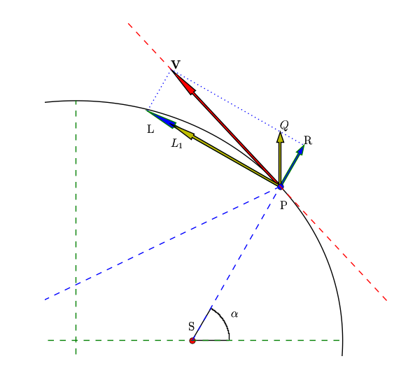
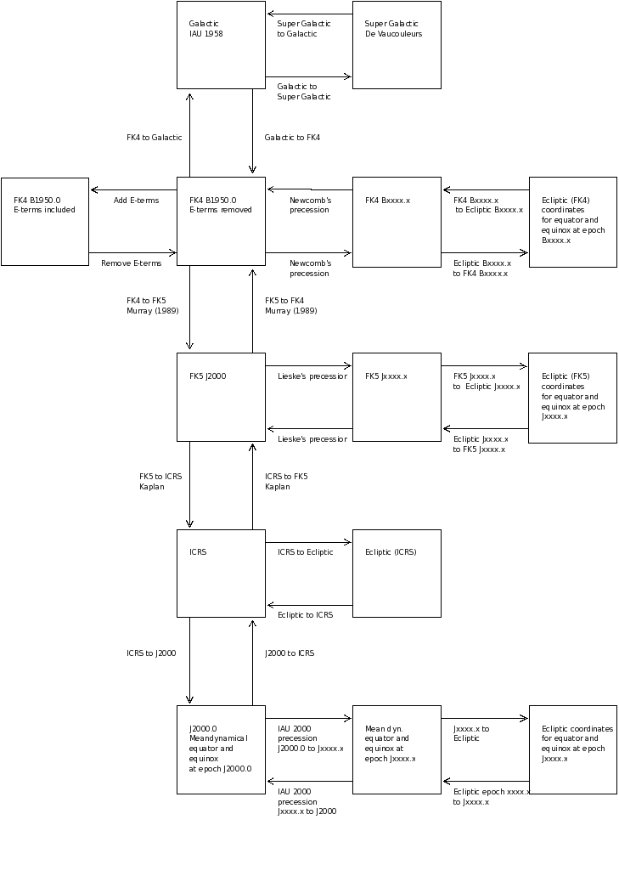

Background information module celestial
=======================================

.. highlight:: python
   :linenothreshold: 10

Rotation matrices
-----------------

Spherical astronomy sections in older textbooks rely heavily on the reader's knowledge of
spherical trigonometry (e.g. Smart 1977). For more complicated problems than 
a simple rotation, this technique becomes laborious. Matrix and vector techniques 
come to rescue. Many of the transformations are defined in terms of rotation matrices.
A rotation matrix is a matrix whose multiplication with a 
vector rotates the vector while preserving its length. There is a 
special group  3 x 3 rotation matrices R where 

.. math::
   :label: eq10
   
   | R | = \pm 1 \ and \ R^{-1} = R^T

For transformations between sky systems we only use matrices with :math:`|R|=+1`.

A coordinate rotation is a rotation about a single coordinate axis. 
The three coordinate rotation matrices are:

.. math::
   :label: eq20

   R_1(\alpha) =\begin{bmatrix}1 & 0 & 0\\ 0 & \cos(\alpha) & \sin(\alpha) \\ 0 & -\sin(\alpha) & \cos(\alpha)\end{bmatrix}

.. math::
   :label: eq30
   
   R_2(\alpha) =\begin{bmatrix}\cos(\alpha) & 0 & -\sin(\alpha)\\ 0 & 1 & 0 \\ \sin(\alpha) & 0 & \cos(\alpha)\end{bmatrix}

.. math::
   :label: eq40
   
   R_3(\alpha) =\begin{bmatrix}\cos(\alpha) & \sin(\alpha) & 0\\ -\sin(\alpha) & \cos(\alpha) & 0 \\ 0 & 0 & 1\end{bmatrix}

Three coordinate rotations in sequence can describe any
rotation. The result matrix is:

.. math::
   :label: eq50
   
    R_{ijk}(\phi,\theta,\psi) = R_i(\phi)R_j(\theta)R_k(\psi)

The angles are called Euler angles. There are 27 possible sequences
of the three indices i,j,k. Not all sequences are valid rotations. 
The most common choices of valid combinations are (1,2,3), (3,1,3) and (3,2,3) ( [Diebel]_, 2006)

If :math:`\vec r_0` is a position vector in system 0 and :math:`\vec r_1`
is the **same position** in the sky but in another sky system then, with the appropriate rotation
matrix *R*, we calculate :math:`\vec r_1` in the coordinates belonging to the rotated system
with:

.. math::
   :label: eq60

   \vec r_1 = R \vec r_0

Note that the listed rotations represent the same position in different coordinate systems.
The indices 1,2,3 correspond to the rotation axes x, y, z. In this documentation we will 
write :math:`R_x` for :math:`R_1`, :math:`R_y` for :math:`R_2` and :math:`R_z` for :math:`R_3`:

.. math::
   :label: eq70

   \begin{bmatrix}a_{x2} \\ a_{y2}\\ a_{z2}\end{bmatrix}=\begin{bmatrix}R_{11} & R_{12} & R_{13}\\R_{21} & R_{22} & R_{23}\\R_{31} & R_{32} & R_{33}\end{bmatrix} \begin{bmatrix}a_{x1} \\ a_{y1}\\ a_{z1}\end{bmatrix} 

If (:math:`\alpha,\delta`) is the longitude and latitude
of a position in system 0, then the corresponding position vector can be written as:

.. math::
   :label: eq80

   \vec r_0 = \begin{bmatrix}\cos\delta_0\cos\alpha_0 \\ \cos\delta_0\sin\alpha_0\\ \sin\delta_0  \end{bmatrix}

Note that the longitude and latitude applies to the other sky systems too, but then 
we use other symbols, like (:math:`\lambda, \beta`), (l,b) or (sgl, sgb).
>From any position (x,y,z) we calculate the longitude and latitude with the expressions:

.. math::
   :label: eq90

   \tan(lon) = y/x

and

.. math::
   :label: eq100

   \tan(lat) = z/\sqrt{x^2+y^2}

where we used the arctan2 function to solve for (lon,lat) to keep the right quadrant.
Longitudes range from :math:`0^\circ` to :math:`360^\circ`  and latitudes from
:math:`-90^\circ` to :math:`90^\circ`.

FK4
---
The impression one could get from the literature is that FK4 and FK4-NO-E are different sky systems and
that there exists a matrix to rotate a position from one system to the other.
But this is not true. The systems differ because positions in FK4 catalogs usually
contain the elliptic terms of aberration (so they are almost mean places). Others list positions 
that are corrected for these E-terms (like catalogs with radio sources). 
Also B1950 radio interferometer data (e.g. maps from the W.S.R.T.) could be processed in a way
that positions are corrected for E-terms. It is convenient to define a system that is FK4 but
without the E-terms. FITS uses the name FK4-NO-E for this system. 
Catalog positions corrected for the E-terms are (real) mean places and are
used for precession and transformations from
FK4 B1950 positions to FK5 J2000 positions and galactic coordinates.

In a later section we give the original definition of galactic coordinates. 

FK4 and the elliptic terms of aberration
----------------------------------------

Stellar aberration is caused by the motion of the earth in its orbit. This motion is
represented by a circular velocity component and a component perpendicular to 
the major axis 
caused by the fact that the orbit is elliptical. This velocity component 
is responsible for elliptical terms of aberration (E-terms) which are less
than 0.35 arcseconds (maximum is equal to the constant of aberration times the eccentricity of the earths orbit
= 20".496 x 0.01673 ~= 343 mas). The terms are independent of the position of the earth and depend
only on the position of the object in the sky.

.. centered:: Fig.1 --  Ecliptic from above showing e-terms.

Fig.1 shows the ecliptic from above.
S is the Sun, in one of the focal points of the ellipse and P the position
of the Earth. The plot was made with Python script :download:`etermfig.py <EXAMPLES/etermfig.py>`.

Smart (1977) gives an excellent description of aberration and its elliptical terms.
We reproduced one of his figures with a small program. Here are the steps.

   * Given an elliptical orbit with semi major axis a and semi minor axis b, and
     center at (0,0), the positions of the focal points are (-c,0) and (c,0) with
     :math:`c^2 = a^2 - b^2`
   * Suppose the Sun is in focal point S and the Earth is on the ellipse in P
   * The tangent in P is the normal of the bisector of the two lines from focal point to P
   * **r** is the radius vector SP
   * Earth has a velocity **V** along the tangent at P and:

     .. math::
       :label: eq110

        V^2 = {PL}^2 + {PR}^2 = ({\frac{dr}{dt}})^2 + ({r\frac{d\alpha}{dt}})^2

   * So for given P and a velocity V, we can calculate the angle between the
     normal of SP (i.e. in the direction PL) and decompose **V** into a linear velocity
     perpendicular to the radius vector and a component in the direction of the
     radius vector
   * Now we want to decompose **V** into a circular velocity component
     :math:`PL_1` and a velocity perpendicular to the major axis (PQ)
   * :math:`PQ = PR / \sin(\alpha)` and
     :math:`PL_1 = PL - PR / \tan(\alpha)`

Smart derives two epressions:

.. math::
   :label: eq120

   V_{PQ} = \frac{e\mu}{h}

.. math::
   :label: eq130

   V_{PL_1} = \frac{\mu}{h}

with:

.. math::
   :label: eq140

   \mu = G(M+m);\ \ h = r^2\frac{d\alpha}{dt}

With M is mass of the Sun, m is mass of the Earth, G is the gravitational constant
and e is the eccentricity of the ellipse:

.. math::
   :label: eq150

   b^2 = a^2(1-e^2)

The most important observation now is that these velocities are constant!
Therefore the total displacement of the position of a star due to aberration 
can be decomposed into a displacement due to a constant velocity at right 
angle to the radius vector and one due to a constant velocity perpendicular 
to the major axis.

If the position of a star is given by longitude :math:`\lambda` and latitude :math:`\beta`
and the longitude (measured from the vernal equinox) is :math:`\omega`
then the displacements due to the velocity perpendicular to 
the major axis are:

.. math::
   :label: eq160

   \Delta \lambda = +e\kappa \sec(\beta)\cos(\omega-\lambda)\\ \Delta \beta = +e\kappa \sin(\beta)\sin(\omega-\lambda)

and :math:`\kappa` is the constant of aberration (Smart section 108).

The constant of aberration is defined as:

.. math::
   :label: eq170

   \kappa = V_{PL_1}  \frac{\csc(1'')}{c}

and c is the speed of light.

The value of :math:`\kappa` is 20".496. Therefore, given the eccentricity of the Earth's
orbit (0.01673), the maximum displacement in :math:`\lambda` or :math:`\beta` is
20".496 * 0.01673 ~= 343 mas.

Data in FK4 catalogs are 'almost' mean places because the conventional correction for
annual aberration in FK4 includes only terms for circular motion and not the small  
E-terms. Therefore all published FK4 catalog positions are affected 
by elliptic aberration. 

Mean places should be unaffected by aberration of any kind. Thus, for precession or 
transformation of FK4 positions, one should remove the E-terms first.

With a standard transformation from ecliptic coordinates to equatorial 
coordinates one can find expressions for the displacements in :math:`\alpha` and :math:`\delta`.
(e.g. see ES, section 3.531, p 170):

.. math::
   :label: eq180

   \Delta\alpha &= \alpha - \alpha_{cat} = -(\Delta C \cos\alpha_{cat}+\Delta D sin\alpha_{cat}/(15\cos\delta_{cat})\\
   \Delta\delta &= \delta - \delta_{cat} = -(\Delta D \cos\alpha_{cat}-\Delta C sin\alpha_{cat})sin\delta_{cat} - \Delta C \tan\epsilon \cos\delta_{cat}

where :math:`\epsilon` is the obliquity of the ecliptic.

Also one could write a position vector in an equatorial system:

.. math::
   :label: eq190

   \vec r_0 = \begin{bmatrix}\cos\delta_0\cos\alpha_0 \\ \cos\delta_0\sin\alpha_0\\ \sin\delta_0  \end{bmatrix}

and a second vector:

.. math::
   :label: eq200

   \vec r_1 = \begin{bmatrix}\cos(\delta_0+\Delta\delta)\cos(\alpha_0+\Delta\alpha) \\ \cos(\delta_0+\Delta\delta)\sin(\alpha_0+\Delta\alpha)\\ \sin(\delta_0+\Delta\delta)  \end{bmatrix}

then one can define the E-term vector as:

.. math::
   :label: eq210

   \vec E = \vec r_1 - \vec r_0

If one works out this difference between two vectors, neglect terms that are 
very small and rearrange the equations so that we can compare them to the expressions
for the displacements in :math:`\alpha` and :math:`\delta`, then the E-term vector
is equal to:

.. math::
   :label: eq220

   \vec E = \begin{bmatrix}-\Delta D\\ +\Delta C\\ \Delta C \tan(\epsilon)\end{bmatrix}

This E-term vector can then be used to transform FK4 positions to real mean places 
(i.e. remove E-terms) or to convert mean places to FK4 catalog positions (i.e. add E-terms).

Module :mod:`celestial` calculates the E-term vector in the equatorial system as function of
epoch.
Removing and adding E-term vectors are best illustrated in a figure.
In the next plot, the red circle represents the FK4 catalog system.
For each unit vector in this circle one can transform a position in RA, Dec to
a new position where the E-terms are removed. The new vector has its end point on the
blue circle. So adding E-terms would be as simple as adding the E-term vector to
the new vector. However, if one converts the new position to RA and Dec, the information 
about the length of the new vector will be lost. If one converts these RA and Dec 
back to Cartesian coordinates, and add the E-term vector, then we would not obtain the
original vector that we started with. Plot and explanation demonstrate how we
should deal with removing and adding E-terms:

.. image:: EXAMPLES/etermplot.png
   :align: center

.. centered:: Fig.2 -- E-term vectors.

In the figure one starts with a FK4 catalog position represented by vector 
:math:`\vec r_0`.  Removing the E-terms (represented by vector :math:`\vec a`)
results in vector :math:`\lambda \vec r_1`.
If vectors kept their length after converting them back to
longitude and latitude then the inverse procedure would be as easy to add
vector :math:`\vec a`  to :math:`\lambda \vec r_1`. 
Usually this is not the case, so for convenience we normalize 
:math:`\lambda \vec r_1` to get unit vector :math:`\vec r_1`.

However, if we add vector :math:`\vec a` to  :math:`\vec r_1`  we end up with
a vector :math:`\vec {r'}_0` which is not aligned with the original vector.
To get it aligned, we have to stretch  :math:`\vec r_1`  again with some factor
:math:`\lambda`.
We need an E-term adding procedure that applies to
all unit vectors. 
It is straightforward to derive an expression for the wanted scaling factor :math:`\lambda`:

Adding the E-term vector applying the conditions described above we write:

.. math::
   :label: eq230

   \lambda \vec r_1 + \vec a = \vec r_0

And the conditions are:

.. math::
   :label: eq240

   ||\vec r_1|| = ||\vec r_0|| = 1

If we write this out in terms of the Cartesian coordinates x, y, z then with
:math:`\vec r_1 = (x_1,y_1,z_1)`,
:math:`\vec r_0 = (x_0,y_0,z_0)`,
and :math:`\vec a = a_x,a_y,a_z)`:

.. math::
   :label: eq250

   \lambda x_1 + a_x = x_0\\ \lambda y_1 + a_y = y_0\\ \lambda z_1 + a_z = z_0

And:

.. math::
   :label: eq260

   {x_1}^2+{y_1}^2+{z_1}^2 = 1

.. math::
   :label: eq270

   {x_0}^2+{y_0}^2+{z_0}^2 = 1

If we substitute the expressions for :math:`\vec r_0` :eq:`eq250` in this last equation (eq.27)
then we obtain the simplified expression for :math:`\lambda`:

.. math::
   :label: eq280

   \lambda^2 + w \lambda + p = 0

with:

.. math::
   :label: eq290

   w = 2(a_xx_1+a_yy_1+a_zz_1)

.. math::
   :label: eq300

   p = a_x^2+a_y^2+a_z^2 - 1

We know that the length of the E-term vector a is much smaller than 1 so p is
always less than 0.
We also observe that only the positive solution for :math:`\lambda` is the one we are searching for
because a negative value represents a vector in opposite direction.
Then we are left with an expression for the wanted :math:`\lambda`:

.. math::
   :label: eq310

   \lambda = (-w+\sqrt{w^2-4p})/2

We started with known :math:`\vec r_1` and :math:`\vec a`. With those we can calculate
the wanted vector :math:`\vec r_0`, which represents the catalog position.

Transformations between the reference systems FK4 and FK5
---------------------------------------------------------

For conversions between FK4 and FK5 we follow the procedure of Murray [Murray]_.
Murray precesses from B1950 to J2000 using a precession matrix
by Lieske (1979) and then applies the equinox correction and ends up with a
transformation matrix *X(0)* and its rate of change per Julian century *X'(0)*.

If *F* is the ratio of Julian century to tropical century (1.000021359027778)
and T is the time in Julian
centuries from the epoch B1950, then Murray derives a transformation equation for a position
and velocity in FK4:

.. math::
   :label: eq320

   \begin{bmatrix}r \\ v \end{bmatrix} = \begin{bmatrix}X(0) + T\dot X(0) & TFX(0) \\ \dot X(0) & FX(0) \end{bmatrix} \begin{bmatrix}r_1 \\ v_1 \end{bmatrix}
 
**Positions:**

If the epoch of observation is *T* in Julian centuries counted from B1950
then from the previous equation we derive:

.. math::
   :label: eq330

   r_{J2000} = X(0)(r_{B1950}+v_{B1950}FT) + T \dot X(0)r_{B1950}

Module :mod:`celestial` assumes that we have unknown or zero proper motions. We allow for
fictitious proper motion in FK5, then we get the equation:

.. math::
   :label: eq340

   r_{J2000} = r + v_{J2000}t = X(0)r_{B1950} + T \dot X(0)r_{B1950}

where *v* is the (fictitious) proper motion in FK5 and *t* is the time in Julian
centuries form J2000.
This is how the function  :func:`celestial.FK42FK5Matrix()` works for a given epoch of
observation. In the output of the next interactive session, we show the results
of varying the epoch of observation for a position R.A., Dec = (0,0)::

   >>> from kapteyn.celestial import *
   >>> print sky2sky( (eq,'b1950',fk4), (eq,'j2000',fk5), 0,0)
   [[ 0.640691    0.27840944]]
   >>> print sky2sky( (eq,'b1950',fk4, 'J1970'), (eq,'j2000',fk5), 0,0)
   [[ 0.64070422  0.27838524]]
   >>> print sky2sky( (eq,'b1950',fk4, 'J1980'), (eq,'j2000',fk5), 0,0)
   [[ 0.64071084  0.27837314]]
   >>> print sky2sky( (eq,'b1950',fk4, 'J1990'), (eq,'j2000',fk5), 0,0)
   [[ 0.64071745  0.27836105]]

The differences are a result of the fact that FK4 is slowly rotating with respect to the 
inertial FK5 system.

**Velocities**

The relation between velocities in the two systems is given also by the transformation
equations:

.. math::
   :label: eq350

   v_{J2000} = \dot X(0)r_{B1950} + FX(0)v_{B1950}

Then:

.. math::
   :label: eq360

   v_{B1950} = F^{-1}X^{-1}(0) ( v_{J2000} - \dot X(0)r_{B1950})

Module :mod:`celestial` deals with positions from maps with objects for which we expect that
the proper motion in FK5 is zero (e.g. extra-galactic sources). Then the expression for 
the fictitious proper motion in FK4 is:

.. math::
   :label: eq370

   v_{B1950} = -F^{-1}X^{-1}(0)\dot X(0)r_{B1950}

If we substitute this in equation :eq:`eq330` then we have the simple relation:

.. math::
   :label: eq380

   r_{J2000} = X(0)r_{B1950}

To summarize the possible transformations between FK4 and FK5:

.. note::
   If you allow non zero proper motion in FK5 you should specify an epoch for the date
   that the mean place was correct and apply the formula:

   .. math::
      :label: eq390

      r_{J2000} = X(0)r_{B1950} + T \dot X(0)r_{B1950}

   If you are sure that the your position corresponds to an object with zero proper
   motion in FK5 then the epoch of observation is not necessary and one applies the formula:

   .. math::
      :label: eq400
      
      r_{J2000} = X(0)r_{B1950}

Note that the matrix *X(0)* is not a rotation matrix because the inverse matrix is 
not equal to the transpose. Therefore the transformation matrix for conversion 
of FK5 to FK4 is the inverse of *X(0)*.

Murray's method has been described as controversial (e.g. see Soma (1990), [Soma]_),
but Poppe (2005) [Poppe]_ shows that the differences in results between
the methods of Standish, Aoki and Murray
are less than 5 mas. 

Radio maps
----------

Much of the B1950 data that users at the Kapteyn Astronomical Institute
transform to FK5 J2000, is data from the Westerbork Synthesis Radio Telescope (WSRT).
For this telesope we retrieved some information about the correction program that
was used to transform apparent places to mean places.
Apparent coordinates change during an observing run, due to:

   * Refraction
   * Precession
   * Nutation
   * Aberration
       1. Annual aberration
       2. Diurnal aberration
       3. Secular aberration (unknown and not significant)
       4. Planetary aberration (unknown and not significant)
   * Proper motion (not significant)
   * Parallax (not significant)

If :math:`X_t` are the coordinates of a source at a time *t*,
:math:`X_e` are the coordinates at epoch e and:

   * *N* is the rotation matrix describing the nutation
   * *P* is the rotation matrix describing the precession
   * *A* is the vector describing the annual aberration
   * *D* is the vector describing the diurnal aberration

then the following relations apply:

.. math::
   :label: eq410

   X_t = N.P.X_e + A + D

.. math::
   :label: eq420

   X_e = P^{-1}.N^{-1}.(X_t - A - D)

The vector describing the correction for annual aberration is the vector

.. math::
   :label: eq430

   A = \begin{bmatrix}-D\\ +C\\ C \tan(\epsilon)\end{bmatrix}

C and D are the so called Besselian Day Numbers 
(tabulated in the *Astronomical Almanac*) that correct for annual aberration.
Early interferometers like the WSRT produced images with greater resolution than
obtainable in the optical at that time and in the construction of the radio maps a correction for
the elliptical terms was included. So these maps are in fact FK4-NO-E (which is 
FITS terminology for a FK4 map where the E-terms are removed). For precession 
and transformations for these maps, no E-terms need to be removed.

Regretably many of FITS files with B1950 data do not include a value for the ``RADESYS`` keyword
and one should try to find out how the coordinate system of these radio maps were 
constructed to be sure whether E-terms are included or not.

Calabretta (2002) writes:

*FK4 coordinates are not strictly spherical since they include a contribution from
the elliptic terms of aberration, the so-called E-terms which
amount to a maximum of 343 milliarcsec.
Strictly speaking, therefore, a map obtained from, say, a radio synthesis telescope, 
should be regarded as FK4-NO-E unless it has been appropriately resampled or a 
distortion correction provided. In common usage, however, `CRVAL` for such maps
is usually given in FK4 coordinates. In doing so, the E-terms are effectively 
corrected to first order only.*

Contradictory to this, we understand that it depends on how a radio map is sampled whether 
E-terms are included or not. Also not clear is the reason why one would resample a map in 
FK4-NO-E. Finally, assuming that usually `CRVAL`
is given in FK4 coordinates seems a bit dangerous. For example for a transformation to
Galactic coordinates the E-terms in the FK4 map are removed while it possibly didn't 
contain E-terms at all.

With a primary focus on maps with extragalactic objects 
we have to be sure that galaxy positions given in FK4 coordinates can 
reliably be converted to FK5 positions. Cotton (1999) [Cotton]_ presents a list with
galaxy positions in B1950 and J2000 coordinates from the Uppsala General catalog (UGC). 
For the J2000 positions they used Digitized Sky Survey (DSS) images 
to measure accurate positions of all included UGC galaxies.
The positions are accurate to the arcsecond level. 
For a sample of these galaxies we converted the B1950 positions and 
compared these to the listed J2000 positions in the article. 
The numbers were accurate to 10 mas, well within the positional errors
given in the listing (which are > 1 arcsecond).

For VLBI data we need another kind of test for accuracy.
Aoki (1986) [Aoki2]_ compares the transformation results of the B1950 position of 3C273B

:math:`\alpha=12^h26^\prime 33^{\prime \prime}.246`, 
:math:`\delta=2^\circ 19^\prime 42^{\prime \prime}.4238`,
epoch of observation: 1978.62) to J2000 of several authors. He concludes that
different authors use different methods and get different results.
Aoki's method differs a few tens mas from the J2000 (VLBI radio sources based) catalog 
position where RA=12h29m6.6997 (no value for Dec was given).
We also noticed that the highest accuracy is obtained if one uses the 
epoch of observation. Aoki's result differs 1.6 mas from the catalog value.
The results of celestial.py differ only 0.01 mas in RA compared to Aoki's results.

Hering (1998) [Hering]_ gives a short description of a procedure in which a B1950 position
of a radio source is converted to a J2000 position using the position in B1950 and J2000
of a calibrator source assuming that the angular distance between these sources is the same
in both reference systems. An example of Radio star HIP 66257 was added:

::
   
   Calibrator: 1404+286 (FK4)
               alpha(B1950) = 14h 04m 45.613s  delta(B1950) =  28d 41m 29.22''
               1404+286 (ICRF) 
               alpha(J2000) = 14h 07m 00.3944s delta(J2000) =  28d 27m 14.690''
   
   
   Radio star: HIP 66257 = HR 5110, Julian epoch of observation: t0 = 1982.3619
               alpha(B1950) = 13h 32m 32.145s  delta(B1950) = 37d 26' 16.18''
               Updated radio star position with respect to the calibrator given 
               in the ICRF:
               alpha(J2000) = 13h 34m 45.6817s  delta(J2000) = 37d 10' 56.854''

   Celestial:  FK4 to ICRS
               alpha(J2000) = 13h 34m 45.6862s  delta(J2000) = 37d 10' 56.790''

We assumed that the original article has an error in the value of alpha(J2000)
of 2 seconds. This must be a typing mistake because the procedure described in that article
is based on Aoki (1986) and when we apply this method to the data we are close to
the corrected position. A difference of 2000 mas cannot be explained otherwise.
The difference between :mod:`celestial` and the updated radio star position
using the method of constant angular distances, is:

:math:`(\Delta \alpha, \Delta \delta) = (68\ mas, 64\ mas)`

Hering claims a difference between the updated radio star position and that obtained 
by (his) formal transformation from B1950 to J2000 of:

:math:`(\Delta \alpha \cos(\delta), \Delta \delta) = (20\ mas, 7\ mas)`

It is not straightforward to draw conclusions from these comparisons because the 
formal transformation is not described in detail. The results of :mod:`celestial`
are close to Aoki's so if Hering's method is based on Aoki's, we expect 
comparable differences, which is, for unknown reasons, not the case.

Galactic Coordinates
--------------------

According to Blaauw et al. (1959), the original definitions for the Galactic
sky systems are:

   * The new north galactic pole lies in the direction:
   
     .. math::
        :label: eq440
        
        (\alpha,\ \delta) = (12h49m\ ,\  27^\circ .4) = (192^\circ .25,\  27^\circ .4)

     (equinox 1950.0)
       
   * The new zero of longitude is the great semicircle originating at the new
     north galactic pole at the position angle theta = 123 degrees with
     respect to the equatorial pole for 1950.0.
   * Longitude increases from 0 degrees to 360 degrees. The sense is such that,
     on the galactic equator
     increasing galactic longitude corresponds to increasing Right Ascension.
     Latitude increases from -90 degrees through 0 degrees to +90 degrees
     at the new galactic pole.

Given the RA and Dec of the galactic pole, and using the Euler angles
scheme Rz(a3).Ry(a2).Rz(a1), we first rotate the spin
vector of the XY plane about an angle a1 = 192.25 degrees and then
rotate the spin vector in the XZ plane (i.e. around the Y axis) 
with an angle a2 = 90-27.4 degrees to point it in the right declination.

Now think of a circle with the galactic pole as its center. The radius 
is equal to the distance between this center and the equatorial pole.
The zero point in longitude now is opposite to this pole
We need to rotate along this circle (i.e. a rotation around the new Z-axis)
in a way that the angle between the zero
point and the equatorial pole is equal to 123 degrees. So first we need to
compensate for the 180 degrees of the current zero longitude, opposite
to the pole. Then we need to rotate about an angle 123 degrees but in a way that
increasing galactic longitude corresponds to increasing Right Ascension
which is opposite to the standard rotation of this circle (note that we 
rotated the original X axis about 192.25 degrees which flips the direction
of rotation when viewed from (0,0,0). The last rotation angle
therefore is a3 = 180-123 degrees. The composed rotation matrix is calculated with:

.. math::
   :label: eq450

   R = R_z(180-123) R_y(90-27.4) R_z(192.25)

The numbers are the same as in Slalib's 'ge50.f'
and in the matrix of eq. (32) of Murray (1989) [Murray]_.
The numbers in the composed rotation matrix to convert equatorial FK4 mean places to IAU1958
galactic coordinates, calculated with  :mod:`celestial` are::

   >>> from kapteyn.celestial import *
   >>> import numpy
   >>> m = skymatrix((eq,'b1950',fk4), gal)[0]
   >>> print numpy.array2string(numpy.array(m), precision=12)
   [-0.066988739415 -0.872755765852 -0.483538914632]
   [ 0.492728466075 -0.45034695802   0.744584633283]
   [-0.867600811151 -0.188374601723  0.460199784784]

Compare this to the numbers in SLALIB's
`ge50.f <http://koala.ir.isas.ac.jp/AKARI/iris_data/trac/iraf64/browser/trunk/src/iraf/math/slalib/ge50.f?rev=9>`_::

   [-0.066988739415D0,-0.872755765852D0,-0.483538914632D0]
   [+0.492728466075D0,-0.450346958020D0,+0.744584633283D0]
   [-0.867600811151D0,-0.188374601723D0,+0.460199784784D0]

And to Murray's matrix::

   [-0.066988739 -0.872755766 -0.483538915]
   [ 0.492728466 -0.450346958  0.744584633]
   [-0.867600811 -0.188374602  0.460199785]
   
FK4 catalog positions are not corrected for the elliptic terms of aberration. 
One should remove these terms first before transforming to galactic coordinates.

**Transformations from FK5 J2000 to Galactic coordinates**

Galactic coordinates are defined using features in the FK4 system.
If these axes could be identified with catalog objects one should first remove 
the E-terms. Then the rotation to FK5 results in a new system of axes that are
non-orthogonal because the E-term correction depends on the position 
in the sky. Therefore we consider the position of the galactic pole as a 
FK4 position corrected for E-terms (i.e. FK4-NO-E) and apply transformations only to
FK4 positions corrected for E-terms (i.e. we transform from and to the FK4-NO-E system).
According to Blaauw (private communication 2008) the precision in the determination
of the position of the galactic pole did not justify the effort to bother about E-terms.
So if we define the position of the Galactic pole to be in FK4-NO-E coordinates,
we don't change the original definition.

Using this definition of the galactic pole one can find the position of this
pole in J2000 coordinates by direct transformations from FK4-NO-E to FK5 and
define a rotation matrix for a transformation from FK5 to Galactic coordinates. But to preserve
as accurate as possible the galactic coordinates of objects observed in the FK4 system
one should first apply the transformation from FK5 to FK4-NO-E
and then apply the transformation from FK4-NO-E to Galactic coordinates.

We identify the same problem with the conversion from FK4 to Ecliptic coordinates
and using the same logic, we only define transformation between FK4-NO-E and 
the Ecliptic system. 

.. note::
   Transformations involving FK4 coordinates are defined in the FK4-NO-E system.
   For FK4 catalog positions, this means that one needs to remove the E-terms first
   before any transformation is applied.

The composed rotation matrix for *FK5 to Galactic* coordinates from  :mod:`celestial` is::

   >>> m = skymatrix((eq,'j2000',fk5), gal)[0]
   [-0.054875539396 -0.873437104728 -0.48383499177 ]
   [ 0.494109453628 -0.444829594298  0.7469822487  ]
   [-0.867666135683 -0.198076389613  0.455983794521]

which is consistent with the transpose of the matrix in eq. 33 of Murray (1989) [Murray]_.
::

   [-0.054875539 -0.873437105 -0.483834992]
   [ 0.494109454 -0.444829594  0.746982249]
   [-0.867666136 -0.198076390  0.455983795]

And to SLALIB's
`galeq.f <http://koala.ir.isas.ac.jp/AKARI/iris_data/trac/iraf64/browser/trunk/src/iraf/math/slalib/galeq.f?rev=9>`_::

   [-0.054875539726D0,-0.873437108010D0,-0.483834985808D0]
   [+0.494109453312D0,-0.444829589425D0,+0.746982251810D0]
   [-0.867666135858D0,-0.198076386122D0,+0.455983795705D0]

The SLALIB version also first applies the standard FK4 to FK5 transformation, for zero proper
motion in FK5 and then applies the transformation from FK4 to galactic coordinates.

Galactic coordinates are given in (l,b) (also known as
:math:`l^{II}, b^{II}`.

Supergalactic coordinates
-------------------------

The Supergalactic equator is conceptually defined by the plane
of the local (Virgo-Hydra-Centaurus) supercluster, and the origin of 
supergalactic longitude is at the intersection of the supergalactic and galactic planes. 
According to Corwin (1994) the 
northern supergalactic pole is at l=47 degrees.37, b=6 degrees.32 (IAU1958 galactic coordinates)
and the supergalactic longitude (sgl) is zero at l=137 degrees.37.

For the rotation matrix we chose the scheme R = Rz.Ry.Rz

Then first we rotate about 47 degrees.37 along the Z-axis followed by
a rotation about 90-6.32 degrees along the Y-axis to set the supergalactic pole to the 
right declination.
The new plane intersects the old one at two positions.
One of them is l=137 degrees.37, b=0 degrees (in galactic coordinates). If we want this
position to be sgl=0 we have to rotate this plane along the new Z-axis about 
an angle of 90 degrees. So the composed rotation matrix is:

.. math::
   :label: eq460

   R = R_z(90) R_y(90-6.32) R_z(47.37)

The numbers in the matrix that converts from *galactic to supergalactic* coordinates
are::

   [ -7.357425748044e-01   6.772612964139e-01  -6.085819597056e-17]
   [ -7.455377836523e-02  -8.099147130698e-02   9.939225903998e-01]
   [  6.731453021092e-01   7.312711658170e-01   1.100812622248e-01]

Compare this to the numbers in SLALIB's
`galsup.f <http://koala.ir.isas.ac.jp/AKARI/iris_data/trac/iraf64/browser/trunk/src/iraf/math/slalib/galsup.f?rev=9>`_ 

::

   [-0.735742574804D0,+0.677261296414D0,+0.000000000000D0]
   [-0.074553778365D0,-0.080991471307D0,+0.993922590400D0]
   [+0.673145302109D0,+0.731271165817D0,+0.110081262225D0]
     

Supergalactic coordinates are given in (sgl, sgb).

Ecliptic coordinates
--------------------

The ecliptic coordinate system is a celestial coordinate system 
that uses the ecliptic for its fundamental plane. The coordinate system is suitable for
objects with small deviations from the ecliptic (e.g. planets).

The latitude is measured positive towards the north. The longitude is measured eastwards and has 
an angle between 0 degrees and 360 degrees, the same direction as in the equatorial system.
The intersection of the ecliptic and the equatorial plane at Right Ascension zero (vernal equinox)
is the origin of the ecliptic longitude. In converting equatorial coordinates to ecliptic coordinates,
only one angle is involved. This angle is known as the obliquity of the ecliptic. The value for the 
obliquity depends on epoch. In fact, the ecliptic is the rotation of the equatorial 
plane along the X-axis and the rotation angle is the obliquity:

.. math::
   :label: eq470

   R = R_x(\epsilon)

Like equatorial coordinates, ecliptic coordinates are subject to precession and a value for 
the equinox is required to specify positions. Ecliptic coordinates therefore are also related to the reference systems
(FK4, FK5 and ICRS) known to the equatorial sky system. ICRS positions are defined without 
an equinox value so the corresponding ecliptic coordinates should be fixed also (to J2000).
However we apply a frame bias to ICRS to get a position in the dynamical j2000 system
and allow for precession of this system.

According to the IAU 1980 theory of nutation an estimation of the obliquity
can be made with the expression:

.. math::
   :label: eq480

   \epsilon = 23^\circ 26'21''.448 - 46''8150T - 0''00059T^2 + 0''.001813T^3

The expression is from Lieske (1977).
T is the time, measured in Julian centuries of 36525 days, since 'basic' epoch J2000.

The IAU2000 expression is:

.. math::
   :label: eq490

   \epsilon = \epsilon_0 - 46''836769T - 0''0001831T^2 + 0''.0.00200340T^3 - 0.000000576T^4 - 0.0000000434T^5

and :math:`\epsilon_0` = 84381.406 arcseconds.

Ecliptic coordinates are given in :math:`(\lambda, \beta)`

ICRS, Dynamical J2000 and FK5
-----------------------------

ICRS
....

In 1991 a new celestial reference system was proposed by the IAU. It was adopted by
the IAU General Assembly of 1997 as the 
*The International Celestial Reference System* (ICRS)
It officially replaced the FK5 system on January 1, 1998 and is now
in common use for positional astronomy. The ICRS is based on a number of extra-galactic 
radio sources. The system is centered on the barycenter of the Solar System.
It doesn't depend on any rotating pole and its origin is close to the mean equinox at J2000.
This origin is called the *Celestial Ephemeris Origin* (CEO).
The realization of the reference frame is provided by a sample of
suitable stars from the Hipparcos catalog.
Coordinates in this frame are Right Ascension and Declination. There is no associated
equinox but when dealing with proper motions one should associate an epoch of
observation. 

The dynamical J2000 system
..........................

The dynamical J2000 system is based on the real mean position of the equinox at J2000.
We follow the inertial definition (i.e. inertial ecliptic versus rotating ecliptic) which
has an offset of 93.66 mas with respect to the rotating definition. So the offsets of the
right ascensions in the next sections are in correspondence with the inertial definition.

**Offsets**

The tilt and offset of the FK5 equator with respect to the ICRS is:

   * :math:`\eta_0` = -19.9 mas (ICRS pole offset)
   * :math:`\xi_0` = 9.1 mas (ICRS pole offset)
   * :math:`d \alpha_0` = -22.9  (the ICRS right ascension offset)

To transform vectors from ICRS to FK5 at J2000 one uses the rotation matrix:

.. math::
   :label: eq500

   R = R_x(-\eta_0) R_y(\xi_0) R_z(d\alpha_0)

The rotation matrix is::

   >>> print skymatrix(fk5,icrs)
   [[  1.00000000e+00   1.11022337e-07   4.41180343e-08]
   [ -1.11022333e-07   1.00000000e+00  -9.64779274e-08]
   [ -4.41180450e-08   9.64779225e-08   1.00000000e+00]]

Observations showed that the J2000 mean pole is not at ICRS position
(0,0) but at position (-0".016617, -0".0068192) and that the 
J2000 mean equinox was positioned 0".0146 west of the ICRS meridian
(IAU-SOFA 2007). 

With the angles:

   * :math:`\eta_0` = -6.8192 mas
   * :math:`\xi_0` = -16.617 mas
   * :math:`d \alpha_0` = -14.6 mas
   

we construct the rotation matrix::

   >>> print skymatrix(j2000,icrs)
   [[  1.00000000e+00,   7.07827948e-08,  -8.05614917e-08]
   [ -7.07827974e-08,   1.00000000e+00,  -3.30604088e-08]
   [  8.05614894e-08,   3.30604145e-08,   1.00000000e+00]]

which is similar to the rotation matrix described 
in eq. 8 of Hilton (2004). In this article the rotation matrix
from J2000 to the ICRS is discussed. The authors follow the 
rotation scheme
:math:`R_z\ R_x\ R_z`, but
we follow the scheme in Kaplan (2005) which is equivalent but is
a more straightforward translation of the pole offsets and the origin.

So if we define a position (x,y,z) = (0,0,1)
in the J2000 system, then we expect in the ICRS system two values 
that are approximately the pole offsets.
Indeed this is the case as is shown in the next code fragment. Note that 
the offsets in x and y can be converted to angles because these angles
are very small :math:`dx \approx R.d\xi`::

   >>> import numpy as n
   >>> from kapteyn.celestial import *
   >>> xyz = n.asmatrix( (0,0,1.0), 'd' ).T
   >>> xyz2 = dotrans(skymatrix(j2000,icrs), xyz)
   >>> print xyz2
   [[ -8.05614894e-08],
   [ -3.30604145e-08],
   [  1.00000000e+00]]
   >>> print xyz2[0,0]*(180/n.pi)*3600000
   -16.6170004827
   >>> print xyz2[1,0]*(180/n.pi)*3600000
   -6.8191988238

Composing other transformations
-------------------------------

With the basic transformation described above we can compose all other transformations
by composing a new rotation matrix. In the next figure we show all the transformations
that :mod:`celestial` supports.

.. centered:: Fig.3 -- Schematic overview of all possible transformations in celestial.

.. note::
   The figure illustrates that for each transformation from FK4 and for each
   transformation to FK4, the E-terms are processed. This has been motivated
   for transformations between FK4 and FK5. For galactic coordinates we assume
   that the galactic pole was given in FK4-NO-E. The difference between
   the position in FK4 and FK4-NO-E is much smaller than the errors in the position
   of the galactic pole which is the motivation to use FK4-NO-E as the starting point
   (which means that we use improved mean places anyhow).

Defaults in relation to FITS
----------------------------

In FITS the type of world coordinate system (celestial system) is specified in keyword
``CTYPE``
For equatorial systems, the reference system in FITS is given with 
keyword ``RADESYS``

The epoch of the mean equator and equinox is given with FITS keyword 
``EPOCH`` (deprecated) or ``EQUINOX``
For ecliptic and equatorial systems, some rules are set:

   * Epoch is sometimes used to refer to the time of observation so if both keywords are
     given, ``EQUINOX`` takes preference
   * ``EQUINOX`` also applies to ecliptic coordinates
   * For ``RADESYS`` values of FK4 and FK4-NO-E any stated equinox is Besselian
   * ``RADESYS`` also applies to ecliptic coordinates
   * If for FK4 neither ``EQUINOX`` or ``EPOCH`` are given, a default of 1950 will be taken
   * For ``RADESYS`` value of FK5 the stated equinox is Julian
   * If only ``EQUINOX`` is given and not ``RADESYS`` then the reference
     system defaults to FK4 if ``EQUINOX`` < 1984 and it defaults to FK5
     if ``EQUINOX`` > 1984
   * If both ``RADESYS`` and ``EQUINOX`` are absent then ``RADESYS`` defaults to ICRS
   * A date of observation is given in keywords ``MJD-OBS`` or ``DATE-OBS`` 

Glossary
--------

Most of the definitions are from the reference below or from various web sources.

.. glossary::

   Besselian to Julian epoch 
      B = 1900.0 + (Julian date - 2415020.31352) / 365.242198781
      (according to IAU).

   Epoch
      Instant of time.

   Epoch B1950
         Mean orientation of the earth's equator and ecliptic at the beginning of the year 
         1950 (1950,01,01, 12h). It is tied to the sky by star coordinates in the FK4 catalog.

   Epoch J2000
         Mean orientation of the earth's equator and ecliptic at the beginning of the year
         2000 (2000,01,01, 12h). It is tied to the sky by star coordinates in the FK5 catalog.

   Equinox 
         An equinox is a moment in time when the center of the Sun can be observed to be 
         directly above the Earth's equator. At an equinox, the Sun is at one of two 
         opposite points on the celestial sphere where the celestial equator (i.e. declination 0) 
         and the ecliptic intersect (Vernal and autumnal points).

   Equinox of the date 
         Means that the equinox is the same as the epoch.

   Ecliptic
         The Ecliptic is the plane of the Earth's orbit, 
         projected onto the sky. Ecliptic coordinates are a 
         spherical coordinate system referred to the ecliptic and 
         expressed in terms of "Ecliptic latitude" and "Ecliptic longitude". 
         By implication, Ecliptic coordinates are also referred to a 
         specific "Equinox"

   Equator: true equator of a date 
         Is the plane perpendicular to direction of the celestial pole.

   Equator: mean equator of a date 
         Is deduced from the true equator of the date by a transformation 
         given by the nutation theory.

   Fiducial point
         A point on a scale used for reference or comparison purposes. If the
         plane of the ecliptic and the plane of the equator is used as lanes of reference,
         the equinox is used as fiducial point.

   FK4
         FundamentalKatalog 4. The 4th fundamental catalog. The FK4 is an equatorial 
         coordinate system (coordinate system linked to the Earth) based on its B1950 position. 
         The units used for time specification is the Besselian Year (Fricke & Kopff 1963).
         See also: Fricke, W., & Kopff, A. 1963, Fourth Fundamental Katalog (FK4),
         Veroeff. Astron. Rechen-Inst. Heidelb. No. 10.
         The FK4 system is not inertial. There is a small but significant rotation
         relative to distant objects. So, besides the equinox, an epoch is required 
         to specify when the mean place was correct.

   FK5
         FundamentalKatalog 5. Based on J2000 positions. 
         The units used for time specification is the Julian year.

   Galactic coordinates
         The galactic coordinate system is a spherical reference system
         on the sky where the origin is close to the apparent center of
         the Milky Way, and the "equator" is aligned to the galactic plane. 

   ICRS
         Current astrometric observations and measurements should now be made in the 
         International Celestial Reference System (ICRS)
         The best optical realization of the ICRF currently available is the
         Hipparcos catalogue. The Hipparcos frame is aligned to the ICRF to within about 0.5 mas
         For reasons of continuity and convenience, the orientation of the new ICRS frame was 
         set up to have a close match to FK5 J2000.
         See for example: http://aa.usno.navy.mil/faq/docs/ICRS_doc.php

   mas
        milliarcsecond  (:math:`10^{-3}` arcsec).

   Obliquity (of the Ecliptic)
         This term refers to the angle the plane of the equator 
         makes with the plane of the Earth's orbit.

   Precession
         The orientation of the Earth's axis is slowly but continuously changing, 
         tracing out a conical shape in a cycle of approximately 25,765 years
         This change is caused by the gravitational forces (mainly Sun and Moon).

   Reference frame
         A reference frame consists of a set of identifiable fiducial points on
         the sky along with their coordinates, which serves as the practical
         realization of a reference system.

   Reference system
         A reference system is the complete specification of how a
         celestial coordinate system is to be formed. It defines the origin and
         fundamental planes (or axes) of the coordinate system. It also specifies
         all of the constants, models, and algorithms used to transform between
         observable quantities and reference data that conform to the system.

   
References
----------

.. [Aoki1]
   **Aoki**, S., Soma, M., Kinoshita, H., Inoue, K., 1983.
   *Conversion matrix of epoch B 1950.0 FK4-based positions of
   stars to epoch J 2000.0 positions in accordance with
   the new IAU resolutions*, Astron. Astrophys. 128, p.263-267, 1983,
   `ADS Abstract Service 1983 <http://adsabs.harvard.edu/abs/1983A%26A...128..263A>`_

.. [Aoki2]
   **Aoki**, S. et al, 1986. *The Conversion from the B1950 FK4 Based
   Position to the J2000 Position of Celestial Objects*, 
   Astrometric Techniques: IAU SYmp:109 Florida p.123, 1986,  
   `ADS Abstract Service 1986 <http://adsabs.harvard.edu/abs/1986IAUS..109..123A>`_

.. [Blaauw]
   **Blaauw**, A.; Gum, C. S.; Pawsey, J. L.; Westerhout, G., 1959,
   *Note: Definition of the New I.A.U. System of Galactic Co-Ordinates*
   Astrophysical Journal, vol. 130, p.702,
   `ADS Abstract Service 1959 <http://adsabs.harvard.edu/abs/1959ApJ...130..702B>`_

.. [Brouw]
   **Brouw**, W.N., 1974.
   *Synthesis Radio Telescope Project; The SRT Reduction Program*,
   Internal Technical Report ITR 78 about the Standard Reduction Program for the Westerbork
   Synthesis Radio Telescope, Astr. Observatory, Leiden, Netherlands

.. [Calabr]
   **Calabretta**, M.R., Greisen, E.W., 2002
   *Representations of celestial coordinates in FITS*
   Astronomy and Astrophysics, v.395, p.1077-1122 (2002).
   `PDF version at http://www.atnf.csiro.au/people/mcalabre/WCS/ <http://www.atnf.csiro.au/people/mcalabre/WCS/ccs.pdf>`_

.. [Corwin]
   **Corwin**, H. G.; de Vaucouleurs, A.; de Vaucouleurs, G., 1994.
   *Southern Galaxy Catalogue (SGC)*,
   VizieR On-line Data Catalog: VII/116. Originally published in: 1985MAUTx...4....1C,
   `RC3 - Third Reference Catalog of Bright Galaxies <http://heasarc.nasa.gov/W3Browse/all/rc3.html>`_
   
.. [Cotton]
   **Cotton**, W. D.; Condon, J. J.; Arbizzani, E. , 1999.
   *Arcsecond Positions of UGC Galaxies*,
   The Astrophysical Journal Supplement Series, Volume 125, Issue 2,  p.409-412
   `ADS Abstract Service 1999 <http://adsabs.harvard.edu/abs/1999ApJS..125..409C>`_

.. [Diebel]
   **Diebel**, J, 2006.
   *Representing Attitude: Euler Angles, Quaternions, and Rotation Vectors*
   (:download:`local copy<EXTERNALDOCS/attitude.pdf>`)

.. [Hering]
   **Hering**, R.; Walter, H. G., 1998.
   *Updating of B1950 radio star positions by means of J2000 calibrators.*
   International Spring Meeting of the Astronomische Gesellschaft:
   The message of the angles - astrometry from 1798 to 1998, p.198 - 200,
   http://www.astro.uni-bonn.de/~pbrosche/aa/acta/vol03/acta03_198.html

.. [Hilton]
   **Hilton**, J.L.; Hohenkerk, C. Y., 2004.
   *Rotation matrix from the mean dynamical equator and equinox at J2000.0 to the ICRS*
   Astronomy and Astrophysics, v.413, p.765-770 (2004).
   `ADS Abstract Service 2004 <http://adsabs.harvard.edu/abs/2004A%26A...413..765H>`_

.. [Kaplan]
   **Kaplan**, G.H., 2005.
   *The IAU Resolutions on Astronomical Reference
   systems, Time scales, and Earth Rotation Models*, US Naval Observatory, Circular No. 179,
   http://aa.usno.navy.mil/publications/docs/Circular_179.pdf
   
.. [Lieske1]
   **Lieske**, J. H.; Lederle, T.; Fricke, W.; Morando, B., 1977.
   *Expressions for the precession quantities based upon the IAU /1976/ system of astronomical constants*,
   Astronomy and Astrophysics, vol. 58, no. 1-2, June 1977, p. 1-16
   `ADS Abstract Service 1977 <http://adsabs.harvard.edu/abs/1977A%26A....58....1L>`_
   
.. [Lieske2]
   **Lieske**, J.H., 1979.
   *Precession matrix based on IAU 1976 system of astronomical constants*
   Astronomy and Astrophysics, vol. 73, no. 3, Mar. 1979, p.282-284, 
   `ADS Abstract Service 1979 <http://adsabs.harvard.edu/abs/1979A%26A....73..282L>`_
   
.. [Murray]
   **Murray**, C.A.,  1989.
   *The transformation of coordinates between systems of B1950.0 and J2000.0 and the principal galactic axes referred to J2000.0*,
   Astron. Astrophys, 218, p.325-329, 
   `ADS Abstract Service 1989 <http://adsabs.harvard.edu/abs/1989A&A...218..325M>`_

.. [Poppe]
   **Poppe** P.C.R., Martin, V.A.F., 2005.
   *Sobre as Bases de Referencia Celeste (On the celestial reference frames)*,
   Sitientibus Serie Ciencias Fisicas 01: 30-38 (2005), 
   http://www2.uefs.br/depfis/sitientibus/vol1/Vera_Main-SPSS.pdf

.. [Scott]
   **Scott** F.P., Hughes J.A. ,
   *Computation of Apparent Places for the Southern
   Reference Star Program*, The Astronomical Journal, Vol 69, Number 5, 1964, p.368-371,
   `ADS Abstract Service 1964 <http://adsabs.harvard.edu/abs/1964AJ.....69..368S>`_

.. [Seidel]
   **Seidelmann**, P.K., 1992.
   *Explanatory Supplement to the Astronomical Almanac*,
   University Science Books

.. [Smart]
   **Smart**, W.M., 1931, Sixth ed. 1977, reprint 1990.
   *Textbook on Spherical Astronomy*,
   Sixth Edition, Revised by R.M. Green, Cambridge University Press

.. [Smith]
   **Smith**, C. A.; Kaplan, G. H.; Hughes, J. A.; Seidelmann, P. K.; Yallop, B. D.; Hohenkerk, C. Y.,
   1989.
   *Mean and apparent place computations in the new IAU system. I -
   The transformation of astrometric catalog systems to the equinox J2000.0. II - Transformation of mean star places from FK4 B1950.0 to FK5 J2000.0 using matrices in 6-space*,
   `ADS Abstract Service 1989II <http://adsabs.harvard.edu/abs/1989AJ.....97..265S>`_

.. [Soma]
   **Soma**, M., Aoki, S. 1990.
   *Transformation of the Mean Place from FK4 to FK5*,
   Inertial Coordinate System Of/ Sky: IAU SYMP.141 p.131, 1989, 
   `ADS Abstract Service 1990 <http://adsabs.harvard.edu/abs/1990IAUS..141..131S>`_

.. [Wallace1]
   **Wallace**, P. T., 1994.
   *The SLALIB Library* ,
   Astronomical Data Analysis Software and Systems III, A.S.P. Conference Series, Vol. 61, 1994,
   Dennis R. Crabtree, R.J. Hanisch, and Jeannette Barnes, eds., p.481.
   
.. [Wallace2]
   **Wallace, P. (chair)**, IAU SOFA, IAU, 2007,
   *SOFA Tools for Earth Attitude*
   `sofa_pn.pdf <http://iau-sofa.hmnao.com/2007_0810/sofa/sofa_pn.pdf>`_ and also:
   `ADS Abstract Service 1994 <http://adsabs.harvard.edu/abs/1994ASPC...61..481W>`_
   
.. [Wallace3]
   **Wallace**, P. T., 2005.
   *SLALIB -- Positional Astronomy Library 2.5-3 Programmer's Manual*,
   `Manual <http://www.starlink.rl.ac.uk/star/docs/sun67.htx/sun67.html>`_

.. [Yallop]
   **Yallop**, B. D.; Hohenkerk, C. Y.; Smith, C. A.; Kaplan, G. H.; Hughes, J. A.; Seidelmann, P. K., 1989.
   *Mean and apparent place computations in the new IAU system II.
   Transformation of mean star places from FK4 B1950.0 to FK5 J2000.0 using matrices in 6-space*,
   Astron. Journal, 97, Number 1, January 1989,
   `ADS Abstract Service 1989 III <http://adsabs.harvard.edu/abs/1989AJ.....97..274Y>`_