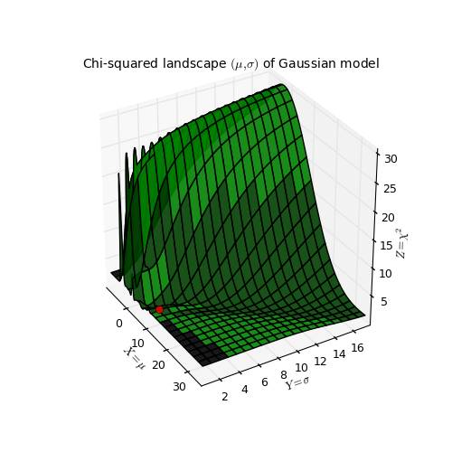
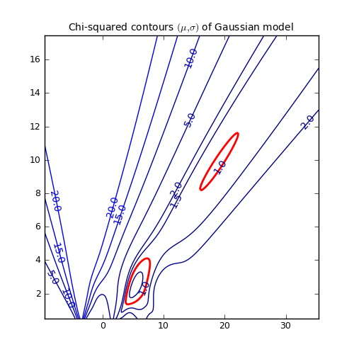
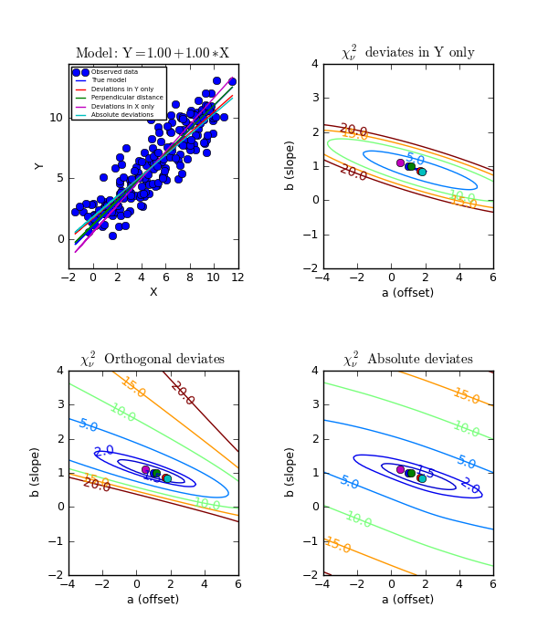

.. _kmpfit_tutorial:
   
Least squares fitting with kmpfit
================================================

.. highlight:: python
   :linenothreshold: 10

.. sectionauthor:: M. Vogelaar <gipsy@astro.rug.nl>

Introduction
------------

In this tutorial we try to show the flexibility of the least squares
fit routine in :mod:`kmpfit` by showing examples and some background
theory which enhance its use. The *kmpfit* module is an excellent tool to demonstrate
features of the least squares fitting theory. It is a Python module
so the examples are simple and almost self explanatory.
The fit routine *kmpfit* has many similar
aspects in common with SciPy's *leastsq* function,
but its interface is a more friendly and flexible.

A least squares fit method is an algorithm that minimizes a so called
*objective function* for N data points :math:`(x_i,y_i), i=0, ...,N-1`.
These data points are measured and often :math:`y_i` has a measurement error
that is much smaller than the error in :math:`x_i`. Then we call *x* the
independent and *y* the dependent variable. In this tutorial we will
also deal with examples where the errors are comparable.

Objective function
+++++++++++++++++++

The method of least squares adjusts the parameters of a model function
*f(parameters, independent_variable)* by finding a minimum of a so called
*objective function*. This objective function is a sum of values:

.. math::
   :label: Objective_function

   S = \sum\limits_{i=0}^{N-1} r_i^2

Objective functions are also called *merit* functions.
Least squares routines also predict what the range of best-fit
parameters will be if we repeat the experiment, which produces the
data points, many times. But it can do that only for objective functions
if they return the (weighted) sum of squared residuals (WSSR). If the
least squares fitting procedure uses measurement errors as weights, then
the is. then the objective function *S*  can be written as a
maximum-likelihood estimator (MLE) and *S* is then called chi square (:math:`\chi^2`).

If we define :math:`\mathbf{p}` as the set of parameters and take *x* for the independent data
then we define a residual as the difference between the actual dependent variable
:math:`y_i` and the value given by the model:

.. math::
   :label: Residuals_function

   r(\mathbf{p}, [x_i,y_i]) = y_i - f(\mathbf{p},x_i)

A model function :math:`f(\mathbf{p},x_i)` could be::

   def model(p, x):       # The model that should represent the data
      a, b = p            # p == (a,b)
      return a + b*x      # x is explanatory variable

A residual function :math:`r(\mathbf{p}, [x_i,y_i])` could be::

   def residuals(p, my_arrays):   # Function needed by fit routine
      x, y, err = my_arrays       # The values for x, y and weights
      a, b = p                    # The parameters for the model function
      return (y-model(p,x))/err   # An array with (weighted) residuals)

One is not restricted to one independent (*explanatory*) variable. For example, 
for a plane the dependent (*response*) variable :math:`y_i`
depends on two independent variables :math:`(x_{1_i},x_{2_i})`

>>>    x1, x2, y, err = my_arrays

The Python variable ``my_arrays`` could also be an object with arrays as attributes.

*kmpfit* needs only a specification of the residuals function :eq:`Residuals_function`.
It defines the objective function *S* itself by squaring the residuals and summing them
afterwards. So if you pass an array with weights :math:`w_i` which are calculated
from :math:`1/\sigma_i^2`, then you need to take the square root of these numbers
first as in::

   def residuals(p, my_arrays):   # Function needed by fit routine
      x, y, w = my_arrays         # The values for x, y and weights
      a, b = p                    # The parameters for the model function
      w = numpy.sqrt(w)           # kmpfit does the squaring
      return w*(y-model(p,x))     # An array with (weighted) residuals)

It is more efficient to store the square root of the weights beforehand so that
it is not necessary to repeat this (often many times) in the residuals function
itself. This is different if your weights depend on the model parameters,
which are adjusted in the iterations to get a best-fit. An example is the
residuals function for an orthogonal fit of a straight line::

   def residuals(p, data):
      # Residuals function for data with errors in both coordinates
      a, theta = p
      x, y = data
      B = numpy.tan(theta)
      wi = 1/numpy.sqrt(1.0 + B*B)
      d = wi*(y-model(p,x))
      return d

.. note::

   For *kmpfit*, you need only to specify a residuals function.
   The least squares fit method in *kmpfit* does the squaring and summing
   of the residuals.

Linearity
++++++++++

For many least squares fit problems we can use analytical methods to find
the best-fit parameters. This is the category of linear problems.
For linear least-squares problems (LLS) the second and higher derivatives of the fitting
function with respect to the parameters are zero. If this is not true then
the problem is a so called non-linear least-squares problem (NLLS). We use *kmpfit*
to find best-fit parameters for both problems and use the analytical methods
of the first category to check the output of *kmpfit*.
An example of a LLS problem is finding the best fit parameters of the model:

.. math::
   :label: linearexample

   f(a,x) = a\, \sin(x)

   \frac{\partial f}{\partial a} = \sin(x)\,  \Rightarrow \frac{\partial^2 f}{\partial a^2} = 0

An example of a NLLS problem is finding the best fit parameters of the model:

.. math::
   :label: nonlinearexample

   f(a,x) = \sin(a\,x)

   \frac{\partial f}{\partial a} = x\cos(a\,x)\, \Rightarrow \frac{\partial^2 f}{\partial a^2} \neq 0

A well known example of a model that is non-linear in its parameters, is a
function that describes a Gaussian profile as in::

   def my_model(p, x):
      A, mu, sigma, zerolev = p
      return( A * numpy.exp(-(x-mu)*(x-mu)/(2.0*sigma*sigma)) + zerolev )

.. note::

   In the linear case, parameter values can be determined analytically with
   straightforward linear algebra.
   *kmpfit* finds best-fit parameters for models that are either linear or non-linear
   in their parameters. If efficiency is an issue, one should find and apply
   an analytical method.

In the linear case, parameter values can be determined by comparatively simple linear
algebra, in one direct step.

Goal
+++++++

The function that we choose is based on a model which should describe the data
so that *kmpfit* finds best-fit values for the free parameters in this model.
These values can be used for interpolation or prediction of data based
on the measurements and the best-fit parameters.
*kmpfit* varies the values of the free parameters until it finds a set of
values which minimize the objective function. Then, either it stops and
returns a result because it found these *best-fit* parameters, or it
stops because it met one of the stop criteria in *kmpfit* (see next section).
Without these criteria, a fit procedure that is not converging would never stop.

Later we will discuss a familiar example for astronomy when we find best-fit
parameters for a Gaussian to find the characteristics of a profile like
the position of the maximum and the width of a peak.

Stop criteria
++++++++++++++

LLS and NLLS problems are solved by *kmpfit* by an iterative procedure.
The fit routine attempts to find the minimum by doing a search. Each iteration
gives an improved set of parameters and the sum of the squared residuals is
calculated again. *kmpfit* is based on the C version of *mpfit* which
uses the Marquardt-Levenberg algorithm to select the parameter values for the
next iteration. These iterations are repeated until a criterion is met.
They are set with parameters for the constructor of the *Fitter*
object in *kmpfit* or with the appropriate attributes. From the documentation
of the original C code we copy:

   * ``ftol`` - a nonnegative input variable. Termination occurs when both
     the actual and predicted relative reductions in the sum of
     squares are at most ``ftol``.  Therefore, ``ftol`` measures the
     relative error desired in the sum of squares.
     The default is: 1e-10

   * ``xtol`` - a nonnegative input variable. Termination occurs when the
     relative error between two consecutive iterates is at most
     ``xtol``. therefore, ``xtol`` measures the relative error desired
     in the approximate solution.
     The default is: 1e-10

   * ``gtol`` - a nonnegative input variable. Termination occurs when the
     cosine of the angle between *fvec* (is an internal input array which
     must contain the functions evaluated at x)
     and any column of the
     Jacobian is at most ``gtol`` in absolute value. Therefore, ``gtol``
     measures the orthogonality desired between the function
     vector and the columns of the Jacobian.
     The default is: 1e-10

   * ``maxiter`` - Maximum number of iterations. The default is: 200

   * ``maxfev`` - Maximum number of function evaluations.
     The default is: 0 (no limit)

A ``Fitter`` object
++++++++++++++++++++++

After we defined a residuals function, we need to create a Fitter object.
A Fitter object is an object of class **Fitter**. This object tells the fit
procedure which arrays should be passed to the residuals function. So it needs
the name of the residuals function and an object that sets the arrays
with data. In most of our examples we will use a tuple with references to arrays.
Assume we have a residuals function called *residuals* and two arrays *x* and *y*
with data from a measurement, then a ``Fitter`` object is created by::

   fitobj = kmpfit.Fitter(residuals=residuals, data=(x,y))

Note that the *fitobj* is an arbitrary name. You need it to retrieve the results
of the fit.
The real fit is started when we call method ``fit``. This is now a method
of object ``fitobj``. The fit procedure needs start values. Often the fit
procedure is not sensitive to these values and you can enter 1 as a value
for each parameter. But there are also examples where these *initial estimates*
are important. Starting with values that are not close to the best-fit
parameters could result in a solution that is a local minimum and not
a global minimum.

If you imagine a surface which is a function of parameter values and heights
given by the the sum of the residuals as function of these parameters and this surface
shows more than one minimum, you must be sure that you start your
fit nearby the global minimum.

**Example:** :download:`kmpfit_chi2landscape_gauss.py <EXAMPLES/kmpfit_chi2landscape_gauss.py>`
**- Chi-squared landscape for model that represents a Gaussian profile**

The figure shows the parameter landscape for a model that represents a Gaussian.
The landscape axes are model parameters the position of the peak :math:`\mu` and
:math:`\sigma` which is a measure for the width of the peak (half width at 1/e of
peak). The relation between
:math:`\sigma` and the the full width at half maximum (FWHM) is:
:math:`\mathrm{FWHM} = 2\sigma \sqrt{2ln2} \approx 2.35\, \sigma`.
If you imagine this landscape as a solid surface and release a marble, then it
rolls to the real minimum (red dot in the figure) only if you are not too
far from this minimum.
If you start for example in the front right corner, the marble will never end in the real
minimum. Note that the parameter space is in fact 4 dimensional (4 free parameters)
and therefore more complicated than this example.
In the figure we scaled the value for chi-squared to avoid the labeling of big
numbers. From Matplotlib version 1.1.0 it is possible to format also labels
along the z-axis.

Another representation of the parameter space is a contour plot. It is created
by the same example code:

These contour plots are very useful when you compare different objective functions.
For instance if you want to compare an objective function for orthogonal fitting
with an an objective function for robust fitting.

**Example:** :download:`kmpfit_contours_objfunc.py <EXAMPLES/kmpfit_contours_objfunc.py>`
**- Comparing objective functions with contour plots**

A model which represents a straight line, always shows a very simple landscape
with only one minimum. Wherever you release the marble, you will always end
up in the real minimum.
Then, the quality of the values of the initial estimates are not important to
the quality of the fit result. 

The initial estimates are entered in parameter ``params0``. You can enter this
either in the constructor of the ``Fitter`` object or in the method ``fit()``.
In most examples we use the latter because it becomes obvious that one can repeat
the same fit with different initial estimates::

   fitobj.fit(params0=[1,1])

The results are stored in the attributes of *fitobj*.
For example the best-fit parameters are stored in ``fitobj.params``.
For a list of all attributes and their meaning, see the documentation
of :mod:`kmpfit`.

An example of an overview of the results could be::

   print "Fit status: ", fitobj.message
   print "Best-fit parameters:      ", fitobj.params
   print "Covariance errors:        ", fitobj.xerror
   print "Standard errors           ", fitobj.stderr
   print "Chi^2 min:                ", fitobj.chi2_min
   print "Reduced Chi^2:            ", fitobj.rchi2_min
   print "Iterations:               ", fitobj.niter
   print "Number of function calls: ", fitobj.nfev
   print "Number of free pars.:     ", fitobj.nfree
   print "Degrees of freedom:       ", fitobj.dof
   print "Number of pegged pars.:   ", fitobj.npegged

We wrote a section about the use and interpretation of parameter errors
in :ref:`standard_errors`.
In the next chapter we will put the previous information together and compile a
complete example.

A Basic example
-------------------

In this section we explain how to setup a residuals function for *kmpfit*.
We use vectorized functions written with :term:`NumPy`.

The residual function
+++++++++++++++++++++++++

Assume we have data for which we know that the relation between X
and Y is a straight line with offset *a* and slope *b*,
then a model :math:`f(\mathbf{p},\mathbf{x})`
could be written in Python as::

   def model(p, x):
      a,b = p
      y = a + b*x
      return y

Parameter ``x`` is a NumPy array and ``p`` is an array with model
parameters *a* and *b*. This function calculates response Y values
for a given set of parameters and an array with explanatory X values.

Then it is simple to define the residuals function :math:`r(\mathbf{p}, [x_i,y_i])`
which calculates the
residuals between data points and model::

   def residuals(p, data):
      x, y = data
      return y - model(p,x)

This residuals function has always two parameters.
The first one is ``p`` which is an array
with parameter values in the order as defined in your model, and ``data``
which is an object that stores the data arrays that you need in your residual function.
The object could be anything but a list or tuple is often most practical to store
the required data. We will explain a bit more about this object when we discuss
the constructor of a *Fitter* object.
We need not worry about the sign of the residuals because the
fit routine calculates the the square of the residuals itself.

Of course we can combine both
functions ``model`` and ``residuals`` in one function.
This is a bit more efficient in Python,
but usually it is handy to have the model function available if you  need
to plot the model using different sets of best-fit parameters.

.. note::

   A residuals function should always return a NumPy double-precision floating-point number
   array (i.e. dtype='d'). If your data in argument ``data`` is a list or is an array
   with single precision floating point numbers, you need to convert the result to
   the required type.

.. note::

   It is also possible to write residual functions that represent objective
   functions used in orthogonal fit procedures
   where both variables **x** and **y** have errors.

Artificial data for experiments
+++++++++++++++++++++++++++++++

For experiments with least square fits, it is often convenient to start with artificial data
which resembles the model with certain parameters, and add some Gaussian distributed
noise to the y values.
This is what we have done in the next couple of lines:

The number of data points and the mean and width of the normal distribution 
which we use to add some noise::

   N = 50
   mean = 0.0; sigma = 0.6

Finally we create a range of x values and use our model with arbitrary model parameters
to create y values::

   xstart = 2.0; xend = 10.0
   x = numpy.linspace(3.0, 10.0, N)
   paramsreal = [1.0, 1.0]
   noise = numpy.random.normal(mean, sigma, N)
   y = model(paramsreal, x) + noise

Initial parameter estimates
++++++++++++++++++++++++++++

Now we have to tell the constructor of the `Fitter` object what the 
residuals function is and which arrays the residuals function needs.
To create a Fitter object we use the line::

   fitobj = kmpfit.Fitter(residuals=residuals, data=(x,y))

Least squares fitters need initial estimates of the model parameters.
As you probably know, our problem is an example of 'linear regression' and this
category of models have best fit parameters that can be calculated analytically.
Then the fit results are not very sensitive to the initial values you supply.
So set the values of our initial parameters in the model (a,b) to (0,0). Use these values 
in the call to :meth:`Fitter.fit`. The result of the fit is stored in attributes 
of the Fitter object (`fitobj`). We show the use of attributes
`status`, `message`, and `params`. This last attribute stores the 'best fit' parameters,
it has the same type as the sequence with the initial parameter (i.e. NumPy array, list or tuple)::

   paramsinitial = (0.0, 0.0)
   fitobj.fit(params0=paramsinitial)
   if (fitobj.status <= 0):
      print 'Error message = ', fitobj.message
   else:
      print "Optimal parameters: ", fitobj.params

Below we show a complete example. If you run it, you should get a plot like the one
below the source code. It will not be exactly the same because we used a random number generator
to add some noise to the data. The plots are created with Matplotlib. A plot is
a simple but effective tool to qualify a fit. For most of the examples in this
tutorial we added a plot.

**Example: kmpfit_example_simple.py - Simple use of kmpfit**

.. plot:: EXAMPLES/kmpfit_example_simple.py
   :include-source:
   :align: center

Function ``simplefit()``
-----------------------------

For simple fit problems we provided a simple interface.
It is a method which is used  as follows:

>>> p0 = (0,0)
>>> fitobj = kmpfit.simplefit(model, p0, x, y, err=err, xtol=1e-8)
>>> print fitobj.params

Argument ``model`` is a function, just like the model in the previous section. 
``p0`` is a sequence with initial values with length equal to the number of parameters
that defined in your model. Argument ``x`` and ``y`` are the arrays or lists that represent 
you measurement data. Argument ``err`` is an array with 1 :math:`\sigma` errors,
one for each data point. Then you can enter values to tune the fit routine
with keyword arguments (e.g. *gtol*, *xtol*, etc.).
In the next example we demonstrate how to use lists for your data points, 
how to make an unweighted fit and how to print the right parameter uncertainties.
For an explanation of parameter uncertainties, see section :ref:`standard_errors`.

The advantages of this method:

  * You need only to worry about a model function
  * No need to create a *Fitter* object first
  * Direct input of relevant arrays
  * As a result you get a Fitter object with all the attributes
  * It is (still) possible to tune the fit routine with keyword arguments,
    no limitations here.

**Example:** :download:`kmpfit_example_easyinterface.py <EXAMPLES/kmpfit_example_easyinterface.py>`
**- Simple method**

.. literalinclude:: EXAMPLES/kmpfit_example_easyinterface.py

.. _standard_errors:

Standard errors of best-fit values
----------------------------------
   
With the estimation of errors on the best-fit parameters we get an idea how
good a fit is. Usually these errors are called standard errors, but often
programs call these errors also standard deviations. For nonlinear least-squares routines,
these errors are based on mathematical simplifications and are therefore often called
*asymptotic* or *approximate* standard errors.

The standard error (often denoted by SE) is a measure of the average amount that
the model over- or under-predicts.

According to [Bev]_ , the standard error is an uncertainty which corresponds to an
increase of :math:`\chi^2` = 1. That implies that if we we add the standard error
:math:`\sigma_i` to
its corresponding parameter, fix it in a second fit and fit again, the value of
:math:`\chi^2` will be increased by 1.

.. math::
   :label: bevington11_31

   \chi^2(p_i+\sigma_i) = \chi^2(p_i) + 1

The next example shows this behaviour. We tested it with the first parameter fixed and 
a second time with the second parameter fixed. The example also shows how to set
parameters to 'fixed' in *kmpfit*.
The model is a straight line. If you run
the example you will see that it shows exactly the behaviour as in 
:eq:`bevington11_31`. This proves that the covariance matrix (explained later)
of *kmpfit* can be used to
derive standard errors.
Note the use of the ``parinfo`` attribute of the *Fitter* object to fix 
parameters. One can use an index to set values for one parameter or one can set
the values for all parameters. These values are given as a Python dictionary.
An easy way to create a dictionary is to use Python's ``dict()`` function.

**Example:** :download:`kmpfit_errors_chi2delta.py <EXAMPLES/kmpfit_errors_chi2delta.py>`
- Meaning of asymptotic errors

.. literalinclude:: EXAMPLES/kmpfit_errors_chi2delta.py

The results for an arbitrary run::

   ======== Results kmpfit for Y = A + B*X =========
   Params:         [2.0104270702631712, 2.94745915643011]
   Errors from covariance matrix         :  [ 0.05779471  0.06337059]
   Uncertainties assuming reduced Chi^2=1:  [ 0.04398439  0.04822789]
   Chi^2 min:      56.7606029739
   
   Fix first parameter and set its value to fitted value+error
   Params:         [2.0682217814912143, 2.896736695408106]
   Chi^2 min:      57.7606030002
   Errors from covariance matrix         :  [ 0.          0.03798767]
   
   Fix second parameter and set its value to fitted value+error
   Params:         [1.9641675954511788, 3.0108297500339498]
   Chi^2 min:      57.760602835
   Errors from covariance matrix         :  [ 0.0346452  0.       ]

As you can see, the value of chi-square has increased with ~1. 

Standard errors in Weighted fits
++++++++++++++++++++++++++++++++++

In the literature [Num]_ we can find analytical expressions for the standard errors
of weighted fits for standard linear regression. We want to discuss the
derivation of analytical errors for weighted fits to demonstrate that these errors
are also represented by the elements of the so called variance-covariance matrix
(or just covariance matrix),
which is also a result of a fit with *kmpfit* (attribute ``Fitter.covar``).
How should we interpret these errors? For instance in Numerical Recipes, [Num]_
we find the expressions for the best fit parameters of a model :math:`y=a+bx`

Define:

.. math::
   :label: numrep_linear1

   S \equiv \sum_{i=0}^{N-1} \frac{1}{\sigma_i^2}\ \ S_x \equiv \sum_{i=0}^{N-1} \frac{x_i}{\sigma_i^2} \ \ S_y \equiv \sum_{i=0}^{N-1} \frac{y_i}{\sigma_i^2}\\
   S_{xx} \equiv \sum_{i=0}^{N-1} \frac{x_i^2}{\sigma_i^2}\ \ S_{xy} \equiv \sum_{i=0}^{N-1} \frac{x_iy_i}{\sigma_i^2}

One can solve for the best-fit parameter with the equations:

.. math::
   :label: numrep_linear

   aS + bS_x = S_y\ \ \ aS_x + bS_{xx} = S_{xy}

which is in matrix notation:

.. math::
   :label: equationmatrix

   \begin{bmatrix} S & S_x\\ S_x & S_{xx}\end{bmatrix} \begin{pmatrix} a \\ b\end{pmatrix} =\begin{pmatrix}S_y\\ S_{xy}\end{pmatrix}

If we define:

.. math::
   :label: covariancematrix

   C = \frac{1}{SS_{xx} - (S_x)^2}\begin{bmatrix} S_{xx} & -S_x\\ -S_x & S\end{bmatrix}

which gives the solution:

.. math::
   :label: lsqsolution

   \begin{pmatrix} a \\ b\end{pmatrix} = C \begin{pmatrix}S_y\\ S_{xy}\end{pmatrix}

Define:

.. math::
   :label: numrep_linear3

   \Delta \equiv SS_{xx} - (S_x)^2

The solutions for *a* and *b* are:

.. math::
   :label: numrep_linear4

   a = \frac{S_{xx}S_y - S_xS_{xy}}{\Delta}\\
   b = \frac{S_{}S_{xy} - S_xS_{y}}{\Delta}

For the standard errors we will derive the error in parameter *a* and *b*.
The error in *a* is by the law of propagation of errors:

.. math::
   :label: properrors

   \sigma_a^2 = \sum_{i} \sigma_i^2 \left(\frac{\partial{a}}{\partial{y_i}}\right)^2

From :eq:`numrep_linear4` and :eq:`numrep_linear1` we derive:

.. math::
   :label: parderivA

   \frac{\partial{a}}{\partial{y_i}} = \frac{\frac{S_{xx}}{\sigma_i^2}-\frac{S_xx_i}{\sigma_i^2} }{\Delta}= \frac{S_{xx}-S_xx_i}{\sigma_i^2\Delta}

With :eq:`properrors` we find

.. math::
   :label: deriverrorA

   \sigma_a^2  &=  \sum_{i} \sigma_i^2 \left(\frac{\partial{a}}{\partial{y_i}}\right)^2 \\
               &=  \sum_{i} \sigma_i^2 \left( \frac{S_{xx}-S_xx_i}{\sigma_i^2\Delta} \right)^2 \\
               &=  \frac{1}{\Delta^2}\left\{ S_{xx}^2\Sigma\frac{1}{\sigma_i^2} -2S_xS_{xx} \Sigma\frac{x_i}{\sigma_i^2} + S_x^2\Sigma\frac{x_i^2}{\sigma_i^2}\right\} \\
               &=  \frac{1}{\Delta^2}\left\{S_{xx}^2S-2S_xS_{xx}S_x+S_{xx}S_x^2 \right\} \\
               &=  \frac{1}{\Delta^2}\left\{S_{xx}(S_{xx}S-S_x^2)\right\} \\
               &=  \frac{1}{\Delta^2}S_{xx}\Delta \\
               &=  \frac{S_{xx}}{\Delta}

Applying the same procedure to *b*:

.. math::
   :label: parderivB

   \frac{\partial{b}}{\partial{y_i}} = \frac{\frac{Sx_i}{\sigma_i^2}-\frac{S_x} {\sigma_i^2}}{\Delta}=\frac{Sx_i-S_x}{\sigma_i^2\Delta}

With :eq:`properrors` we find

.. math::
   :label: deriverrorB

   \sigma_b^2  &=  \sum_{i} \sigma_i^2 \left(\frac{\partial{b}}{\partial{y_i}}\right)^2 \\
               &=  \sum_{i} \sigma_i^2 \left( \frac{S_xx_i-S_x}{\sigma_i^2\Delta} \right)^2 \\
               &=  \frac{1}{\Delta^2}\left\{ S^2\Sigma\frac{x_i^2}{\sigma_i^2} -2S_xS \Sigma\frac{x_i^2}{\sigma_i^2} + S_x^2\Sigma\frac{x_i^2}{\sigma_i^2}\right\} \\
               &=  \frac{1}{\Delta^2}\left\{S^2S-2S_xSS_x+S_x^2S \right\} \\
               &=  \frac{1}{\Delta^2}\left\{S(S_{xx}S-S_x^2)\right\} \\
               &=  \frac{1}{\Delta^2}S\Delta \\
               &=  \frac{S}{\Delta}

To summarize:

.. math::
   :label: deriverrorAB

   \boxed{\sigma_a = \sqrt{\frac{S_{xx}}{\Delta}}}

   \boxed{\sigma_b = \sqrt{\frac{S}{\Delta}}}

A classical implementation to find analytical best-fit parameters using NumPy
is as follows::

   def lingres(xa, ya, err):
      w = numpy.where(err==0.0, 0.0, 1.0/(err*err))
      sum   =  w.sum()
      sumX  = (w*xa).sum()
      sumY  = (w*ya).sum()
      sumX2 = (w*xa*xa).sum()
      sumY2 = (w*ya*ya).sum()
      sumXY = (w*xa*ya).sum()
      delta = sum * sumX2 - sumX * sumX
      a = (sumX2*sumY - sumX*sumXY) / delta
      b = (sumXY*sum - sumX*sumY) / delta
      siga = numpy.sqrt(abs(sumX2/delta))
      sigb = numpy.sqrt(abs(sum/delta))
      return a, b, siga, sigb, delta, sum, sumX2, sumX

Note that these formulas are susceptible to roundoff error and Numerical Recipes
derives alternative formulas (Section 15.2). However, our functions work
with double precision numbers and we didn't (yet) encounter a situation where
roundoff errors were obvious.

If we compare these results with the elements of the covariance matrix in
:eq:`covariancematrix`, then we observe that the expressions for the
parameter variances, are the square root of the diagonal values of this matrix.
The co-variance between *a* and *b* can be calculated also
and the formula turn out to be the same as the
off diagonal elements of the covariance matrix. This value is:

.. math::
   :label: covariance

    \mathrm{Cov}(a,b) = C_{12} = C_{21} = \frac{-S_x}{\Delta}

It is easy to demonstrate that these errors are the same as those we find with
*kmpfit* in attribute ``xerror``, which are the square-root diagonal values of
the covariance matrix in attribute ``covar``.

The covariance matrix elements :math:`C_{jk}` for best-fit parameters
**p** can be written as:

.. math::
   :label: covarianceelements

   C_{jk} = \sum\limits_{i=0}^{i=N} \sigma_i \left(\frac{\partial p_j}{\partial y_i}\right) \left(\frac{\partial p_k}{\partial y_i}\right)

where we used *j* to indicate the matrix row and *k* the matrix column.
If *j=k* then:

.. math::
   :label: covariance_error

   C_{jj} = \sum\limits_{i=0}^{i=N} \sigma_i \left(\frac{\partial p_j}{\partial y_i}\right)^2

from which follows that the square root of the diagonal elements of the covariance matrix
are the estimates of the best-fit parameter uncertainties.

.. note::

   * Parameter variances and covariance between parameters can be read from a
     covariance matrix. This is true for any model, not just a straight line.
     It is also true for models that are non-linear in their parameters.
   * The covariance matrix C is in stored as an attribute of the 'kmpfit.Fitter' object
     The attribute is called ``covar``.
   * Error estimates for best-fit parameter are stored as an attribute of
     the 'kmpfit.Fitter' object.
     The attribute is called ``xerror``

Example program :download:`kmpfit_linearreg.py <EXAMPLES/kmpfit_linearreg.py>`
compares the analytical covariance matrix with the *kmpfit* version for
linear regression, using the previously derived formulas  in this section.
The output of an arbitrary example run demonstrates the similarity between the
analytical and the *kmpfit* method:

**Example:** :download:`kmpfit_linearreg.py <EXAMPLES/kmpfit_linearreg.py>`
**- Compare output analytical method and kmpfit**

::

   -- Results analytical solution:
   Best fit parameters:                         [0.57857142857143595, 5.5285714285714258]
   Parameter errors weighted fit:               [0.84515425472851657, 0.1889822365046136]
   Parameter errors un-/relative weighted fit:  [1.0696652156022404, 0.2391844135253578]
   Minimum chi^2:                               8.00928571429
   Covariance matrix:
   0.714285714286 -0.142857142857
   -0.142857142857 0.0357142857143

   -- Results kmpfit:
   Best-fit parameters:                         [0.57857145533008425, 5.5285714226701863]
   Parameter errors weighted fit:               [ 0.84515434  0.18898225]
   Parameter errors un-/relative weighted fit:  [ 1.06966532  0.23918443]
   Minimum chi^2:                               8.00928571429
   Covariance matrix:
   [[ 0.71428585 -0.14285717]
   [-0.14285717  0.03571429]]

We observe:

   * The analytical values of the best-fit parameters and those from *kmpfit*
     correspond. The same applies to the errors for the unweighted fit/fit with
     relative weights.

When to use weights?
+++++++++++++++++++++

Sometimes there is a good reason to use a fit method that can deal with weights.
Usually you assign weights if you have additional knowledge about your measurements.
Some points get more weight if they are more reliable than others. Therefore you should
expect that the best-fit parameters are different between weighted and un-weighted
fits. Also the accuracy of the results will improve, because besides the
data you are using the quality of the data (weights).
The difference in best-fit parameters and the quality of the results are shown
with program :download:`kmpfit_compare_wei_unwei.py <EXAMPLES/kmpfit_compare_wei_unwei.py>`

**Example:** :download:`kmpfit_compare_wei_unwei.py <EXAMPLES/kmpfit_compare_wei_unwei.py>`
**- Compare output for unweighted (unit weighting) and weighted fit**

::

   Data x: [ 1.  2.  3.  4.  5.  6.  7.]
   Data y: [  6.9   11.95  16.8   22.5   26.2   33.5   41.  ]
   Errors: [ 0.05  0.1   0.2   0.5   0.8   1.5   4.  ]

   -- Results kmpfit unit weighting wi=1.0:
   Best-fit parameters:                         [0.57857145533008425, 5.5285714226701863]
   Parameter errors weighted fit:               [ 0.84515434  0.18898225]
   Minimum chi^2:                               8.00928571429
   Covariance matrix:
   [[ 0.71428585 -0.14285717]
   [-0.14285717  0.03571429]]

   -- Results kmpfit with weights:
   Best-fit parameters:                         [1.8705399823164173, 5.0290902421858439]
   Parameter errors weighted fit:               [ 0.09922304  0.06751229]
   Minimum chi^2:                               4.66545480308
   Covariance matrix:
   [[ 0.00984521 -0.00602421]
   [-0.00602421  0.00455791]]

If you examine the residuals function in this program, you will observe
that we use a weight of :math:`1/err_i` in the residuals function, which is squared by *kmpfit*,
so in fact the weighting is  :math:`1/\sigma_i^2`.
First we set all the errors to 1.0. This is called *unit weighting* and effectively
this fit does not weight at all.
The second fit has different weights.
Important is the observation that these weights can be relative.
Then they contain information about the quality of the data but do not necessarily
contain correct information about the errors on the data points and therefore
give incorrect errors on the parameter estimates.
This is shown in the same
program :download:`kmpfit_compare_wei_unwei.py <EXAMPLES/kmpfit_compare_wei_unwei.py>`
where we scaled the errors with a factor 10. The errors in the parameter estimates
are increased with a factor 10.

**Example:** :download:`kmpfit_compare_wei_unwei.py <EXAMPLES/kmpfit_compare_wei_unwei.py>`
**- Compare output for unweighted (unit weighting) and weighted fit**

::

   -- Results kmpfit with scaled individual errors (factor=10):
   Best-fit parameters:                         [1.870539984453957, 5.0290902408769238]
   Parameter errors weighted fit:               [ 0.99223048  0.6751229 ]
   Minimum chi^2:                               0.0466545480308
   Covariance matrix:
   [[ 0.98452132 -0.60242076]
   [-0.60242076  0.45579092]]

This demonstrates that if weights are relative or when unit weighting is
applied, one cannot rely on the covariance errors to represent real
errors on the parameter estimates. The covariance errors are still
based on a change in :math:`\chi^2` of 1.0, but the weights do not
represent the variances of the data correctly.

To summarize the weighting schemes:

   * *Unweighted* or *unit weighting*. Set  :math:`w_i=1/\sigma_i^2` to 1.0
   * *Relative weighting*. Set :math:`w_i=1/\sigma_i^2` but the errors on
     the parameter estimates in *kmpfit*'s attribute ``xerror`` cannot
     be used.
   * *Statistical weighting*. Set :math:`w_i=1/\sigma_i^2`. The errors on
     the parameter estimates in *kmpfit*'s attribute ``xerror`` are correct.
     An important assumption of this method is that the error distribution
     of the measured data is Gaussian and that the data errors are
     measured accurately (absolute uncertainties).
   * Other weighting schemes like Poisson weighting :math:`w_i=1/y_i`

Reduced chi squared
+++++++++++++++++++++

From the theory of maximum likelihood we find that for a least squares solution
we need to maximize the probability that a measurement :math:`y_i` with given
:math:`\sigma_i` is in a
a small interval :math:`dy_i` around :math:`y_i` by minimizing the sum
chi squared [Ds1]_ :

.. math::
   :label: maximumlikelihood

   \chi^2 = \sum\limits_{i}^{} {\left(\frac{\Delta y_i}{\sigma_i}\right)}^2 = \sum\limits_{i}^{} \frac{({y_i-f(x_{i}))}^2}{\sigma_i^2}

with:

   * N is the number of data points
   * :math:`y_i` the measured data at  :math:`x_i`
   * :math:`\sigma_i` is the standard deviation of measurement i
   * f is the model for which we want to find the best-fit parameters.

The sum is often called chi squared because it follows the :math:`\chi^2` distribution
if we repeat the experiment to get new measurements.
The expectation value of :math:`\chi^2` is
(see proof in [Ds3]_):

.. math::
   :label: expectationchi2

   \langle \chi^2 \rangle = N - n

where *n* is the number of free parameters in the fit. The *reduced* chi squared
:math:`\chi_{\nu}^2` is defined as:

.. math::
   :label: reducedchi2

   \chi^2_{\nu} = \frac{\chi^2}{N - n} = \frac{\chi^2}{\nu}

where :math:`\nu = N-n`. From :eq:`expectationchi2` we derive for the
expectation value of :math:`\chi_{\nu}^2`:

.. math::
   :label: expectationreducedchi2

   \langle \chi^2_{\nu} \rangle = 1

Fitting with :eq:`maximumlikelihood` as objective function is often called
chi squared fitting. The value of :math:`\chi^2_{\nu}` is a measure of
the *goodness of fit* and is returned by *kmpfit* in a Fitter object as
attribute ``rchi2_min``. The number of degrees of freedom is stored
in attribute ``dof``.

.. note::

   *  :math:`\chi_{\nu}^2` follows the chi square statistic. This statistic measures
      both the spread of the data and the accuracy of the fit.
   *  The reduced chi squared  :math:`\chi_{\nu}^2` is a measure of the goodness of fit.
      Its expectation value is 1. 
   *  A value of :math:`\chi_{\nu}^2 \approx 1` indicates
      that there is a match between measurements, best-fit parameters and error variances.
   *  A large value of :math:`\chi_{\nu}^2` (e.g. > 1.5) indicates a poor model fit.
   *  A :math:`\chi_{\nu}^2 < 1` indicates that probably the error variance has been over-estimated.
   *  A :math:`\chi_{\nu}^2 > 1` indicates that probably the error variance has been under-estimated.

In the literature we find relations between the standard deviation of the sample
and the true standard deviation of the underlying distribution . For least squares
analysis we replace the average value of *y* (i.e. :math:`\bar{y}`) in those
formulas by the model with the best-fit parameters :math:`f(p,x)`.

What should we expect of the variance :math:`\sigma_i` compared to the
sample deviations for each sample point?
Assume we have N data points and each data point has an individual error of
:math:`\sigma_i`.
From :eq:`expectationchi2` we have:

.. math::
   :label: expectationreducedchi2_2

   \left\langle \sum\limits_{i=0}^{N-1} \frac{\big(y_i-f(x_i)\big)^2}{\sigma_i^2} \right\rangle = N-n

With the observation that the expectation value of each of the *N* terms is the same
we derive for each data point:

.. math::
   :label: expectationdatapoint

   \left\langle \big(y_i-f(x_i)\big)^2\right\rangle = (1-\frac{n}{N}) \sigma_i
   
So for a good fit the true deviation of a measurement :math:`\sigma_i`
for large *N* is almost equal to the deviation between data point and fit.
The less the scatter of data about the best fit, the smaller :math:`\sigma_i`
should be.

The *sample variance*, :math:`s_y^2` is then written as [Ds2]_ :

.. math::
   :label: standarddeviation

   s_y^2 = \frac{1}{N-n} \sum\limits_{i}^{} \left(y_i-f(x_i)\right)^2

If we replace all :math:`\sigma_i` with :math:`\sigma_y` in equation :eq:`expectationreducedchi2_2`,
then we derive a familiar relationship:

.. math::
   :label: expectationvariance

   \frac{s_y^2}{\sigma_y^2} = \chi_{\nu}\, \rightarrow \, \langle s_y^2 \rangle = \sigma_y^2

so that the value of :math:`s_y^2` of the measurements is an unbiased estimate of the true variance :math:`\sigma_y^2`
of the underlying distribution. For an unbiased estimator, the expected value and the
true value are the same.

The weighted version of the sample variance is defined as:

.. math::
   :label: weightedvariance

   sw_y^2 = \frac{\frac{1}{N-n}\sum\limits_i^{} w_i(y_i-f(x_i))^2 } {\frac{1}{N}\sum\limits_i^{}w_i}
   
If we use :math:`1/\sigma_i^2` as weight, then:

.. math::
   :label: weightedvariance2

   sw_y^2 \times \frac{1}{N}\sum\limits_i^{}\frac{1}{\sigma_i^2} = \chi^2_\nu

Bevington [Bev]_ defines the weighted average of the individual variances
:math:`\bar{\sigma}_i^2` as:

.. math::
   :label: weightedvariance3

   \bar{\sigma}_i^2 = \frac{\frac{1}{N}\sum\limits_i^{}\left(\frac{1}{\sigma_i^2}\sigma_i^2\right)}{\frac{1}{N}\sum\limits_i^{}\frac{1}{\sigma_i^2}} = \frac{1}{\frac{1}{N}\sum\limits_i^{}\frac{1}{\sigma_i^2}}

Then:

.. math::
   :label: varianceratio1

    \frac{sw_y^2}{\bar{\sigma}_i^2} = \chi^2_\nu
   

If we set all weights to the same value :math:`w_i=1/\sigma_y^2` then :math:`sw_y = s_y`
and:

.. math::
   :label: sampleandparentvar

   \frac{s_y^2}{\sigma_y^2}  = \chi^2_\nu

which is consistent with :eq:`expectationvariance`.

For chi squared fitting it is therefore important to have correct values for :math:`\sigma_i`.
Over-estimated values give a :math:`\chi^2_{\nu}` which is smaller than 1 and
under-estimated values give a value bigger than 1 (If you get very large values,
then probably fit and data are not in agreement). If the values for :math:`\sigma_i`
are unreliable then also the error estimates of the best-fit parameters are unreliable,
because they are functions of :math:`\sigma_i` (see e.g. the analytical
expressions for these errors in a linear regression in :eq:`deriverrorAB`).
According to equations :eq:`varianceratio1` and :eq:`sampleandparentvar` it is
reasonable then to scale the values of :math:`\sigma_i` in a way that we
force :math:`\chi^2_{\nu}` to take its expectation value of 1.
Then one gets values for the errors in ``stderr`` which are insensitive
to arbitrary scaling factors of the weights.

We noted earlier that scaling the weights does not change the values of the
best-fit parameters but they affect the values of the parameter error
estimates because they depend on the values of :math:`\sigma_i`.
If for example values of :math:`\sigma_i` are all too small with a factor
2 with respect to those that make :math:`\chi_{\nu} =1`.
Then the errors in the parameter estimates are to small with a
factor 2x2=4 (see e.g. :eq:`deriverrorA` and :eq:`deriverrorB` for
the straight line model).
The value of :math:`\chi_{\nu}` will be 2x2=4. So to correct the
errors on the parameter estimates, we can multiply the variances
with the value of :math:`\chi_{\nu}`.
If we recall equation :eq:`covariance_error`, then we see that this scaling
can be applied to arbitrary models.
This scaling is exactly what happens in *kmpfit* for the values in attribute
``stderr``.

In *kmpfit* we use the unit- or relative weights as given by the user and calculate
the value of :math:`\chi_{\nu}`. The asymptotic standard errors in
``xerror`` are then multiplied by the square root of the value
of :math:`\chi_{\nu}` and stored in attribute ``stderr``. We demonstrate
this with the output of a small example
(:download:`kmpfit_compare_wei_unwei.py <EXAMPLES/kmpfit_compare_wei_unwei.py>`)
with data from [Wol]_:

**Example:** :download:`kmpfit_compare_wei_unwei.py <EXAMPLES/kmpfit_compare_wei_unwei.py>`
**- Compare output for unweighted (unit weighting) and weighted fit**

::

   Data x: [ 1.  2.  3.  4.  5.  6.  7.]
   Data y: [  6.9   11.95  16.8   22.5   26.2   33.5   41.  ]
   Errors: [ 0.05  0.1   0.2   0.5   0.8   1.5   4.  ]

   New array with measurement errors, scaled with factor 0.933091 to give
   a reduced chi-squared of 1.0:
   [ 0.04829832  0.09659663  0.19319327  0.48298317  0.77277307  1.4489495
   3.86386534]

   -- Results kmpfit with scaled individual errors to force red_chi2=1:
   Best-fit parameters:                               [1.8705399822570359, 5.029090242191204]
   Parameter errors using measurement uncertainties:  [ 0.09584612  0.0652146 ]
   Parameter errors unit-/relative weighted fit:      [ 0.09584612  0.0652146 ]
   Minimum chi^2:                                     5.0
   Minimum reduced chi^2:                             1.0
   Covariance matrix:
   [[ 0.00918648 -0.00562113]
   [-0.00562113  0.00425294]]

The next code example is a small script that shows that the scaled error estimates
in attribute ``stderr`` for unit- and relative weighting are realistic if we
compare them to errors found with a Monte Carlo method.
We start with values of :math:`\sigma_i` that are under-estimated. This
results in a value for :math:`\chi_{\nu}` which is too low. The re-scaled
errors in ``stderr`` match with those that are estimated with the Monte-Carlo method.
In the example we used the Bootstrap Method.
The plot shows the fit and the bootstrap distributions of parameter *A* and *B*.
We will explain the Bootstrap Method in the next section.

**Example: kmpfit_unweighted_bootstrap_plot.py - How to deal with unweighted fits**

.. plot:: EXAMPLES/kmpfit_unweighted_bootstrap_plot.py
   :include-source:
   :align: center

Bootstrap Method
++++++++++++++++++

We need to discuss the bootstrap method, that we used in the last script, in some detail.
Bootstrap is a tool which estimates standard errors of parameter estimates
by generating synthetic data sets with samples drawn with replacement from
the measured data and repeating the fit process with this synthetic data.

Your data realizes a set of best-fit parameters, say :math:`p_{(0)}`.
This data set is one
of many different data sets that represent the 'true' parameter set :math:`p_{true}` . 
Each data set will
give a different set of fitted parameters :math:`p_{(i)}`. These parameter sets follow
some probability distribution in the *n* dimensional space of all possible parameter sets.
To find the uncertainties in the fitted parameters we need to know the distribution 
of :math:`p_{(i)}-p_{true}` [Num]_. In Monte Carlo simulations of synthetic data sets
we assume that the shape of the distribution of Monte Carlo set :math:`p_{(i)}-p_{0}` is equal to 
the shape of the real world set :math:`p_{(i)}-p_{true}`

The *Bootstrap Method* [Num]_ uses the data set that you used to find the best-fit parameters.
We generate different synthetic data sets, all with *N* data points, by drawing 
randomly *N* data points, with replacement from the original data.
In Python we realize this as follows::

   indx = randint(0, N, N)    # Do the re-sampling using an RNG
   xr[:] = x[indx]
   yr[:] = y[indx]
   ery[:] = err[indx]

We create an array with randomly selected array indices in the range 0 to *N*.
This index array is used to create new arrays which represent our synthetic data.
Note that for the copy we used the syntax xr[:] with the colon, because we want to
be sure that we are using the same array ``xr``, ``yr`` and ``ery`` each time, because
the fit routine expects the data in these arrays (and not copies of them with the same name).
The synthetic data arrays will consist of about 37 percent duplicates. With these 
synthetic arrays we repeat the fit and find our :math:`p_{(i)}`. If we repeat this
many times (let's say 1000), then we get the distribution we needed. The standard
deviation of this distribution (i.e. for one parameter), gives the uncertainty.

.. note::

   The bigger the data set, the higher the number of bootstrap trials should be
   to get accurate statistics. The best way to find a minimum number is to plot
   the Bootstrap results as in the example.

Notes about weighting
+++++++++++++++++++++++ 

**Unweighted (i.e. unit weighting) and relative weighted fits**

   * For unit- or relative weighting, we find errors that correspond to
     attribute ``stderr`` in *kmpfit*.
   * The errors on the best-fit parameters are scaled (internally) which is
     equivalent to scaling the weights in a way that the value of the reduced chi-squared
     becomes 1.0
   * For unweighted fits, the standard errors from ``Fitter.stderr`` are comparable to
     errors we find with Monte Carlo simulations.

Alper, [Alp]_ states that for some combinations of model, data and weights,
*the standard error estimates from diagonal elements of the covariance
matrix neglect the interdependencies between parameters and lead
to erroneous results*. Often the measurement errors are difficult to obtain precisely,
sometimes these errors are not normally distributed. For this category of
weighting schemes, one should always inspect the covariance matrix (attribute
``covar``) to get an idea how big the covariances are with respect to
the variances (diagonal elements of the matrix).
The off-diagonal elements of the covariance matrix should be
much lower than the diagonal.

**Weighted fits with weights derived from real measurement errors**

   * For weighted fits where the weigths are derived from measurement errors,
     the errors correspond to attribute ``xerror`` in *kmpfit*.
     Only for this type of weights, we get a value of
     (reduced) chi-squared that can be used a a measure of *goodness of fit**.
   * The fit results depend on the accuracy of the measurement errors :math:`\sigma_i.`
   * A basic assumption of the chi-squared objective function is that the error
     distribution of the measured data is Gaussian. If this assumption is
     violated, the value of chi squared does not make sense.
   * The uncertainties given in attribute ``xerror`` and ``stderr`` are the same,
     only when :math:`\chi_{\nu}^2 = 1`

From [And]_ we summarize the conditions which must be met before one can
safely use the values in ``stderr`` (i.e. demanding that :math:`\chi_{\nu} = 1`):
In this approach of scaling, the error in the best-fit parameters
we make three assumptions:

   1) The error distribution has to be Gaussian.
   2) The model has to be linear in all parameters. If the model is
      nonlinear, we cannot demand that :math:`\chi_{\nu} = 1`, because
      the derivation of :math:`\langle\chi\rangle^2=N-n`
      implicitly assumes linearity in all parameters.
   3) By demanding :math:`\chi_{\nu} = 1`, we explicitly claim that the model
      we are using is the **correct** model that was underlying the data.
      This is a rather optimistic claim. This claim requires justification.
   4) Even if all these assumptions above are met, the method is in fact only
      applicable if the degrees of freedom *N-n* is large.
      The reason is that the uncertainty in the measured data
      data does not only cause an uncertainty in the model parameters,
      but also an uncertainty in the value of :math:`\chi^2` itself.
      If *N-n* is small, :math:`\chi^2` may deviate substantially from *N-n* even
      though the model is linear and correct.

The conclusion is that one should be careful with the use of standard errors
in ``stderr``. A Monte Carlo method should be applied to prove that the
values in ``stderr`` can be used.
For weighted fits it is advertised not to use the Bootstrap method.
Experiments show that for weighted fits the Bootstrap results
(errors in the best-fit parameters) are close to the errors in ``stderr``
only when we repeat fits in the Bootstrap procedure with unit weighting.
In the next example we compare the Bootstrap method with weights and without weights.
The example plots all trial results in the Bootstrap procedure.
The yellow lines represent weighted fits in the Bootstrap procedure.
The green lines represent unweighted fits in the Bootstrap procedure.

**Example:** :download:`kmpfit_weighted_bootstrap.py <EXAMPLES/kmpfit_weighted_bootstrap.py>`
**- Compare Bootstrap with weighted and unweighted fits**

::

   ======= Results kmpfit weighted fit =========
   Params:         [-1.1694491304350085, 2.4654432828616515]
   Errors from covariance matrix         :  [ 0.00299542  0.00264989]
   Uncertainties assuming reduced Chi^2=1:  [ 0.06413585  0.0567377 ]
   Chi^2 min:      90771.98002
   Reduced Chi^2:  458.444343535
   Iterations:     3
   Function ev:    7
   Status:         1
   Covariance matrix:  [[  8.97253321e-06   5.98812996e-06]
   [  5.98812996e-06   7.02193663e-06]]

   Bootstrap errors in A, B for procedure with weighted fits: 0.685701834156 0.329034985381
   Bootstrap errors in A, B for procedure with unweighted fits: 0.0556354741114 0.0194388973321

.. plot:: EXAMPLES/kmpfit_weighted_bootstrap.py
   :align: center

*kmpfit* with Explicit partial derivatives
------------------------------------------------

Gaussian profiles
++++++++++++++++++

There are many examples where an astronomer needs to know the characteristics of a Gaussian profile.
Fitting best parameters for a model that represents a Gauss function, is a way to obtain a measure for
the peak value, the position of the peak and the width of the peak. It does not reveal any skewness or
kurtosis of the profile, but often these are not important. We write the Gauss function as:

.. math::
   :label: gaussianfunction

   f(x) = A{e^{-\frac{1}{2} {\left(\frac{x - \mu}{\sigma}\right)}^2}} + z_0

Here :math:`A` represents the peak of the Gauss, :math:`\mu` the mean, i.e. the position of the peak
and :math:`\sigma` the width of the peak. We added :math:`z_0` to add a background to the profile
characteristics. In the early days of fitting software, there were no implementations that did not need
partial derivatives to find the best fit parameters. The fit routine in `kmpfit` is based on
Craig Markwardt's non-linear least squares curve fitting routines for IDL called MPFIT.
It uses the Levenberg-Marquardt technique to solve the least-squares problem,
which is a particular strategy for iteratively searching for the best fit.

Partial derivatives for a Gaussian
+++++++++++++++++++++++++++++++++++++

In the documentation of the IDL version of *mpfit.pro*, the author states that it
is often sufficient and even faster to allow the fit routine to calculate the
derivatives numerically. With explicit partial derivatives
we usually gain an increase in speed of about 20%, at least for fitting Gaussian profiles.
The real danger in using explicit partial derivatives seems to be that one easily makes
small mistakes in deriving the necessary equations. This is not always obvious in test-runs.
For the Gauss function in :eq:`gaussianfunction` we derived the following partial derivatives:

.. math::
   :label: partialderivatives

   \frac{\partial f(x)}{\partial A} &= e^{-\frac{1}{2} {\left(\frac{x - \mu}{\sigma}\right)}^2}\\
   \frac{\partial f(x)}{\partial \mu} &= A{e^{-\frac{1}{2} {\left(\frac{x-\mu}{\sigma}\right)}^2}}. \frac{(x-\mu)}{\sigma^2}\\
   \frac{\partial f(x)}{\partial \sigma} &= A{e^{-\frac{1}{2} {\left(\frac{x-\mu}{\sigma}\right)}^2}}. \frac{{(x-\mu)}^2}{\sigma^3}\\
   \frac{\partial f(x)}{\partial z_0} &= 1

If we want to use explicit partial derivatives in *kmpfit* we need the external residuals
to return the derivative of the model f(x) at x, with respect to any of the parameters.
If we denote a parameter from the set of parameters :math:`P = (A,\mu,\sigma,z_0)`
with index i, then one calculates
the derivative with a function ``FGRAD(P,x,i)``.
In fact, kmpfit needs the derivative of the **residuals** and if we defined the residuals
as ``residuals = (data-model)/err``, the residuals function should return:

.. math::
   :label: dervresidual

   \frac{\partial f(x)}{\partial P(i)} =\frac{ -FGRAD(P,x,i)}{err}

where ``err`` is the array with weights.

Below, we show a code example of how one can implement explicit partial derivatives.
We created a function, called ``my_derivs`` which calculates the derivatives for each
parameter. We tried to make the code efficient but you should be able to recognize
the equations from :eq:`partialderivatives`. The return value is equivalent with :eq:`dervresidual`.
The function has a fixed signature because it is called by the fitter which expects
that the arguments are in the right order. This order is:

   * p
     -List with model parameters, generated by the fit routine
   * a1, a2, ... an
     -References to data in the ``data`` argument in the constructor of the Fitter object.
   * dflags
     -List with booleans. One boolean for each model parameter.
     If the value is ``True`` then an explicit partial derivative is
     required. The list is generated by the fit routine.

There is no need to process the ``dflags`` list in your code. There is no problem if
you return all the derivatives even when they are not necessary.

.. note::

   A function which returns derivatives should create its own work array to store the
   calculated values. The shape of the array should be (parameter_array.size, x_data_array.size).

The function ``my_derivs`` is then::

   def my_derivs(p, data, dflags):
      #-----------------------------------------------------------------------
      # This function is used by the fit routine to find the values for
      # the explicit partial derivatives. Argument 'dflags' is an array
      # with booleans. If an element is True then an explicit partial
      # derivative is required.
      #-----------------------------------------------------------------------
      x, y, err = data
      A, mu, sigma, zerolev = p
      pderiv = numpy.zeros([len(p), len(x)])  # You need to create the required array
      sig2 = sigma*sigma
      sig3 = sig2 * sigma
      xmu  = x-mu
      xmu2 = xmu**2
      expo = numpy.exp(-xmu2/(2.0*sig2))
      fx = A * expo
      for i, flag in enumerate(dflags):
         if flag:
            if i == 0:
               pderiv[0] = expo
            elif i == 1:
               pderiv[1] = fx * xmu/(sig2)
            elif i == 2:
               pderiv[2] = fx * xmu2/(sig3)
            elif i == 3:
               pderiv[3] = 1.0
      return pderiv/-err

Note that all the values per parameter are stored in a row. A minus sign is added to
to the error array to fulfill the
requirement in equation :eq:`dervresidual`.
The constructor of the Fitter object is as follows (the function ``my_residuals`` is
not given here)::

   fitobj = kmpfit.Fitter(residuals=my_residuals, deriv=my_derivs, data=(x, y, err))

The next code and plot show an example of finding and plotting best fit parameters given a Gauss
function as model. If you want to compare the speed between a fit with  explicit partial derivatives
and a fit using numerical derivatives, add a second Fitter object by omitting the ``deriv`` argument.
In our experience, the code with the explicit partial derivatives is about 20% faster because it
needs considerably fewer function calls to the residual function.

**Example: kmpfit_example_partialdervs.py - Finding best fit parameters for a Gaussian model**

.. plot:: EXAMPLES/kmpfit_example_partialdervs.py
   :include-source:
   :align: center

Fitting data when both variables have uncertainties
----------------------------------------------------

Sometimes your data contains errors in the *response* (dependent) variable
y (i.e. we have values for :math:`\sigma_y`) and in the *explanatory* (independent) variable x
(i.e. we have values for :math:`\sigma_x`).
In the next sections we describe a method to use *kmpfit* for this category
of least squares fit problems.

Orthogonal Distance Regression (ODR)
+++++++++++++++++++++++++++++++++++++

Assume we have a model function *f(x)* and on that curve we have a
data point :math:`(\hat{x},\hat{y}) = (\hat{x},f(\hat{x}))` which has the shortest distance to a
data point :math:`(x_i,y_i)`. The distance between those points is:

.. math::
   :label: orthdistance

   D_i(\hat{x}) = \sqrt{{(x_i-\hat{x})}^2 + {(y_i-f(\hat{x}))}^2}

or more general with weights in :math:`\hat{x},\hat{y}`

.. math::
   :label: weighted_orthdistance

   D_i(\hat{x}) = \sqrt{w_{xi}{(x_i-\hat{x})}^2 + w_{yi}{(y_i-f(\hat{x}))}^2}

The problem with this distance function is that it is not usable as an
:term:`Objective Function`
because we don't have the model values for :math:`\hat{x}`. But there is a
condition that can be used to express :math:`\hat{x}` in known variables :math:`x_i`
and :math:`y_i`
Orear [Ore]_ showed that for any model *f(x)* for which

.. math::
   :label:  Taylor

   f(\hat{x}) = f(x_i)+(\hat{x}-x_i)f^{\prime}(x_i)

is a good approximation, we can find an expression for a usable objective function.
:math:`D_i(\hat{x})` has a minimum for :math:`\frac{\partial{D}}{\partial{\hat{x}}} = 0`.
Insert :eq:`Taylor` in :eq:`weighted_orthdistance` and take the derivative to find
the condition for the minimum:

.. math::
   :label: derivative

   \frac{\partial{D}}{\partial{\hat{x}}} = \frac{\partial{}}{\partial{\hat{x}}}\sqrt{w_{xi}{(x_i-\hat{x})}^2 + w_{yi}{(y_i-[f(x_i)+(\hat{x}-x_i)f^{\prime}(x_i)])}^2} = 0

Then one derives:

.. math::
   :label: extra_condition

   -2w_x(x_i-\hat{x})-2w_y\left( y_i-\left [ f(x_i)-(x_i-\hat{x}){f^{\prime}}(x_i)\right]\right ) {f^{\prime}}(x_i) = 0

so that:

.. math::
   :label: extra_condition2

   (x_i-\hat{x}) = \frac{-w_y\big( y_i- f(x_i)\big){f^{\prime}}(x_i) }{w_x+w_y{f^{\prime}}^2(x_i)}

If you substitute this in :eq:`weighted_orthdistance`,
then (after a lot of re-arranging) one finds for the objective function:

.. math::
   :label: Orear

   D_i^2(\hat{x}) \approx \frac{w_{xi}w_{yi}}{w_{xi}+w_{yi}{f^{\prime}}^2(x_i) }{(y_i-f(x_i))}^2

If we use statistical weighting with
weights :math:`w_{xi}=1/{\sigma_{xi}}^2` and :math:`w_{yi}=1/{\sigma_{yi}}^2`,
we can write this as:

.. math::
   :label: common_distance

   \boxed{\chi^2 = \sum\limits_{i=0}^{N-1} D_i^2 = \frac{{\big(y_i-f(x_i)\big)}^2}{\sigma^2_{yi}+\sigma^2_{xi}{f^{\prime}}^2(x_i)}}

Effective variance
+++++++++++++++++++

The method in the previous section can also be explained in another way:
Clutton [Clu]_ shows that for a model function *f*,
the effect of a small error :math:`\delta x_i` in :math:`x_i` is to change the
measured value :math:`y_i` by an amount :math:`f^\prime (x_i) \delta x_i` and that
as a result, the *effective variance* of a data point *i* is:

.. math::
   :label: clutton

   var(i) = var(y_i) + var(f^\prime(x_i)) = \sigma_{y_i}^2 + {f^\prime}^2(x_i) \sigma_{x_i}^2

Best parameters for a straight line
++++++++++++++++++++++++++++++++++++

Equation :eq:`common_distance` can be used to create an objective function.
We sow this for a model which represents a straight line :math:`f(x)=a+bx`.
For a straight line the Taylor approximation :eq:`Taylor` is exact.
This can be seen as follows:
With :math:`f^\prime(x) = b`. The relation :math:`f(x) = f(x_i)+(x-x_i)f^{\prime}(x_i)`
is equal to :math:`f(x) = f(x_i)+(x-x_i)b = a+bx_i+bx-bx_i = a+bx`.

The objective function, chi-square, that needs to be minimized for a straight line
is then:

.. math::
   :label: errorinxandy

   \chi^2 = \sum\limits_{i=0}^{N-1} D_i^2 = \sum\limits_{i=0}^{N-1} \frac{{(y_i-a-bx_i)}^2}{\sigma_{y_i}^2 + \sigma_{x_i}^2 b^2 }

This formula seems familiar. It resembles an ordinary least squares objective
function but with 'corrected' weights in Y.
A suitable residuals function for *kmpfit* is the square root of this
objective function::

   def residuals(p, data):
      a, b = p
      x, y, ex, ey = data
      w = ey*ey + b*b*ex*ex
      wi = numpy.sqrt(numpy.where(w==0.0, 0.0, 1.0/(w)))
      d = wi*(y-model(p,x))
      return d

Pearson's data
++++++++++++++++

Another approach to find the best fit parameters for orthogonal fits of straight lines
starts with the observation that best (unweighted) fitting straight lines for given data points
go through the centroid of the system. This applies to regression of y on x,
regression of x on y and also for the result of an orthogonal fit.

.. note::

   Unweighted best fitting straight lines for given data points
   go through the centroid of the system.

If we express our straight line as :math:`y=b+\tan(\theta)x` and substitute the
coordinates of the centroid :math:`(\bar{x}, \bar{y})`, we get the expression
for a straight line:

.. math::
   :label: straightline

   \tan(\theta)x - y + \bar{y}-\tan(\theta)\bar{x} = 0

For a line :math:`ax+by+c=0` we know that the distance of a data point
:math:`(x_i,y_i)` to this line is given by: :math:`(ax_i+by_i+c)/\sqrt{(a^2+b^2)}`.
If we use this for :eq:`straightline` then we derive an expression for
the distance *D*:

.. math::
   :label: disttan

   D_i = \left[\tan(\theta)x_i - y_i + \bar{y}-\tan(\theta)\bar{x}\right]\cos(\theta)

For an objective function we need to minimize:

.. math::
   :label: disttan2

   \sum\limits_{i=0}^{N-1} D_i^2 =\sum\limits_{i=0}^{N-1}  {\left[\tan(\theta)x_i - y_i + \bar{y}-\tan(\theta)\bar{x}\right]}^2\cos(\theta)^2

To minimize this we set the first partial derivative with respect to :math:`\theta`
to 0 and find the condition:

.. math::
   :label: conditiontan

   \tan(2\theta) = \frac{\sum\limits_{i=0}^{N-1}(y_i-\bar{x})(y_i-\bar{x})}{\sum\limits_{i=0}^{N-1}{(y_i-\bar{y})}^2 - \sum\limits_{i=0}^{N-1}{(x_i-\bar{x})}^2}

Fitting problems like the ones we just described are not new. In 1901, Karl Pearson
published an article [Pea]_ in which he discussed a problem "where
the :term:`Independent Variable` is subject to as much deviation or error
as the :term:`Dependent Variable`.
He derived the same best-fit angle :eq:`conditiontan` in a different way (using correlation
ellipsoids). Pearson writes it as:

.. math::
   :label: Pearson

   \tan(2\theta) = \frac{2r_{xy}\sigma_x\sigma_y}{\sigma_x^2-\sigma_y^2}

where :math:`r_{xy}` is called the Pearson product-moment correlation coefficient.
Using the same variables he writes for the slope :math:`b_1` of a regression of y on x
and the slope :math:`b_2` for a regression of x on y:

.. math::
   :label: Pearsonsslope

   b_1 = \frac{r_{xy}\sigma_y}{\sigma_x},\ \ b_2 = \frac{r_{xy}\sigma_x}{\sigma_y}

with:

.. math::
   :label: Pearsonscorrcoeff

   r_{xy} = \frac{\sum\limits^{N-1}_{i=0}(x_i - \bar{x})(y_i - \bar{y})}{\sqrt{\sum\limits^{N-1}_{i=0}(x_i - \bar{x})^2} \sqrt{\sum\limits^{N-1}_{i=0}(y_i - \bar{y})^2}}

With :eq:`Pearson` and :eq:`Pearsonsslope` we get the well known relation between
the slopes of the two regression lines and the correlation coefficient:

.. math::
   :label: Pearsonsrelation

   r_{xy}^2 = b_1*b_2

and :eq:`Pearson` can be written as:

.. math::
   :label: Pearsonb1b2

   \boxed{\tan(2\theta) = \frac{2b_1b_2}{b_2-b_1}}

On page 571 in this article he presented a table
with data points. This table has been used many times in the literature to compare
different methods.

>>> x = numpy.array([0.0, 0.9, 1.8, 2.6, 3.3, 4.4, 5.2, 6.1, 6.5, 7.4])
>>> y = numpy.array([5.9, 5.4, 4.4, 4.6, 3.5, 3.7, 2.8, 2.8, 2.4, 1.5])

So let's prove it works with a short program.
The script in the next example calculates Pearson's best fit slope using the analytical
formulas from this section. Then it shows how one can use *kmpfit* for a
regression of y on x and for a regression of x on y. In the latter case,
we swap the data arrays x and y in the initialization of *kmpfit*.
Note that for a plot we need to transform its offset and slope in the YX plane
to an offset and slope in the XY plane. If the values are :math:`(a,b)` in the
YX plane, then in the XY plane, the offset and slope will be :math:`(-a/b, 1/b)`.

.. literalinclude:: EXAMPLES/kmpfit_Pearsonshort.py

The most remarkable fact is that Pearson applied the 'effective variance'
method, formulated at a later date, to an unweighted orthogonal fit, as can
be observed in the second plot in the figure. Pearson's best-fit parameters
are the same as the best-fit parameters we find
with the effective variance method (look in the output below).
In an extended version of the program above, we added the effective variance
method and added the offset and slope for the bisector of the two regression lines
(y on x and x on y). The results are shown in the next figure.
Note that Pearson's best-fit line is **not** the same
as the bisector which has no relation to orthogonal fitting procedures.

.. note::

   Pearson's method is an example of an orthogonal fit procedure. It cannot
   handle weights nor does it give you estimates of the errors
   on the best-fit parameters. We discussed the method because it is
   historically important and it proves that *kmpfit* can be used for its
   implementation.

.. note::

   In the example we find best-fit values for the angle :math:`\theta` from
   which we derive the slope :math:`b = \tan(\theta)`. The advantage of this method
   is that it also finds fits for data points that represent vertical lines.

**Example:  kmpfit_Pearsonsdata.py - Pearsons data and method (1901)**

.. plot:: EXAMPLES/kmpfit_Pearsonsdata.py
   :align: center

The output of this program is::

   Analytical solution
   ===================
   Best fit parameters: a=5.7840437745  b=-0.5455611975
   Pearson's Corr. coef:  -0.976475222675
   Pearson's best tan2theta, theta, slope:  -1.55350214417 -0.49942891481 -0.545561197521
   b1 (Y on X), slope:  -0.539577274984 -0.539577274984
   b2 (X on Y), slope -1.76713124274 -0.565888925403

   ======== Results kmpfit: effective variance =========
   Params:                  5.78404377469 -0.545561197496
   Covariance errors:       [ 0.68291482  0.11704321]
   Standard errors          [ 0.18989649  0.03254593]
   Chi^2 min:               0.618572759437
   Reduced Chi^2:           0.0773215949296

   ======== Results kmpfit Y on X =========
   Params:                  [5.7611851899974615, -0.4948059176648682]
   Covariance errors:       [ 0.59895647  0.10313386]
   Standard errors          [ 0.1894852   0.03262731]
   Chi^2 min:               0.800663522236
   Reduced Chi^2:           0.100082940279

   ======== Results kmpfit X on Y =========
   Params:                  (10.358385598025167, 5.2273490890768901)
   Covariance errors:       [ 0.94604747  0.05845157]
   Standard errors          [ 0.54162728  0.03346446]
   Chi^2 min:               2.62219628339
   Reduced Chi^2:           0.327774535424

   Least squares solution
   ======================
   a1, b1 (Y on X) 5.76118519 -0.539577274869
   a2, b2 (X on Y) 5.86169569507 -0.565888925412
   Best fit tan2theta, Theta, slope:  -1.5535021437 -0.499428914742 -0.545561197432
   Best fit parameters: a=5.7840437742  b=-0.5455611974
   Bisector through centroid a, b:  5.81116055121 -0.552659830161

Comparisons of weighted fits methods
+++++++++++++++++++++++++++++++++++++

York [Yor]_ added weights to Pearsons data. This data set is a standard for
comparisons between fit routines for weighted fits. Note that the weights are given as
:math:`w_{x_i}` which is equivalent to :math:`1/\sigma_{x_i}^2`.

>>> x = numpy.array([0.0, 0.9, 1.8, 2.6, 3.3, 4.4, 5.2, 6.1, 6.5, 7.4])
>>> y = numpy.array([5.9, 5.4, 4.4, 4.6, 3.5, 3.7, 2.8, 2.8, 2.4, 1.5])
>>> wx = numpy.array([1000.0,1000,500,800,200,80,60,20,1.8,1.0])
>>> wy = numpy.array([1,1.8,4,8,20,20,70,70,100,500])

This standard set is the data we used in the next example. This program compares
different methods. One of the methods is the approach of Williamson [Wil]_
using an implementation described in [Ogr]_.

**Example:  kmpfit_Pearsonsdata_compare - Pearson's data with York's weights**

.. plot:: EXAMPLES/kmpfit_Pearsonsdata_compare.py
   :align: center

Part of the output of this program is summarized in the next table.

Literature results:

=========================== ================ ================
Reference                    a                b
=========================== ================ ================
Pearson unweighted           5.7857           -0.546
Williamson                   5.47991022403    -0.48053340745
Reed                         5.47991022723    -0.48053340810
Lybanon                      5.47991025       -0.480533415
=========================== ================ ================

Practical results:

=========================== ================ ================
Method                       a                b
=========================== ================ ================
kmpfit unweighted            5.76118519259    -0.53957727555
kmpfit weights in Y only     6.10010929336    -0.61081295310
kmpfit effective variance    5.47991015994    -0.48053339595
ODR                          5.47991037830    -0.48053343863
Williamson                   5.47991022403    -0.48053340745
=========================== ================ ================

From these results we conclude that *kmpfit* with the effective variance
residuals function, is very well suited to perform weighted
orthogonal fits for a model that represents a straight line.
If you run the program, you can observe that also the uncertainties
match.

To study the effects of weights and to compare residual functions based on
a combination of :eq:`extra_condition2` and :eq:`weighted_orthdistance` and
on the effective variance formula in :eq:`common_distance` we made a small program
which produces random noise for the model data and random weights for
the measured data in both x an y.
It also compares the results of these methods with SciPy's ODR routine.
If you run the program you will observe that the three methods agree very well.

**Example:  kmpfit_errorsinXandYPlot - Comparing methods using random weights**

.. plot:: EXAMPLES/kmpfit_errorsinXandYPlot.py
   :align: center

Effective variance method for various models
+++++++++++++++++++++++++++++++++++++++++++++

Model with a 1/x factor
!!!!!!!!!!!!!!!!!!!!!!!!!!!!!!!!!!!!!

**:math:`f([a,b],x) = ax - b/x`**

We used data from an experiment described in Orear's article [Ore]_ to test the
effective variance method.
Orear starts with a model :math:`f([a,b],x) = ax - b/x`. He
tried to minimize the objective function by an iteration using 
:eq:`extra_condition` with the derivative :math:`f^{\prime}([a,b],x) = a + b/x^2`
and calls this the exact solution. He also iterates
using the effective variance method as in :eq:`Orear` and find small differences
between these methods. This must be the result of an insufficient convergence
criterion or numerical instability because we don't find significant difference
using these methods in a program (see example below).
The corresponding residual function for the minimum distance expression is::

   def residuals3(p, data):
      # Minimum distance formula with expression for x_model
      a, b = p
      x, y, ex, ey = data
      wx = numpy.where(ex==0.0, 0.0, 1.0/(ex*ex))
      wy = numpy.where(ey==0.0, 0.0, 1.0/(ey*ey))
      df = a + b/(x*x)
      # Calculated the approximate values for the model
      x0 = x + (wy*(y-model(p,x))*df)/(wx+wy*df*df)
      y0 = model(p,x0)
      D = numpy.sqrt( wx*(x-x0)**2+wy*(y-y0)**2 )
      return D

The residual function for the effective variance is::
  
   def residuals(p, data):
      # Residuals function for data with errors in both coordinates
      a, b = p
      x, y, ex, ey = data
      w = ey*ey + ex*ex*(a+b/x**2)**2
      wi = numpy.sqrt(numpy.where(w==0.0, 0.0, 1.0/(w)))
      d = wi*(y-model(p,x))
      return d

The conclusion, after running the example, is that *kmpfit* in combination with
the effective variance method finds best-fit parameters that are better than
the published best-fit parameters (because a smaller value for the minimum
chi-square is obtained). The example shows that for data and model like Orear's,
the effective variance, which includes uncertainties both in x and y, produces
a better fit than an Ordinary Least-Squares (OLS) fit where we treat errors in x
as being much smaller than the errors in y.

**Example:  kmpfit_Oreardata - The effective variance method with Orear's data**

.. plot:: EXAMPLES/kmpfit_Oreardata.py
   :align: center

Model with a parabola
!!!!!!!!!!!!!!!!!!!!!!!!!!!!!!!!!!!!!!!                             

**:math:`f([a,b,c],x) = ax^2+bx+c`**

Applying the effective variance method for a parabola
we  an objective function:

.. math::
   :label: objective_function_parabola

   \chi^2 = \sum\limits_{i=0}^{N-1} \frac{{(y_i-a-bx_i)}^2}{\sigma_{y_i}^2 + \sigma_{x_i}^2 {(b+2cx)}^2 }

and we write the following residuals function
for *kmpfit*::

   def residuals(p, data):
      # Model: Y = a + b*x + c*x*x
      a, b, c = p
      x, y, ex, ey = data
      w = ey*ey + (b+2*c*x)**2*ex*ex
      wi = numpy.sqrt(numpy.where(w==0.0, 0.0, 1.0/(w)))
      d = wi*(y-model(p,x))
      return d

How good is our Taylor approximation here?
Using :math:`f(x) \approx f(x_i)+(x-x_i)(b+2cx_i)` we find that f(x) can be approximated
by: :math:`f(x) = a + bx + cx^2 - c(x-x_i)^2`. So this approximation works if
the difference between :math:`x_i` and :math:`x` remains small.
For *kmpfit* this implies that also the initial parameter estimates must be
of reasonable quality.
Using the code of residuals function above, we observed that this approach works
adequate. It is interesting to compare the results of *kmpfit* with the results
of Scipy's ODR routine. Often the results are comparable. That is, if we start
with model parameters ``(a, b, c) = (-6, 1, 0.5)`` and initial estimates
``beta0 = (1,1,1)``,
then *kmpfit* (with smaller tolerance than the default) obtains a smaller value for
chi square in 2 of 3 trials. With initial estimates ``beta0 = (1.8,-0.5,0.1)``
it performs worse with really wrong fits.

.. note::

   *kmpfit* in combination with the effective variance method is more sensitive
   to reasonable initial estimates than Scipy's ODR.

**Example:  kmpfit_ODRparabola - The effective variance method for a parabola**

.. plot:: EXAMPLES/kmpfit_ODRparabola.py
   :align: center

Model with a sine function
!!!!!!!!!!!!!!!!!!!!!!!!!!!!!!!!!!!!!!!!

 **:math:`f([a,b,c],x) = a\sin(bx+c)`**

If your model is a model that is not linear in its parameters, then the
effective variance method can still be applied.
If your model is given for example by :math:`f(x) = a\sin(bx+c)`, which
is not linear in parameter *b*,
then :math:`f^\prime(x) = ab\cos(bx+c)`
and the effective variance in relation :eq:`clutton` can be implemented as::

   def model(p, x):
      # Model: Y = a*sin(b*x+c)
      a,b,c = p
      return a * numpy.sin(b*x+c)

   def residuals(p, data):
      # Merit function for data with errors in both coordinates
      a, b, c = p
      x, y, ex, ey = data
      w1 = ey*ey + (a*b*numpy.cos(b*x+c))**2*ex*ex
      w = numpy.sqrt(numpy.where(w1==0.0, 0.0, 1.0/(w1)))
      d = w*(y-model(p,x))
      return d

In the next script we implemented the listed model and
residuals function. The results are compared with SciPy's ODR routine.
The same conclusion applies to these results as to the results of
the parabola in the previous section. 

.. note::

   *kmpfit* with effective variance can also be used for models
   that are not linear in their parameters.

**Example:  kmpfit_ODRsinus.py - Errors in both variables**

.. plot:: EXAMPLES/kmpfit_ODRsinus.py
   :align: center

Confidence- and prediction intervals
-------------------------------------

Experimenters often want to find the best-fit parameters *p* of their model to
predict a value *f(p,x)* at given *x*. To get the predicted value
:math:`\hat{y}` is trivial: :math:`\hat{y} = f(p,x)`, but to estimate
the error in :math:`\hat{y}` ( :math:`\sigma_f)` is not.
Wolberg [Wol]_ starts with an expression for :math:`\Delta f`:

.. math::
   :label: wolberg_taylor

   \Delta f \cong \frac{\partial f}{\partial p_1} \Delta p_1 + \frac{\partial f}{\partial p_2} \Delta p_2 + \cdots + \frac{\partial f}{\partial p_n} \Delta p_n

which is a Taylor expansion  of the error in y neglecting higher order terms.
If one repeats the experiment many times, Wolberg finds an expression for
the average error :math:`\bar{{\Delta f}^2}= \sigma^2_f` in terms of the
elements of the covariance matrix:

.. math::
   :label: wolberg_df2

   \sigma^2_f = \sum\limits_{j=0}^{j=n}\sum\limits_{k=0}^{k=n}\frac{\partial f}{\partial p_j}\frac{\partial f}{\partial p_k}\, C_{jk}

which implies, as already seen in :eq:`wolberg_taylor` that this error includes
all variances and covariances in the covariance matrix.
Note that for unit weighting or relative weighting we need to rescale
the covariance matrix elements with :math:`\chi_{\nu}^2`, and get:

.. math::
   :label: wolberg_df2Cov

   \sigma^2_f = \chi_{\nu}^2 \sum\limits_{j=0}^{j=n}\sum\limits_{k=0}^{k=n}\frac{\partial f}{\partial p_j}\frac{\partial f}{\partial p_k}\, C_{jk}

This *confidence* interval is interpreted as the region in which there is a probability of
68.3% to find the true value of *f*.
To find a confidence region for another probability (e.g. 95%), we need to
scale the error using Student-t statistics. If we use 
:math:`100(1-\alpha)` percent to define the confidence interval on any fitted
:math:`\hat{y}_{i}`, then the scale factor is :math:`t_{\alpha/2, \nu}`.
where *t* is the upper :math:`\alpha/2` critical value for the t distribution with
N-n degrees of freedom.
All the information needed to construct a confidence interval
can be found in *kpmfit*'s Fitter object:

   * Degrees of freedom :math:`\nu` = ``Fitter.dof``
   * Reduced chi square: :math:`\chi_{\nu}^2` = ``Fitter.rchi2_min``
   * Covariance matrix: *C* = ``Fitter.covar``
   * Best-fit parameters: *p* = ``Fitter.params``

Confidence bands are often used in plots to give an impression of the quality
of the predictions. To calculate confidence bands we vectorize
:eq:`wolberg_df2Cov`:

.. math::
   :label: confidence_interval

   CB = \hat{y} \pm \sigma_f

which is the short version of:

.. math::
   :label: confidence_interval_covariance

   \boxed{CB = \hat{y} \pm t_{\alpha/2, \nu}\, \sqrt{\chi_{\nu}^2\, \sum\limits_{j=0}^{j=n}\sum\limits_{k=0}^{k=n}\frac{\partial f}{\partial p_j}\frac{\partial f}{\partial p_k}\, C_{jk} }}

If your model *f* is for example a parabola :math:`f(x) = a + bx +cx^2`,
then we have derivatives:

.. math::
   :label: confidence_derivatives

   \frac{\partial f}{\partial p_0} = \frac{\partial f}{\partial a} = 1, \hspace{1.5 cm} \frac{\partial f}{\partial p_1} = \frac{\partial f}{\partial b} = x \hspace{0.5 cm} \mathrm{and} \hspace{0.5 cm} \frac{\partial f}{\partial p_2} = \frac{\partial f}{\partial c} =  x^2

and the confidence band is calculated using:

.. math::
   :label: confidence_interval_covariance2

   CB = f(p,x) \pm t_{\alpha/2, \nu}\,\sqrt{\chi_{\nu}^2\, \left[(1\times 1)C_{00}+(1\times x)C_{01}+(1\times x^2)C_{02} + (x\times 1)C_{10} + \cdots\, (x^2\times x^2)C_{22}\right]}

Next code example shows a function which implements the confidence interval
for a given model (variable ``model`` is a function or a lambda expression).
The list ``dfdp`` is a list with derivatives evaluated at the values of ``x``.
The values in ``x`` need not to be the same values as the x coordinates
of your data values.
The code uses  statistics module ``stats.t`` from SciPy to get the critical value for
``t`` with method ``ppf`` (*percent point function*).
Then with the information in Fitter object ``fitobj``, it creates a
NumPy array with the lower values of the confidence interval (``lowerband``) and
an array with the upper values of the confidence interval (``upperband``).

::

   def confidence_band(x, dfdp, alpha, fitobj, model, abswei):
      from scipy.stats import t
      # Given the confidence probability confprob = 100(1-alpha)
      # we derive for alpha: alpha = 1 - confprob/100
      alpha = 1 - confprob/100.0
      prb = 1.0 - alpha/2
      tval = t.ppf(prb, fitobj.dof)

      C = fitobj.covar
      n = len(fitobj.params)              # Number of parameters from covariance matrix
      p = fitobj.params
      N = len(x)
      if abswei:
         covscale = 1.0
      else:
         covscale = fitobj.rchi2_min
      df2 = numpy.zeros(N)
      for j in range(n):
         for k in range(n):
            df2 += dfdp[j]*dfdp[k]*C[j,k]
      df = numpy.sqrt(fitobj.rchi2_min*df2)
      y = f(p, x)
      delta = tval * df
      upperband = y + delta
      lowerband = y - delta
      return y, upperband, lowerband

   
   def model(p, x):
      # Model: Y = a + b*x + c*x*x
      a,b,c = p
      return a + b*x + c*x*x

   dfdp = [1, x, x**2]
   alpha = 0.05
   yhat, upperband, lowerband = confidence_band(x, dfdp, alpha, fitobj, model)

Confidence bands are plotted in the next program. It uses a 95% confidence
probability to draw bands for a fit with weigths in y only and for a fit with errors
both in x and y using the effective variance method. We used data
and weights, so the weights should be treated as relative weights (``abswei=False``).

**Example:  kmpfit_ODRparabola_confidence - Confidence bands fit of parabola**

.. plot:: EXAMPLES/kmpfit_ODRparabola_confidence.py
   :align: center

Glossary
--------

.. glossary::

   Objective Function
      An *Objective Function* is a function associated with an optimization
      problem. It determines how good a solution is. In Least Squares fit
      procedures, it is this function that needs to be minimized.
   
   Independent Variable
      Usually the **x** in a measurement. It is also
      called the explanatory variable

   Dependent Variable
      Usually the **y** in a measurement. It is also
      called the response variable

   LLS
      Linear Least-Squares

   NLLS
      Non-Linear Least Squares

   Numpy
      NumPy is the fundamental package needed for scientific computing with Python.
      See also information on the Internet at: `numpy.scipy.org <http://numpy.scipy.org/>`_

   SE
      Standard error

   WSSR
      Weighted Sum of Squared Residuals (WSSR)

.. only:: latex

   *See Bibliography.* 

References
----------

.. [Alp] Alper, Joseph S., Gelb, Robert I., *Standard Errors and Confidence Intervals
   in Nonlinear Regression: Comparison of Monte Carlo and Parametric Statistics*,
   J. Phys. Chem., 1990, 94 (11), pp 4747–4751 (Journal of Physical Chemistry)

.. [And] Andrae, R, *Error estimation in astronomy: A guide*,
   arXiv:1009.2755v3 [astro-ph.IM] 29 Oct 2010

.. [Bev] Bevington, Philip R. , *Data Reduction and Error Analysis for the Physical Sciences*,
   1969, McGraw-Hill

.. [Clu] Clutton-Brock, *Likelihood Distributions for Estimating Functions
   When Both Variables Are Subject to Error*, Technometrics, Vol. 9, No. 2 (May, 1967), pp. 261-269

.. [Ds1] DeSerio, R., *Statistical Analysis of Data for PHY48803L*, Advanced Physics Laboratory,
   University of Florida (version 1)
   Local copy: :download:`statmain-florida.pdf <EXAMPLES/statmain-florida.pdf>`

.. [Ds2] DeSerio, R., *Statistical Analysis of Data for PHY48803L*, Advanced Physics Laboratory,
   University of Florida (version 2)
   Local copy: :download:`statmain.pdf <EXAMPLES/statmain.pdf>`

.. [Ds3] DeSerio, R., *Regression Algebra*,
   Local copy: :download:`matproof_statmain.pdf <EXAMPLES/matproof_statmain.pdf>`

.. [Num] William H. Press, Saul A. Teukolsky, William T. Vetterling and Brian P. Flannery,
   *Numerical Recipes in C, The Art of Scientific Computing*,
   2nd edition, Cambridge University Press, 1992

.. [Ogr] Ogren, J., Norton, J.R., *Applying a Simple Linear Least-Squares
   Algorithm to Data with Uncertainties in Both Variables*,
   J. of Chem. Education, Vol 69, Number 4, April 1992 

.. [Ore] Orear, Jay, *Least squares when both variables have uncertainties*,
   Am. J. Phys. 50(10), Oct 1982

.. [Pea] Pearson, K. *On lines and planes of closest fit to systems
   of points in space*. Philosophical Magazine 2:559-572, 1901.
   A copy of this article can be found at:
   `http://stat.smmu.edu.cn/history <http://stat.smmu.edu.cn/history/pearson1901.pdf/>`_

.. [Yor] York, D. *Least-squares fitting of a straight line*,
   Canadian Journal of Physics. Vol. 44, p.1079, 1966

.. [Wil] Williamson, *Least-squares fitting of a straight line*,
   J.A., Can. J. Phys, 1968, 46, 1845-1847

.. [Wol] Wolberg, J., *Data Analysis Using the Method of Least Squares*,
   2006, Springer