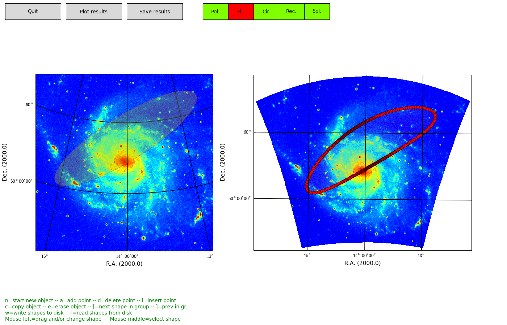

.. _maputils_tutorial:
   
Tutorial maputils module
========================

.. highlight:: python
   :linenothreshold: 10

Introduction
------------

Module :mod:`maputils` is your toolkit for writing small and dedicated applications
for the inspection and of FITS headers, the extraction, manipulation
display and re-projection of (FITS) data,
interactive inspection of this data (color editing) and for the creation of
plots with world coordinate information. Many of the examples in this tutorial
are small applications which can be used with your own data with only small modifications
(like file names etc.).
 
Module :mod:`maputils` provides methods to draw a :term:`graticule` in a plot showing
the world coordinates in the given projection and sky system.
One can plot spatial rulers which show offsets of constant
distance whatever the projection of the map is. We will also demonstrate how to
create a so called :term:`all-sky plot`

The module combines the functionality in modules
:mod:`wcs` and :mod:`celestial` from the Kapteyn package, together with Matplotlib,
into a powerful module for the extraction and display of FITS image data or external
data described by a FITS header or a Python dictionary with FITS keywords
(so in principle you are not bound to FITS files).

We show examples of:

   * overlays of different graticules (each representing
     a different sky system),
   * plots of data slices from a data set with more than two axes
     (e.g. a FITS file with channel maps from a radio interferometer observation)
   * plots with a spectral axis with a 'spectral translation'
     (e.g. Frequency to Radio velocity)
   * rulers showing offsets in spatial distance
   * overlay a second image on a base image
   * plot that covers the entire sky (allsky plot)
   * mosaics of multiple images (e.g. HI channel maps)
   * a simple movie loop program to view 'channel' maps.

We describe simple methods to add **interaction** to the Matplotlib canvas e.g. for
changing color maps or color ranges.

In this tutorial we assume a basic knowledge of FITS files.
Also a basic knowledge of Matplotlib is handy but not
necessary to be able to modify the examples in this tutorial to suit your own needs.
For useful references see information below.

.. seealso::

   `FITS standard <http://fits.gsfc.nasa.gov/standard30/fits_standard30.pdf>`_
      A pdf document that describes the current FITS standard.

   `Matplotlib <http://matplotlib.sourceforge.net/index.html>`_
      Starting point for documentation about plotting with Matplotlib.

   `PyFITS <http://www.stsci.edu/resources/software_hardware/pyfits>`_
      Package for reading and writing FITS files.
      
   Module :mod:`celestial`
      Documentation of sky- and reference systems. Useful if you need
      to define a celestial system.

   Module :mod:`wcsgrat`
      Documentation about graticules. Useful if you want to fine tune the
      wcs coordinate grid.

Maputils basics
---------------

Building small display- and analysis utilities with :mod:`maputils` is easy. The complexity is
usually in finding the right parameters in the right methods or functions
to achieve special effects. The structure of a script to create a plot using :mod:`maputils`
can be summarized with:

   * Import maputils module
   * Get data from a FITS file or another source
   * Create a plot window and tell it where to plot your data
   * From the object that contains your data, derive new objects
   * With the methods of these new objects, plot an image, contours, graticule etc.
   * Do the actual plotting and in a second step fine tune plot properties
     of various objects
   * Inspect, print or save your plot or save your new data to file on disk.

In the example below it is easy to identify these steps:
   
**Example: mu_basic1.py - Show image and allow for color interaction**

.. literalinclude:: EXAMPLES/mu_basic1.py

FITS files
-----------

A simple utility to analyze a FITS file
.......................................

With module :mod:`maputils` one can extract image data from a FITS file,
modify it and write it to another FITS file on disk.
The methods we use for these purposes are based on package PyFITS, but
are adapted to function in the environment of the Kapteyn Package.
Note that PyFITS is not part of the Kapteyn Package.

With  :mod:`maputils` one can also
extract data slices from data described by **more** than **two** axes (e.g.
images as function of velocity or polarization).
For data with only two axes, it can swap those axes (e.g. to swap R.A.
and Declination). Also the limits of the data can be set
to extract part of 2-dimensional data.
To be able to create plots of unfamiliar data without any user interaction,
you need to know some
of the characteristics of this data before you can extract the right slice.
Module :mod:`maputils` provides routines that can display this relevant information.

First you need to create an object from class :class:`maputils.FITSimage`.
Some information is extracted from the FITS header directly. Other
information is extracted from attributes of a :class:`wcs.Projection` object
defined in module :mod:`wcs`.
Method :meth:`maputils.FITSimage.str_axisinfo` gets its information from a
header and its associated Projection object.
It provides information about things like the sky system and
the spectral system, as strings, so the method is suitable to get
verbose information for display on terminals and in gui's.

Next we show a simple script which prints meta information of the FITS file
*ngc6946.fits*:
   
**Example: mu_fitsutils.py - Print meta data from FITS header or Python dictionary**

.. literalinclude:: EXAMPLES/mu_fitsutils.py

This code generates the following output::

   print """
   HEADER:
   
   SIMPLE  =                    T / SIMPLE FITS FORMAT
   BITPIX  =                  -32 / NUMBER OF BITS PER PIXEL
   NAXIS   =                    3 / NUMBER OF AXES
   NAXIS1  =                  100 / LENGTH OF AXIS
   etc.
   
   AXES INFO:
   
   Axis 1: RA---NCP  from pixel 1 to   100
   {crpix=51 crval=-51.2821 cdelt=-0.007166 (DEGREE)}
   {wcs type=longitude, wcs unit=deg}
   etc.
   
   EXTENDED AXES INFO:
   
   axisnr     - Axis number:  1
   axlen      - Length of axis in pixels (NAXIS):  100
   ctype      - Type of axis (CTYPE):  RA---NCP
   axnamelong - Long axis name:  RA---NCP
   axname     - Short axis name:  RA
   etc.
   
   WCS INFO:
   
   Current sky system:                 Equatorial
   reference system:                   ICRS
   Output sky system:                  Equatorial
   Output reference system:            ICRS
   etc.
   
   SPECTRAL INFO:

   0   FREQ-V2F (Hz)
   1   ENER-V2F (J)
   2   WAVN-V2F (1/m)
   3   VOPT-V2W (m/s)
   etc.
   """

The example extracts data from a FITS file on disk as given in the example code.
To make the script a real utility one should allow the user to enter a file
name. This can be done with Python's `raw-input` function but to make
it robust one should check the existence of a file, and if a FITS
file has more than one header, one should prompt the user to
specify the header. We also have to deal with alternate headers for world coordinate
systems (WCS) etc. etc.

.. note::
   
      To facilitate parameter settings we implemented so called :term:`prompt function`.
      These are external functions which read context in a terminal and then set reasonable
      defaults for the required parameters in a prompt.
      These functions can serve as templates for more advanced functions
      which are used in gui environments.

The projection class from :mod:`wcs` interprests and stores the header information.
It serves as
the interface between *maputils* and the library *WCSLIB*.

**Example: mu_projection.py - Get data from attributes of the projection system**

.. literalinclude:: EXAMPLES/mu_projection.py

The output::
   
   Projection object from FITSimage:
   crvals: (178.7792, 53.655000000000001)
   crvals after axes specification: (178.7792, 1415418199.4170001, 53.655000000000001)
   crvals after setting spectral translation: (178.7792, 1050000.0000000042, 53.655000000000001)
   Projection object from Annotatedimage:
   crvals: (178.7792, 1050000.0000000042, 53.655000000000001)

**Explanation:**

As soon as the FITSimage object is created, it is assumed that the first two axes are
the axes of the data you want to display. After setting alternative axes, a slice is
taken and the projection system is changed. Now it shows attributes in the order of
the slice and we see a third value in the tuple with term:`CRVAL`'s.
That's because the last value
represents the necessary matching spatial axis which is needed to do conversions between pixels and
world coordinates.

As a next step we set a spectral translation for the second axis which is a frequency axis.
Again the projection system changes. We did set the translation to an optical velocity
and the printed ``CRVAL`` is indeed the reference optical velocity from the header
of this FITS file (1050 km/s).

When an object from class :class:`maputils.Annotatedimage` is created, the projection
data is copied from the
:class:`maputils.FITSimage` object.
It can be accessed through the :attr:`maputils.Annotatedimage.projection`
attribute (last line of the above example).
 

Specification of a map
......................

Class :class:`maputils.FITSimage` extracts data from a FITS file so that a map can be plotted
with its associated world coordinate system.
So we have to specify a number of parameters to get the required image data.
This is done with the following methods:

   * **Header** - The constructor :class:`maputils.FITSimage` needs name and path
     of the FITS file. It can be a file on disk or an URL. The file
     can be zipped. A FITS file can contain more than one header data unit.
     If this is an issue you need to enter the number of the unit that you want to use.
     A case insensitive name of the hdu is also allowed.
     A FITS header can also contain one or more *alternate* headers. Usually these
     describe another sky or spectral system. We list three examples. The first
     is a complete description of the FITS header. The second get its parameters
     from an external 'prompt' function (see next section)
     and the third uses a prompt function with a pre specfication
     of parameter *alter* which sets the alternate header.
     
     >>> fitsobject = maputils.FITSimage('alt2.fits', hdunr=0, alter='A', memmap=1)
     >>> fitsobject = maputils.FITSimage(promptfie=maputils.prompt_fitsfile)
     >>> fitsobject = maputils.FITSimage(promptfie=maputils.prompt_fitsfile, alter='A')
     >>> fitsobject = maputils.FITSimage('NICMOSn4hk12010_mos.fits', hdunr='err')

     Later we will also discuss examples where we use external headers (i.e. not from
     a FITS file, but as a Python dictionary) and external data (i.e. from another source or
     from processed data). The user/programmer is responsible for
     the right shape of the data. Here is a small example of processed data:
    
     >>> f = maputils.FITSimage("m101.fits", externaldata=log(abs(fftA)+1.0))

   * **Axis numbers** - Method :meth:`maputils.FITSimage.set_imageaxes` sets
     the axis numbers. These numbers follow the FITS standard, i.e. they start with 1.
     If the data
     has only two axes then it is possible to swap the axes. This method can be
     used in combination with an external prompt function. If the data has more
     than two axes, then the default value for the axis numbers *axnr1=1*
     and *axnr2=2*. One can also enter the names of the axes. The input is case
     insensitive and a minimal match is applied to the axis names found
     in the CTYPE keywords in the header. Examples are:

     >>> fitsobject.set_imageaxes(promptfie=maputils.prompt_imageaxes)
     >>> fitsobject.set_imageaxes(axnr1=2, axnr2=1)
     >>> fitsobject.set_imageaxes(2,1)         # swap
     >>> fitsobject.set_imageaxes(1,3)         # XV map
     >>> fitsobject.set_imageaxes('R','D')     # RA-DEC map
     >>> fitsobject.set_imageaxes('ra','freq') # RA-FREQ map

   * **Data slices from data sets with more than two axes** -
     For an artificial set called 'manyaxes.fits', we want to extract one spatial map.
     The axes order is [frequency, declination, right ascension, stokes].
     We extract a data slice at FREQ=2 and STOKES=1.
     This spatial map is obtained with the following lines:
        
     >>> fitsobject = maputils.FITSimage('manyaxes.fits') # FREQ-DEC-RA-STOKES
     >>> fitsobject.set_imageaxes(axnr1=3, axnr2=2, slicepos=(2,1))

   * **Coordinate limits** - If you want to extract only a part of the image then
     you need to set limits for the pixel coordinates. This is set with
     :meth:`maputils.FITSimage.set_limits`. The limits can be set manually or with a prompt
     function. Here are examples of both:

     >>> fitsobject.set_limits(pxlim=(20,40), pylim=(22,38))
     >>> fitsobject.set_limits((20,40), (22,38))
     >>> fitsobject.set_limits(promptfie=maputils.prompt_box)

   * **Output sky definition** - For conversions between pixel- and world coordinates
     one can define to which output sky definition the world coordinates are related.
     The sky parameters are set with :meth:`maputils.FITSimage.set_skyout`.
     The syntax for a sky definition (sky system, reference system, equinox, epoch of observation)
     is documented in :meth:`celestial.skymatrix`.
     
     >>> fitsobject = maputils.FITSimage('m101.fits')
     >>> fitsobject.set_skyout("Equatorial, J1952, FK4_no_e, J1980")
         or:
     >>> fitsobject.set_skyout(promptfie=maputils.prompt_skyout)

Writing data to a FITS file or to append data to a FITS file is also
possible. The method written for these purposes is called
:meth:`writetofits`. It has parameters to scale data and it is possible
to skip writing history and comment keywords. Have a look at the examples:

>>> # Write data with scaling
>>> fitsobject.writetofits(history=True, comment=True,
                           bitpix=fitsobject.bitpix,
                           bzero=fitsobject.bzero,
                           bscale=fitsobject.bscale,
                           blank=fitsobject.blank)

>>> # Append data to existing FITS file
>>> fitsobject.writetofits("standard.fits", append=True, history=False, comment=False)

Prompt functions
-----------------

Usually one doesn't know exactly what's in the header of a FITS file
or one has limited knowledge about the input parameters in
:meth:`maputils.FITSimage.set_imageaxes`
Then a helper function to get the right input is available.
It is called :func:`maputils.prompt_imageaxes` which works only
in a terminal.

But a complete description of the world coordinate system implies also that it
should possible to set limits for the pixel coordinates (e.g. to extract the most interesting
part of the entire image)
and specify the sky system in which we present a spatial map or the
spectral translation (e.g. from frequency to velocity) for an image with a
spectral axis. It is easy to turn our basic script into an interactive application
that sets all necessary parameters to extract the required image data
from a FITS file. The next script is an example how we use prompt functions
to ask a user to enter relevant information. These prompt functions are
external functions. They are aware of the data context and set reasonable
defaults for the required parameters.

**Example: mu_getfitsimage.py** - Use prompt functions to set attributes
of the FITSimage object and print information about the world coordinate system

.. literalinclude:: EXAMPLES/mu_getfitsimage.py

**Example: fitsview** - Use prompt functions to create a script that
displays a FITS image
 
As a summary we present a small but handy utility to display a FITS image
using prompt functions. The name of the FITS file can be a command line argument
e.g.: ``./fitsimage m101.fits``
For this you need to download the code and make the script executable
(e.g. chmod u+x) and run it from the command line like:

>>> ./fitsview m101.fits

.. literalinclude:: EXAMPLES/fitsview

Image objects
-------------

Basic image
...........

If one is interested in displaying image data only (i.e. without any wcs information)
then we need very few lines of code as we show in the next example.

**Example: mu_simple.py - Minimal script to display image data**

.. plot:: EXAMPLES/mu_simple.py
   :include-source:
   :align: center

**Explanation:**

This is a simple script that displays an image using the defaults for the axes,
the limits, the color map and many other properties.
>From an object from class :class:`maputils.FITSimage` an
object from class :class:`maputils.FITSimage.Annotatedimage`
is derived.

This object has methods to create other objects (image, contours, graticule, ruler etc.)
that can be plotted
with Matplotlib. To plot these objects we need to call method
:meth:`maputils.Annotatedimage.plot`

If you are only interested in displaying the image and don't want any white space
around the plot
then you need to specify a Matplotlib frame as parameter for
:meth:`maputils.Annotatedimage`. This frame is created with
Matplotlib's *add_subplot()* or *add_axes()*. The latter has options to
specify origin and size of the frame in so called normalized coordinates [0,1].
Note that images are displayed while preserving the pixel aspect ratio.
Therefore images are scaled to fit either the given width or the given height.

In the next example we reduce whitespace and use keyword parameters *cmap*, *clipmin* and
*clipmax* to set a color map and the clip levels between which the color mapping is applied.

**Example: mu_withimage.py - Display image data using keyword parameters**

.. plot:: EXAMPLES/mu_withimage.py
   :include-source:
   :align: center

.. centered:: Fig.: mu_withimage.py - Image with non default plot frame and parameters for color map and clip levels.

RGB image
...........

It is possible to compose an image from three separate images which represent
a red, green and blue component. In this case you need to create an
:class:`maputils.FITSimage.Annotatedimage`
object first. The data associated with this image can be used
to draw e.g. contours, while the parameters of the method
:meth:`maputils.FITSimage.Annotatedimage.rgbimage` compose the
RGB image.

**Example: mu_rgbdemo.py - display RGB image**

.. plot:: EXAMPLES/mu_rgbdemo.py
   :include-source:
   :align: center

**Explanation:**

Three FITS files contain data in rectangular shapes in different positions.
The shapes have an overlap. For each RGB
component a :class:`maputils.FITSimage` is created. One of these is used to
make a :class:`maputils.FITSimage.Annotatedimage` object. The three
*FITSimage* objects are used as parameters for method
:meth:`maputils.FITSimage.Annotatedimage.rgbimage` to set the individual
components of a RGB image. The shapes are displayed in the colour that
corresponds to the component that was used. The overlapping regions show
composed colours as expected in an RGB image.

This script also displays a message in the message toolbar with information
about mouse positions and the corresponding image value. For an RGB image,
all three image values (z values) are displayed.
The format of the message is changed with parameters in
:meth:`maputils.FITSimage.Annotatedimage.interact_toolbarinfo`
as in:

>>> annim.interact_toolbarinfo(wcsfmt=None, zfmt="%g")

Two parameters need some extra explanation. The first is parameter *fun*.
This is either a function or a lambda expression which scales the
data. An RGB image has no colormap and there is no scaling available through
colormap editing. To provide any scaling for display purposes, we provide this
parameter. The other parameter is *alpha*. This is an alpha factor which applies
to the entire map.

Figure size
...........

In the previous example we specified a size in inches for the figure.
We provide a method :meth:`maputils.FITSimage.get_figsize` to set
the figure size in cm. Enter only the direction for which you want to set the size.
The other size is calculated using the pixel aspect ratio, but then it is not
garanteed that all labels will fit.
The method is used as follows:
   
>>> fig = plt.figure(figsize=f.get_figsize(xsize=15, cm=True))

Graticules
----------

Introduction
............

Module :mod:`maputils` can create graticule objects with method
:meth:`maputils.Annotatedimage.Graticule`.
But in fact the method that does all the work is defined in module :mod:`wcsgrat` So
in the next sections we often refer to module :mod:`wcsgrat`.

Module :mod:`wcsgrat` creates a :term:`graticule` for a given header with WCS information.
That implies that it finds positions on a curve in 2 dimensions in image data
for which one of the world coordinates is a constant value.
These positions are stored in a graticule object.
The positions at which these lines cross one of the sides
of the rectangle (made up by the limits in pixels in both x- and y-direction),
are stored in a list together with a
text label showing the world coordinate of the crossing.

Simple example
..............

**Example: mu_axnumdemosimple.py - Simple plot using defaults**

.. plot:: EXAMPLES/mu_axnumdemosimple.py
   :include-source:
   :align: center

**Explanation:**

The script opens an existing FITS file. Its header is parsed by methods
in module :mod:`wcs` and methods from classes in module :mod:`wcsgrat`
calculate the graticule data. A plot is made with Matplotlib. Note the
small rotation of the graticules.

The recipe:

   * Given a FITS file on disk (*m101.fits*) we want to plot
     a graticule for the spatial axes in the FITS file.
   * The necessary information is retrieved from the FITS header
     with PyFITS through class :class:`maputils.FITSimage`.
   * To plot something we need to tell method :meth:`maputils.FITSimage.Annotatedimage`
     in which frame it must plot. Therefore we need a Matplotlib figure instance
     and a Matplotlib Axes instance (which we call a frame in the context of *maputils*).
   * A graticule representation is calculated by :meth:`maputils.Annotatedimage.Graticule`
     and stored in object *grat*. The maximum number of defaults are used.
   * Finally we tell the Annotated image object *mplim* to plot itself and display
     the result with Matplotlib's function *show()*.
     This last step can be compressed to one statement: :func:`maputils.showall`
     which plots all the annotated images in your script at once and
     then call Matplotlib's function *show()*.
     
The :mod:`wcsgrat` module estimates the ranges in world coordinates
in the coordinate system defined in your FITS file. The method is just
brute force. This is the only way to get good estimates for large maps, rotated maps
maps with weird projections (e.g. Bonne) etc. It is also possible to
enter your own world coordinates to set limits.
Methods in this module calculate 'nice' numbers to
annotate the plot axes and to set default plot attributes.

**Hint**: Matplotlib versions older than 0.98 use module *pylab* instead of *pyplot*.
You need to change the import statement to: `from matplotlib import pylab as plt`

Probably you already have many questions about what :mod:`wcsgrat`
can do more:

   * Is it possible to draw labels only and no graticule lines?
   * Can I change the starting point and step size for the coordinate labels?
   * Is it possible to change the default tick label format?
   * Can I change the default titles along the axes?
   * Is it possible to highlight (e.g. by changing color) just one graticule line?
   * Can I plot graticules in maps with one spatial- and one spectral coordinate?
   * Can I control the aspect ratio of the plot?
   * Is it possible to set limits on pixel coordinates?

In the following sections we will give a number of examples to answer most of these questions.

Selecting axes for image or graticule
...........................................

For data sets with **more** than **2** axes or data sets with swapped axes
(e.g. Declination as first axis and Right Ascension as second), we need to make a choice
of the axes and axes order. To demonstrate this we created a FITS file with
four axes. The order of the axes is uncommon and should only demonstrate the
flexibility of the :mod:`maputils` module. We list the data for these axes
in this 'artificial' FITS file::

   Filename: manyaxes.fits
   No.    Name         Type      Cards   Dimensions   Format
   0    PRIMARY     PrimaryHDU      44  (10, 50, 50, 4)  int32
   Axis  1 is FREQ   runs from pixel 1 to    10  (crpix=5 crval,cdelt=1.37835, 9.76563e-05 GHZ)
   Axis  2 is DEC    runs from pixel 1 to    50  (crpix=30 crval,cdelt=45, -0.01 DEGREE)
   Axis  3 is RA     runs from pixel 1 to    50  (crpix=25 crval,cdelt=30, -0.01 DEGREE)
   Axis  4 is POL    runs from pixel 1 to     4  (crpix=1 crval,cdelt=1000, 10 STOKES)

You can download the file `manyaxes.fits <http://www.astro.rug.nl/software/kapteyn/EXAMPLES/manyaxes.fits>`_
for testing. The world coordinate system is arbitrary.

**Example: mu_manyaxes.py - Selecting WCS axes from a FITS file with NAXIS > 2**

.. plot:: EXAMPLES/mu_manyaxes.py
   :include-source:
   :align: center

The plot shows a system of grid lines that correspond to non spatial axes and it will be no
surprise that the graticule is a rectangular system.
The example follows the same recipe as the previous ones and it shows how one
selects the required plot axes in a FITS file.
The axes are set with :meth:`maputils.FITSimage.set_imageaxes`
with two numbers. The first axis of a set
is axis 1, the second 2, etc. (i.e. FITS standard). The default is
(1,2) i.e. the first two axes in a FITS header.

For a R.A.-Dec. graticule one should enter for this FITS file:

>>> f.set_imageaxes(3,2)

.. note::

   If a FITS file has data which has more than two dimensions or
   it has two dimensions but you want to swap the x- and y axis then you need
   to specify the relevant FITS axes with :meth:`maputils.FITSimage.set_imageaxes`.
   The (FITS) axes numbers correspond to the number n in the FITS keyword CTYPEn
   (e.g. CTYPE3='FREQ' then the frequency axis corresponds to number 3).

Let's study the plot in more detail:

   * The header shows a Stokes axes with an uncommon value for ``CRVAL`` and ``CDELT``.
     We want to label four graticule lines with the familiar Stokes parameters.
     With the knowledge we have about this ``CRVAL`` and ``CDELT`` we tell
     the Graticule constructor to create 4 graticule lines (``starty=1000, deltay=10``).
   * The four positions are stored in attribute *ystarts* as in ``grat.ystarts``.
     We use these numbers to change the coordinate labels into Stokes parameters with
     method :meth:`wcsgrat.Graticule.setp_ticklabel`

     >>> grat.setp_ticklabel(plotaxis="left", position=1000, color='m', fmt="I")

   * We use :meth:`wcsgrat.Insidelabels` to add coordinate labels
     inside the plot. We mark a position near ``CRVAL`` and plot a label
     and with the same method we added a single label at that position.

This example shows an important feature of the underlying module :mod:`wcsgrat` and that is
its possibility to change properties of graticules, ticks and labels.
We summarize:

   * *Graticule line* properties are set with :meth:`wcsgrat.Graticule.setp_gratline`
     or the equivalent :meth:`wcsgrat.Graticule.setp_lineswcs1` or
     :meth:`wcsgrat.Graticule.setp_lineswcs1`. The properties are all Matplotlib
     properties given as keyword arguments. One can apply these to all graticule
     lines, to one of the wcs types or to one graticule line (identified by
     its position in world coordinates).
   * *Graticule ticks* (the intersections with the borders) are modified by
     method :meth:`wcsgrat.Graticule.setp_tick`.
     Ticks are identified by either the wcs axis (e.g. longitude or latitude)
     or by one of the four rectangular plot axes or by a position in
     world coordinates. Combinations of these are also possible.
     Plot properties are given as Matplotlib keyword arguments. The labels can be
     scaled and formatted with parameters *fun* and *fmt*. Usually one
     uses method :meth:`wcsgrat.Graticule.setp_ticklabel` to change tick labels
     and :meth:`wcsgrat.Graticule.setp_tickmark` to change the tick markers.
   * Ticks can be native to a plot axis (e.g. an pixel X axis which corresponds to
     a R.A. axis in world coordinates. But sometimes you can have ticks from
     two world coordinate axes along the same pixel axis (e.g. for a rotated plot).
     Then it is possible to control which ticks are plotted and which not.
     A tick mode for one or more plot/pixel axes is set with
     :meth:`wcsgrat.Graticule.set_tickmode`.
   * *The titles along one of the rectangular plot axes* can be modified with
     :meth:`wcsgrat.Graticule.setp_axislabel` which
     is a specialization of method :meth:`wcsgrat.Graticule.setp_plotaxis`.
     A label text is set with parameter *label*
     and the plot properties are given as Matplotlib keyword arguments.
   * Properties of *labels inside a plot* are set in the constructor
     :meth:`wcsgrat.Insidelabels.setp_label`.
   * Properties of *labels along a ruler* are set with method
     :meth:`rulers.Ruler.setp_label`. Properties of
     the ruler line can be changed with :meth:`rulers.Ruler.setp_line`
   * For labels along the plotaxes which correspond to pixel positions one can change
     the properties of the labels with :meth:`maputils.Pixellabels.setp_label` while
     the properties of the markers can be changed with:
     :meth:`maputils.Pixellabels.setp_marker`

Let's summarize these methods in a table:

.. tabularcolumns:: |p{50mm}|p{100mm}|

=================================  ===============================================
Object                             Properties method
=================================  ===============================================
Graticule line piece               :meth:`wcsgrat.Graticule.setp_gratline`
Graticule tick marker              :meth:`wcsgrat.Graticule.setp_tickmark`
Graticule tick_label               :meth:`wcsgrat.Graticule.setp_ticklabel`
Axis label                         :meth:`wcsgrat.Graticule.setp_axislabel`
Inside label                       :meth:`wcsgrat.Insidelabels.setp_label`
Ruler labels                       :meth:`rulers.Ruler.setp_label`
Ruler line                         :meth:`rulers.Ruler.setp_line`
Pixel labels                       :meth:`maputils.Pixellabels.setp_label`
Pixel markers                      :meth:`maputils.Pixellabels.setp_marker`
Free graticule line                :meth:`wcsgrat.Graticule.setp_linespecial`
=================================  ===============================================

*-Table-* Objects related to graticules and their methods to set properties.

In the following sections we show some examples for changing the
graticule properties. Note that for some methods we can identify objects either with
the graticule line type (i.e. 0 or 1), the number or name of the
plot axis ([0..4] or one of 'left', 'bottom', 'right', 'top' (or a minimal
match of these strings). Some objects (e.g. tick labels) can also be identified
by a position in world coordinates. Often also a combination of these
identifiers can be used.

Graticule axis labels
.......................

**Example: mu_labeldemo.py - Properties of axis labels**

.. plot:: EXAMPLES/mu_labeldemo.py
   :include-source:
   :align: center

Graticule lines
.................

**Example: mu_gratlinedemo.py - Properties of graticule lines**

.. plot:: EXAMPLES/mu_gratlinedemo.py
   :include-source:
   :align: center

.. note::

      If you don't want to plot graticule lines, then use
      method :meth:`wcsgrat.setp_gratline` with attribute
      *visible* set to *False*.

Graticule tick labels
......................

**Example: mu_ticklabeldemo.py - Properties of graticule tick labels**

.. plot:: EXAMPLES/mu_ticklabeldemo.py
   :include-source:
   :align: center

Graticule tick markers
.......................

**Example: mu_tickmarkerdemo.py - Properties of graticule tick markers**

.. plot:: EXAMPLES/mu_tickmarkerdemo.py
   :include-source:
   :align: center

Graticule tick mode
...................

**Example: mu_tickmodedemo.py - Graticule's tick mode**

.. plot:: EXAMPLES/mu_tickmodedemo.py
   :include-source:
   :align: center

Graticule 'inside' labels
...........................

**Example: mu_insidelabeldemo.py - Graticule 'inside' labels**

.. plot:: EXAMPLES/mu_insidelabeldemo.py
   :include-source:
   :align: center

Graticule offset axes
...........................

**Example: mu_offsetaxes.py - Graticule offset labeling**

.. plot:: EXAMPLES/mu_offsetaxes.py
   :include-source:
   :align: center

Graticule minor tick marks
.............................

**Example: mu_minorticks.py - Graticule with minor tick marks**

.. plot:: EXAMPLES/mu_minorticks.py
   :include-source:
   :align: center

**Explanation**

Minor tick marks are created in the same way as major tick marks. They are
created as a by-product of the instantiation of an object from class
:class:`wcsgrat.Graticule`. The method :meth:`maputils.Annotatedimage.Minortickmarks`
copies some properties of the major ticks graticule and then creates
a new graticule object. The example shows 4 plots representing the same image in the sky.

  1. The default plot with minor tick marks
  2. Minor tick marks can also be applied on offset axes
  3. We selected another sky system for our graticule. The tick marks
     are now applied to the galactic coordinate system.
  4. This is the tricky plot. First of all we observe that the center of
     the offset axis is not in the middle of the bottom plot axis. This is because
     the Galactic sky system is plotted upon an equatorial system and therefore it
     is (at least for this part of the sky) rotated which causes the limits
     in world coordinates to be stretched. The start of the offset axis is
     calculated for the common limits in world coordinates and not just those
     along a plot axis.
     Secondly, one should observe that the graticule lines for the longitude
     follow the tick mark positions on the offset axis.
     And third, the offset seems to have different sign when compared
     to the Equatorial system. The reason for this is that we took a part
     of the sky where the Galactic system's longitude runs in an opposite direction.

More 'axnum' variations -- Position Velocity diagrams
.....................................................

For the next example we used a FITS file with the following header information::

   Axis 1: RA---NCP  from pixel 1 to   100  {crpix=51 crval=-51.2821 cdelt=-0.007166 (DEGREE)}
   Axis 2: DEC--NCP  from pixel 1 to   100  {crpix=51 crval=60.1539 cdelt=0.007166 (DEGREE)}
   Axis 3: VELO-HEL  from pixel 1 to   101  {crpix=-20 crval=-243 cdelt=4.2 (km/s)}

**Example: mu_axnumdemo.py - Show different axes combinations for the same FITS file**

.. plot:: EXAMPLES/mu_axnumdemo.py
   :include-source:
   :align: center

We used Matplotlib's *add_subplot()* method to create 4 plots in one figure with minimum effort.
The top panel shows a plot with the default axis numbers which are 1 and 2.
This corresponds to the axis types RA and DEC and therefore the map is a spatial map.
The next panel has axis numbers 3 and 2 representing a *position-velocity* or *XV map* with DEC
as the spatial axis X. The default annotation is offset in spatial distances.
The next panel is a copy but we changed the annotation from the default
(i.e. offsets) to position labels. This could make sense if the map is unrotated.
The bottom panel has RA as the spatial axis X. World coordinate labels
are added inside the plot with a special method: :meth:`wcsgrat.Insidelabels`.
These labels are not formatted to hour/min/sec or deg/min/sec for spatial axes.

The two calls to this method need some extra explanation::

   graticule4.Insidelabels(wcsaxis=0, constval='20h34m', rotation=90, fontsize=10,
                           color='r', ha='right')
   graticule4.Insidelabels(wcsaxis=1, fontsize=10, fmt="%.2f", color='b')

The first statement sets labels that correspond to positions
in world coordinates inside a plot. It copies the positions of the velocities,
set by the initialization of the graticule object. It plots those labels at a
Right Ascension equal to 20h35m which is equal to -51 (=309) degrees.
It rotates these labels by an angle of 90 degrees and
sets the size, color and alignment of the font. The second statement does something similar for
the Right Ascension labels, but it adds also a format for the numbers.

Note also the line:
   
>>> graticule4 = mplim4.Graticule(offsety=False)
>>> graticule4.setp_ticklabel(plotaxis="left", fmt='HMs')

By default the module would plot labels which are offsets because we have only one spatial axis.
We overruled this behaviour with keyword parameter *offsety=False*. Then we get world coordinates
which by default are formatted in hour/minutes/seconds. If we want these labels to be
plotted in another format, lets say decimal degrees, then one needs parameter
*fun* to define some transformation and with
*fmt* we set the format for that output, e.g. as in:

>>> graticule4.setp_tick(plotaxis="left", fun=lambda x: x+360, fmt="$%.1f^\circ$")

Finally note that the alignment of the titles along the left axis (which is a Matplotlib
method) works in the frame of the graticule. It is important to realize that a *maputils* plot
usually is a stack of matplotlib Axes objects (frames). The graticule object sets these
axis labels and therefore we must align them in that frame (which is an attribute
of the graticule object) as in:

>>> graticule3.setp_axislabel(plotaxis='left', xpos=labelx)

For information about the Matplotlib specific attributes you should read the documentation at
the appropriate class descriptions (http://matplotlib.sourceforge.net).
   
Changing the default aspect ratio
..................................

For images and graticules representing spatial data it is important that the aspect
ratio (CDELTy/CDELTx) remains constant if you resize the plot.
A graticule object initializes itself with an aspect ratio based on the pixel
sizes found in (or derived from) the header. It also calculates an appropriate
figure size and size for the actual plot window in normalized device coordinates
(i.e. in interval [0,1]). You can use these values in a script to set
the relevant values for Matplotlib as we show in the next example.

**Example: mu_figuredemo.py - Plot figure in non default aspect ratio**

.. plot:: EXAMPLES/mu_figuredemo.py
   :include-source:
   :align: center

.. note::

   For astronomical data we want equal steps in spatial distance in any direction correspond
   to equal steps in figure size. If one changes the size of the figure interactively,
   the aspect ratio should not change. To enforce this, the constructor of an
   object of class :class:`maputils.Annotatedimage` modifies the input frame so that the
   aspect ratio is the aspect ratio of the pixels. This aspect ratio is preserved
   when the size of a window is changed.
   One can overrule this default by manually setting an aspect ratio with method
   :meth:`maputils.Annotatedimage.set_aspectratio` as in:

   >>> frame = fig.add_subplot(k,1,1)
   >>> mplim = f.Annotatedimage(frame)
   >>> mplim.set_aspectratio(0.02)

Combinations of graticules
..........................

The number of graticule objects is not restricted to one. One can easily add a
second graticule for a different sky system.
The next example shows a combination of two graticules for two different sky systems.
It demonstrates also the use of attributes to change plot properties.

**Example: mu_skyout.py - Combine two graticules in one frame**

.. plot:: EXAMPLES/mu_skyout.py
   :include-source:
   :align: center

**Explanation:**

This plot shows graticules for equatorial coordinates and galactic coordinates in the
same figure. The center of the image is the position of the galactic pole. That is why
the graticule for the galactic system shows circles. The galactic graticule is also
labeled inside the plot using method :meth:`wcsgrat.Insidelabels`
(Note that this is a method derived from class :class:`wcsgrat.Graticule` and that it
is not a method of class :class:`maputils.Annotatedimage`).
To get an impression of arbitrary positions expressed in pixels coordinates,
we added pixel coordinate labels for the top and right axes with
method :meth:`maputils.Annotatedimage.Pixellabels`.

**Plot properties:**

   * Use attribute *boxsamples* to get a better estimation of the ranges in galactic
     coordinates. The default sampling does not sample enough in the neighbourhood
     of the galactic pole causing a gap in the plot.
   * Use method :meth:`wcsgrat.Graticule.setp_gratline` to change the color of the
     longitudes and latitudes for the equatorial system.
   * Method :meth:`wcsgrat.Graticule.setp_tickmark`
     sets for both plot axis (0 == x axis, 1 = y axis)
     the tick length with *markersize*. The value is negative to force a
     tick that points outwards. Also the color and the font size of the tick labels
     is set. Note that these are Matplotlib keyword arguments.
   * With :meth:`wcsgrat.Graticule.setp_axislabel` we allow galactic coordinate labels and ticks
     to be plotted along the top and right plot axis. By default, the labels along these axes
     are set to be invisible, so we need to make them visible with keyword argument *visible=True*.
     Also a title is set for these axes.
     
.. note::
   
     There is a difference between plot axes and wcs axes. The first always represent a
     rectangular
     system with pixels while the system of the graticule lines (wcs axes) usually is
     curved (sometimes
     they are even circular. Therefore many plot properties are either associated with one
     a plot axis and/or a world coordinate axes.

Spectral translations
.....................

To demonstrate what is possible with spectral coordinates and module :mod:`wcsgrat`
we use real interferometer data from a set called *mclean.fits*. A summary of what can be
found in its header::
   
   Axis  1: RA---NCP  from pixel 1 to   512  {crpix=257 crval=178.779 cdelt=-0.0012 (DEGREE)}
   Axis  2: DEC--NCP  from pixel 1 to   512  {crpix=257 crval=53.655 cdelt=0.00149716 (DEGREE)}
   Axis  3: FREQ-OHEL from pixel 1 to    61  {crpix=30 crval=1.41542E+09 cdelt=-78125 (HZ)}

Its spectral axis number is 3. The type is frequency. The extension tells us that an
optical velocity in the heliocentric system is associated with the frequencies. In the
header we found that the optical velocity is 1050 Km/s.
The header is a legacy GIPSY header and module :mod:`wcs` can interpret it.
We require the frequencies to be expressed as wavelengths.

**Example: mu_wave.py - Plot a graticule in a position wavelength diagram.**

.. plot:: EXAMPLES/mu_wave.py
   :include-source:
   :align: center

**Explanation:**
  
  * With PyFITS we open the fits file on disk and read its header
  * A Matplotlib Figure- and Axes instance are made
  * The range in pixel coordinates in x is decreased
  * A Graticule object is created and FITS axis 3 (FREQ) is associated with x and FITS axis 2
    (DEC)
    with y. The spectral axis is expressed in wavelengths with method :meth:`wcs.Projection.spectra`.
    Note that we omitted a code for the conversion algorithm and instead entered three
    question marks so that the *spectra()* method tries to find the appropriate code.
  * The tick labels along the x axis (the wavelengths) are formatted. The S.I. unit is
    meter, but we want it to be plotted in cm. A function to convert the values is
    given with `fun=lambda x: x*100`. A format for the printed numbers is given with:
    `fmt="%.3f"`

.. note::
   
   The spatial axis is expressed in offsets. By default it starts with an offset equal
   to zero in the middle of the plot. Then a suitable step size is calculated and
   the corresponding labels are plotted. For spatial offsets we need also
   a value for the missing spatial axis. If not specified with parameter *mixpix*
   in the constructor of class *Graticule*, a default value is assumed equal to CRPIX
   corresponding to the missing spatial axis (or 1 if CRPIX is outside interval
   [1,NAXIS])
   

For the next example we use the same FITS file (mclean.fits).
 
**Example: mu_spectraltypes.py - Plot grid lines for different spectral translations**

.. plot:: EXAMPLES/mu_spectraltypes.py
   :include-source:
   :align: center

**Explanation:**

  * With PyFITS we open the FITS file on disk and read its header
  * We created a :class:`wcs.Projection` object for this header to get a
    list with allowed spectral translations (attribute *altspec*). We need
    this list before we create the graticules
  * Matplotlib Figure- and Axes instances are made
  * The native FREQ axis (top figure) differs from the FREQ axis in the
    next plot, because a legacy header was found and its freqencies were transformed
    to a barycentric/heliocentric system.

Rulers
------

Rulers in are objects derived from a Graticule object.
A ruler is always plotted
as a straight line, whatever the projection (so it doesn't necessarily
follow graticule lines).
A ruler plots ticks and labels and the *spatial* distance between any two ticks is
a constant. This makes rulers ideal to put nearby a feature in your map to
give an idea of the physical size of that feature. Rulers can be plotted in maps
with one or two spatial axes.

.. note::

   Rulers, Beams and Markers are positioned using either pixel coordinates or
   world coordinates. See the examples in module :mod:`positions`.

**Example: mu_manyrulers.py - Ruler demonstration**

.. plot:: EXAMPLES/mu_manyrulers.py
   :include-source:
   :align: center

Ruler tick labels can be formatted so that we can adjust them. In the next plot we
want offsets to be plotted in arcminutes.

**Example: mu_arminrulers.py - Rulers with non default labels**

.. plot:: EXAMPLES/mu_arcminrulers.py
   :include-source:
   :align: center

It is possible to put a ruler in a map with only one spatial coordinate
(as long there is a matching axis in the header) like a Position-Velocity diagram (sometimes
also called XV maps).
It will take the pixel coordinate of the slice as a constant so even for XV maps
we have reliable offsets. In the next example we created two rulers.
The red ruler is in fact the same as the Y-axis offset labeling. The blue
ruler show the same offsets in horizontal direction. That is because only the
horizontal direction is spatial. Such a ruler is probably not very useful but
is a nice demonstration of the flexibility of method :meth:`maputils.Annotatedimage.Ruler`.

Note that we set Matplotlib's *clip_on* to *True* because if we pan the image in Matplotlib
we don't want the labels to be visible outside the border of the frame.

**Example: mu_xvruler.py - Ruler in a XV map**

.. plot:: EXAMPLES/mu_xvruler.py
   :include-source:
   :align: center

Contours
--------

**Example: mu_simplecontours.py - Simple plot with contour lines only**

.. plot:: EXAMPLES/mu_simplecontours.py
   :include-source:
   :align: center

The example above shows how to plot contours without plotting an image.
It also shows how one can retrieve the contour levels that are
calculated as a default because no levels were specified.

Next we demonstrate how to use the three Matplotlib keyword arguments to set some
global properties of the contours:
   
**Example: mu_contourlinestyles.py - Setting global colors and line styles/widths**

.. plot:: EXAMPLES/mu_contourlinestyles.py
   :include-source:
   :align: center

**Example: mu_annotatedcontours.py - Add annotation to contours**

.. plot:: EXAMPLES/mu_annotatedcontours.py
   :include-source:
   :align: center

The plot shows two sets of contours. The first step is to plot all contours
in a straightforward way. The second is to plot contours with annotation.
For this second set we don't see any contours if a label could not be fitted
that's why we first plot all the contours. Note that now we can use the properties methods
for single contours because we can identify these contours by their corresponding level.

**Example: mu_negativecontours.py - Contours with different line styles for negative values**

.. plot:: EXAMPLES/mu_negativecontours.py
   :include-source:
   :align: center

Colorbar
--------

A colorbar is an image which shows colors and values which correspond to these
colors. It is a tool that helps you to inspect the values in an image.
The distribution of the colors depends on the selected color map and the selected clip
levels. Next example shows how to setup a colorbar. The default position is
calculated by Matplotlib. It borrows space from the current frame depending on the
orientation ('vertical' or 'horizontal').

**Example: mu_colbar.py - Add colorbar to plot**

.. plot:: EXAMPLES/mu_colbar.py
   :include-source:
   :align: center

If you want more control over the position and size of the colorbar then specify a frame
for the colorbar. In the next example we prepared a frame for both the image and the colorbar.
If you don't enter a figure size, it can happen that the figure does not provide enough space
in either width or height. In the example we want the colorbar to be as big as the width
of the image. This will be a problem with the default figure size so we provided some
extra space in height with *figsize=*:

**Example: mu_colbarframe.py - Add colorbar with user's frame to plot**

.. plot:: EXAMPLES/mu_colbarframe.py
   :include-source:
   :align: center

Note that we entered a colormap (case sensitive names!) and a value for the
lower clip value (below which all image pixels get the same color). The clip for the maximum
is not entered so the default will be taken which is the maximum intensity
in your image.

Note also that we added interaction to set other colormaps and to change the
relation between colors and image values. Interaction is a topic in a later section
of this tutorial.

Usually one associates colorbars with images but it can also be used in combination
with contours. We demonstrate the use of Matplotlib's keyword parameters *visible=False*
to make an image invisible. However, to make the contents of the colorbar invisible one should use
*alpha=0.0* but we implemented keyword *visible* to simulate this effect.

**Example: mu_colbarwithlines.py - Add lines representing contours in plot to dummy colorbar**

.. plot:: EXAMPLES/mu_colbarwithlines.py
   :include-source:
   :align: center

Adding pixel coordinate labels
-------------------------------

In Matplotlib the axes in a frame are coupled. To get uncoupled axes a we
stack frames at the same location. For each frame one can change
properties of the pixel coordinate labels separately. The trick is
implemented in a number of methods, but in the methods
of class :class:`maputils.Pixellabels` it is easy to demonstrate that it works.
In the example we defined 4 plot axes for which we want to draw
pixel coordinate labels. The constructor uses Matplotlib defaults
but these can be overruled by parameters *major* and *minor*. These are numbers for
which n*major major ticks and labels are plotted and m*minor minor ticks.
Note that the default in Matplotlib is not to plot minor tick marks.

**Example: mu_pixellabels.py - Add annotation for pixel coordinates**

.. plot:: EXAMPLES/mu_pixellabels.py
   :include-source:
   :align: center

Adding a beam
--------------

Objects from class Beam are graphical representations of the resolution
of an instrument. The beam is plotted at a center position entered as
a string that represents a position or as two world coordinates.
The major axis of the beam is the FWHM of longest distance between
two opposite points on the ellipse. The angle between the major axis
and the North is the position angle of the beam.
See also :meth:`maputils.Annotatedimage.Beam`.

.. note::

   Rulers, Beams and Markers are positioned using either pixel coordinates or
   world coordinates. See the examples in module :mod:`positions`.

In the next example we added two rulers to prove that the sizes of
plotted ellipse are indeed the correct values on a sphere. Note also the use
of parameter *units* to set the FWHM's to minutes of arc.

**Example: mu_beam.py - Plot an ellipse representing a beam**

.. plot:: EXAMPLES/mu_beam.py
   :include-source:
   :align: center

Markers
-------

Sometimes there are features in an image that you want to mark with a symbol.
In other cases you want to plot positions from an external source (file or database etc.).
Then you use objects from class :meth:`maputils.Annotatedimage.Marker`. The use is straightforward.
Positions can be entered in different formats: as pixel coordinates, as world coordinates
or as strings with position information (see module :mod:`positions`).

.. note::

   Rulers, Beams and Markers are positioned using either pixel coordinates or
   world coordinates. See the examples in module :mod:`positions`.

Note the use of Matplotlib keyword arguments to set the properties of
the marker symbols. The most important are:

>>> marker=
>>> markersize=
>>> markeredgewidth=
>>> markeredgecolor=
>>> markerfacecolor=

**Example: mu_markers.py - Different ways to define marker positions**

.. plot:: EXAMPLES/mu_markers.py
   :include-source:
   :align: center

   
Sky polygons
-------------

Sometimes one needs to plot a shape which represents an area in the sky.
Such a shape can be a small ellipse which represents the beam of a radio telescope
or it is a rectangle representing a footprint of a survey.
These shapes (ellipse, circle, rectangle, square, regular polygon) have a prescription.
For example a circle is composed of a number of vertices with a constant 
distance to a center and all the vertices define a different angle. If you want
to plot such a shape onto a projection of a sphere you need to recalculate the vertices
so that for a given center (lon_c,lat_c) the set of distances and angles are preserved
on the sphere. By distances we mean the distance along a great circle and not along a parallel.

So what we do is calculate vertices of an ellipse/rectangle/regular polygon 
in a plane and the center of the shape is at (0,0).
For a sample of points on the shape we calculate the distance of the perimeter
as function of the angle.
Then with spherical trigonometry we solve for the missing (lon,lat) in the triangle
(lon_c,lat_c)-Pole-(lon,lat). This is the position for which the distance along a great
circle is the required one and also the angle is the required one.

Assume a triangle on a sphere connecting two positions
*Q1* with :math:`(\alpha_1, \delta1)` and *Q2* with :math:`(\alpha_2, \delta2)`
and on the sphere *Q2* is situated to the left of *Q1*.
*Q1* is the new center of the polygon. *P* is the pole and *Q2* the position
we need to find. This position has distance *d* along a great circle connecting
*Q1* and *Q2* and the angle *PQ1Q2* is the required angle
:math:`\alpha`. The sides of the triangle are :math:`(90-\delta_1)` and
:math:`(90-\delta_2)`

Then the distance between *Q1* and *Q2* is given by:

.. math::
   :label: distance
   
   \cos(d)=\cos(90-\delta_1)\cos(90-\delta_2)+\sin(90-\delta_1)\sin(90-\delta_2)\cos(\alpha_2-\alpha_1)

from which we calculate :math:`\cos(\alpha_2-\alpha_1)`

Angle *Q1PQ2* is equal to :math:`\alpha_2-\alpha_1`.
For this angle we have the sine formula:

.. math::
   :label: sinerule
   
   \frac{\sin(d)}{\sin(\alpha_2-\alpha_1)} = \frac{\sin(90-\delta_2)}{\sin(\alpha)}

so that:
   
.. math::
   :label: a2mina1

   \sin(\alpha_2-\alpha_1) = \frac{\sin(d)\sin(\alpha)}{\cos(\delta_2)}

>From :math:`\cos(\alpha_2-\alpha_1)` and the value of :math:`\sin(\alpha_2-\alpha_1)`
we derive an unambiguous value for :math:`\alpha_2-\alpha_1` and because we
started with :math:`\alpha_1` we derive a value for :math:`\alpha_2`.

The angle *PQ1Q2* is :math:`\alpha`. This is not the astronomical 
convention, but that doesn't matter because we use the same definition for 
an angle in the 'flat space' polygon.
For this situation we have another cosine rule:

.. math::
   :label: cosinerule

   \cos(90-\delta_2) = \cos(d)cos(90-\delta_1)+\sin(d)\sin(90-\delta_1)\cos(\alpha)

or:

.. math::
   :label: declination2
   
   \sin(\delta_2) = \cos(d)\sin(\delta_1)+\sin(d)\cos(\delta_1)\cos(\alpha)

which gives :math:`\delta_2`
and we found longitude and latitude :math:`(\alpha_2,\delta_2)` of the transformed 
'flat space' coordinate.
The set of transformed vertices in world coordinates are then transformed to 
pixels which involves the projection of a map.

The next example shows some shapes plotted in a map of a part of the sky.
 
**Example: mu_skypolygons.py - 'Sky polygons' in M101**

.. plot:: EXAMPLES/mu_skypolygons.py
   :include-source:
   :align: center

In 'all sky' plots the results can be a little surprising. For the family of cylindrical
projections we give a number of examples.

**Example: mu_skypolygons_allsky.py - 'Sky polygons' in a number of cylindrical projections**

.. plot:: EXAMPLES/mu_skypolygons_allsky.py
   :include-source:
   :align: center

The code shows a number of lines with ``try`` and ``except`` clauses. This is to
catch problems for badly chosen origins or polygon parameters.
We also provide examples of similar polygons in a number of zenithal projections.
The scaling is unaltered so different projections fill the plot differently.

**Example: mu_skypolygons_zenith.py - 'Sky polygons' in a number of zenithal projections**

.. plot:: EXAMPLES/mu_skypolygons_zenith.py
   :include-source:
   :align: center

Note that some polygons could not be plotted for the NCP projection, simply because  
it is defined from declination 90 to 0 only.
To avoid problems with divergence we limit the world coordinates to a declination
of -30 degrees. The sky polygons are not aware of this limit and are plotted as long
conversions between pixel- and world coordinates are possible.
The ZPN example is a bit special. First, it is not possible to center a shape onto the pole
(at least with the set of PV elements defined in the code) and second, we have a
non zero PV2_0 element which breaks the relation between CRPIX and CRVAL.

For a detailed description of the input parameters of the used *Skypolygon* method, read
:meth:`maputils.Annotatedimage.Skypolgon`.

Combining different plot objects
--------------------------------

We arrived at a stage where one is challenged to apply different plot objects in one
plot. Here is a practical example:
   
**Example: mu_graticules.py - Combining plot with contours and a colorbar**

.. plot:: EXAMPLES/mu_graticule.py
   :include-source:
   :align: center

External headers and/or data
-----------------------------

You are not restricted to FITS files to get plots of your data. The only
requirement is that you must be able to get your data into a NumPy array
and you need to supply a Python dictionary with FITS keywords.
For both options we show an example.

**Example: mu_externalheader.py - Header data from Python dictionary and setting a figure size**

.. plot:: EXAMPLES/mu_externalheader.py
   :include-source:
   :align: center

**Example: mu_externaldata.py - Using external FITS header and data**

.. plot:: EXAMPLES/mu_externaldata.py
   :include-source:
   :align: center

.. note::

   Manipulated headers and data can be written to a FITS file with method
   :meth:`maputils.FITSimage.writetofits`. Its documentation shows how
   to manipulate the format in which the data is written.
   Also have a look at this example which creates a FITSobject from an external header
   and external data. It then writes the object to a FITS file. The first time in the original
   data format with the original comments and  history cards. The second time it
   writes to a file with BITPIX=-32 and it skips all comment and history information::
   
      from kapteyn import maputils

      fitsobject = maputils.FITSimage(promptfie=maputils.prompt_fitsfile)
      header = fitsobject.hdr
      edata = fitsobject.dat
      f = maputils.FITSimage(externalheader=header, externaldata=edata)
      
      f.writetofits(history=True, comment=True,
                    bitpix=fitsobject.bitpix,
                    bzero=fitsobject.bzero,
                    bscale=fitsobject.bscale,
                    blank=fitsobject.blank)
      
      f.writetofits("standard.fits", history=False, comment=False)

      # or use parameter append to append to an existing file:
      f.writetofits("existing.fits", append=True, history=False, comment=False)

We use the method with external headers also to create all sky maps.
In the next example we demonstrate how a graticule is created for an all sky map.
You will find examples about plotting data in these plots in the document
about all sky maps.

**Example: mu_allsky_single.py - Using Python dictionary to define all-sky map**

.. plot:: EXAMPLES/mu_allsky_single.py
   :include-source:
   :align: center

The data from a FITS file is stored in a NumPy array. Then it
is straightforward to maniplate this data. NumPy has many methods for this.
We apply a Fourier transform to an image of M101. We show how to use
functions *abs* and *angle* with a complex array as argument to get images of
the amplitude and the fase of the transform. With the transform we test the inverse
procedure and show the residual. There seems to be some systematic structure in
the residual map but notice that the maximum is very small compared to
the smallest image value in the original (which is around 1500).
We used NumPy's FFT functions to calculate the transform. Have a look at the code:

**Example: mu_fft.py - Mosaic of plots showing FFT of image data and inverse transform**

.. plot:: EXAMPLES/mu_fft.py
   :include-source:
   :align: center

.. centered:: Fig. mu_fft.py - FFT: another use of external data

The example shows that we can use external data with the correct shape
in combination with the original FITS header. Note that we used Matplotlib's
*text()* method instead of *xlabel()*. The reason is that the primary
frame has all its axes set to invisible. We can set them to visible but
besides a label, one also get numbers along the axes and that was what we
want to avoid.

Re-projections and image overlays
-------------------------------------

A simple example
.................

There are several methods to compare data of the same part of the sky but from
different sources. These different sources often have different world coordinate
systems. If you want to compare two or more sources in one plot you need to
define a base world coordinate system (wcs) and adjust the other sources so
that their data fits the header description of the first. In other words: you need
to re-project the data of the other sources. Module :mod:`wcs` provides a powerful
coordinate transformation function called :func:`wcs.coordmap` which does the necessary
coordinate transformations between two wcs systems.
The transformation of the data is done with an interpolation
function based Scipy's function ``map_coordinates``. The two functions are combined
in method :meth:`maputils.FITSimage.reproject_to`. If you have a FITS data
structure that contains more than one spatial map (in the same hdu), then
the method will re-project all these maps to a new spatial structure given in
a second FITSimage object. This is demonstrated in the next example

**Example: mu_reproj.py - Use second FITSimage object to define re-projection**

.. literalinclude:: EXAMPLES/mu_reproj.py

Note that the result has the same structure for all non spatial axes,
while the spatial information is copied from the second object.

If you want only a selection of all the available spatial maps, then
you can restrict the re-projection with parameters *plimlo* and  *plimhi*.
These parameters are single pixel coordinates or tuples with pixel
coordinates and each pixel coordinate represents a position on a
non-spatial axis (a repeat axis) similar to the definition of a slice.
Also it is possible to set the pixel limits of the output spatial
structure with *pxlim* and *pylim*. Note that these correspond to the
axis order of the spatial map to which we want to re-project.
With these parameters it is easy to extend a map e.g. so that it contains
a rotated map without cutting the edges. For all these procedures, the
appropriate values of CRPIX in the header are adjusted so that the
output header describes a valid wcs.

Below we show how to decrease the output size for the
spatial axes. Also we require two maps in the output:
the first is at POL=1 and FREQ=7 and the second is at
POL=1 and FREQ=8. Note that *plimlo* and  *plimhi* describe
contiguous ranges!

>>> Reprojfits = Basefits.reproject_to(Secondfits.hdr,
                                       pxlim=(3,30), pylim=(3,20),
                                       plimlo=(1,7), plimhi=(1,8))

You can also expand the output for the spatial maps by entering
values outside the default ranges [1, NAXIS]. Negative values are
allowed to expand beyond pixel coordinate 1. The next code fragment
shows this for all spatial maps at POL=1 (i.e. for all pixels
coordinates on the FREQ axis).

>>> Reprojfits = Basefits.reproject_to(Secondfits.hdr,
                                       pxlim=(-10,50), pylim=(-10,50),
                                       plimlo=1, plimhi=1)

Re-projecting to an adjusted header
....................................

As an alternative to re-projecting to an existing header of a different wcs,
one can also make a copy of a header and adjust it by making changes to
existing keywords or to add new keyword, value pairs.
This is one of the more common applications for re-projection purposes.
For instance, one can change the header value for CROTA (corresponding
to the latitude axis of an image) to rotate a map. Or one can re-project
to another projection e.g. from a Gnomonic projection (TAN) to a
Mercator projection (MER). This is what we have done in the next script.
In the familiar M101 FITS file, we increased the pixel sizes with a factor
of 100 to demonstrate the effect of the re-projection.

There are two practical problems we have to address:

   * The CRVAL's for a Mercator projection must be 0.0. If we don't
     change them, the projection will be oblique.
   * We don't know how big the result must be (in terms of pixels)
     to fit the result.

These problems are solved by creating an intermediate FITSimage object
with the new header where CRVAL is set to 0 and where the values
of CTYPE were changed. Then the corners of the original image are used to
find world coordinates in the original image and from these world
coordinates we derive pixel coordinates in the new system.
Then we know what the pixel limits are which correspond
to the original area in the sky. We end up with the rectangular system
that we are used to from a Mercator projection. Note that the image is
subject to a small rotation.

**Example: mu_m1012mercator.py - Transforming a map to another projection**

.. plot:: EXAMPLES/mu_m1012mercator.py
   :include-source:
   :align: center

Transforming a WCS with CD or PC elements to a classic header
...............................................................

To facilitate legacy FITS readers which cannot process CD and PC elements
we wrote a method that converts headers to classic headers, i.e. with
the familiar header keywords CRVAL, CRPIX, CDELT, CROTA.
When a CD or PC matrix is encountered, and the non diagonal elements
are not zero, then skew can be expected. One derives then two
values for the image rotation. This method averages these values
as a 'best value' for CROTA. (see also section 6 in paper II by Calabretta & Greisen).

**Example: mu_reproj2classic.py - Create a 'classic' header without CD or PC elements**

.. literalinclude:: EXAMPLES/mu_reproj2classic.py

Change FITS keywords to change current image
.............................................

Method :meth:`maputils.FITSimage.reproject_to` recognizes three input types for
parameter *reprojobj*. We demonstrated the use of a FITSimage object and a header.
It is also possible to set its value to *None*. Then the header of the current object is
used to define the transformation. If you don't want to get the header and change it
in your script (as in a previous example) then one can use keyword parameters
with the same name as FITS keywords to change this current header.
In the next example we show how to rotate an image using the *rotation* parameter
and increase the size of the image using keyword parameters.
It also shows a hint how to align an image with the direction of the north,
which combines the use of parameter *rotation* to create a header for which *CROTAn*
defines the rotation of the image and keyword *CROTA2* to set this
header value to 0.0.

**Example: mu_simplereproj.py - Rotate an image using keyword parameters**

.. literalinclude:: EXAMPLES/mu_simplereproj.py

Re-projections for overlay
..........................

Re-projections are often used to enable the comparison of data of two different sources
(i.e. with different world coordinate systems) in one plot.
Then usually contours
of a second FITS image are used upon an image of a base FITS image.
The situation is a bit different compared to the examples above.
We need only one spatial map to be re-projected and this spatial map is
set by a slice (i.e. pixel positions on the repeat axes). The pixel
limits (box) of the spatial axes are set by the first FITS image.
Instead of a header we can use the *FITSimage* object to which we want to
re-project as a parameter. Then all appropriate information is passed
and the :meth:`maputils.FITSimage.reproject_to` method returns a new FITSimage
object with only one spatial map with sizes that fits the first spatial map.
The attribute *boxdat* can be used to replace the contents of the
first image using the *boxdat* parameter in  method :meth:`maputils.FITSimage.Annotatedimage`.

The example script below shows how this is implemented in a script.
The situation is not very complicated because we deal with two
2-dimensional data structures. Note the use of histogram equalization to enhance
some details.

**Example: mu_overlayscuba.py - Overlay image with different world coordinate system**

.. plot:: EXAMPLES/mu_overlayscuba.py
   :include-source:
   :align: center

It is also possible to mix two images using an alpha factor smaller than 1.0.
That is what we did in the next example. The overlay image is smaller than the
base image. Then the overlay is padded with NaN's which are not transparent.
We can change the values for pixels that could not be interpolated
from NaN to another value with parameter *cval* which is part of
a dictionary with keywords and values to control the interpolation routine
in :meth:`maputils.FITSimage.reproject_to`. We also set the interpolation order
to 1 (which is the default set by maputils). This order represents a
bilinear interpolation.

**Example: mu_overlayscuba_im.py - Overlay image with different world coordinate system,
using transparancy factor**

.. plot:: EXAMPLES/mu_overlayscuba_im.py
   :include-source:
   :align: center

The base image has scheduled a function to interactively change its colors while
the second image remains fixed. This enables you do compare the two images.

Improving the quality of the re-projection
............................................

The interpolation routine in the Kapteyn Package is based on SciPy's
:func:`map_coordinates`. This function has a parameter *order* which
sets the interpolation mode. In the script below we create a contour overlay
using a rotated version of a base image (also the pixel size differs).
This version is re-projected onto the first. The difference map is used to
calculate a mean and a standard deviation of the residual. In a table we
show the calculated values as function of the interpolation order:

====== ================== ======== ====== ======
order  interpolation      mean     std    sum
====== ================== ======== ====== ======
0      Nearest int        0.174    194    35337
1      Linear             0.067    156    13728
2      Quadratic          0.034    113     6821
3      Spline order 3     0.032    111     6430
4      order 4            0.031    108     6238
5      order 5            0.030    107     6183
====== ================== ======== ====== ======

So *order=2* or *order=3* seems a reasonable choice.

If you zoom the third figure, you will see that the red contours closely
follow the green contours that were drawn first. This is also a measure
of the precision in the re-projection because the intensities in the two
images are the same.

**Example: mu_overlaym101.py - Re-projection test with overlay data**

.. plot:: EXAMPLES/mu_overlaym101.py
   :include-source:
   :align: center

Plotting markers from file
----------------------------

There are many situations where you want to identify features using markers
at positions listed in a file. These positions are world coordinates.
and assumed to be in degrees.
The format of the file we used to read positions is as follows::
   
   segment 1  rank 4  points 169
         31.270000 32.268889
         31.148611 32.277500
         31.104722 32.171389
         31.061111 32.114444
         31.120833 32.056667

The first line is an example of a comment. Therefore we use
in :meth:`maputils.Annotatedimage.positionsfromfile` character 's' as
indentifier of a line with comments.
In this method, the numbers are read from file with a method from module :mod:`tabarray`
and are transformed to pixel coordinates in the
projection system of the image in the FITS file. We changed the header values
of CDELT a bit to get a bigger area in world coordinates. The positions
are plotted as small dots. The dots represent coastlines in the Caribbean.

**Example: mu_markersfromfile.py - Use special method to read positions from file and mark those positions**

.. plot:: EXAMPLES/mu_markersfromfile.py
   :include-source:
   :align: center

Method :meth:`maputils.Annotatedimage.positionsfromfile` is based on method
:meth:`tabarray.readColumns`. They share the same parameters which implies that you have
many options to get your data from a file.

The next plot also uses :mod:`tabarray.tabarray` to read coast line data. But here we wanted
the coast line dots to be connected to get more realistic coast lines. For this we
use the comment lines in the file as segment separator. This gives us an option
to process the data in segments using tabarray's segment attribute
and avoid that distant segments are connected with
straight lines. Again we used the adapted header of the M101 FITS file to scale
things up and to set the eye of the 'hurricane' in the Caribbean. The example
also shows the use of masked arrays for plotting.

**Example: mu_hurricane - Hurricane 'M101' threatens the Caribbean**

.. plot:: EXAMPLES/mu_hurricane.py
   :include-source:
   :align: center

Mosaics of plots
----------------------------------

We have two examples of a mosaic of plots. First a mosaic is presented with an
image and two position-velocity diagrams. The second is a classic examples which
shows channel maps from an HI data cube at different velocities.

The base of the image is a velocity for which we want to show data and
a pixel coordinate to set the position of the slice (*slicepos=51*).
This code can be used as a template for a more general application, e.g. with
user input of parameters that set velocity and slice position.

**Example: mu_channelmaps1.py - Adding two slices**

.. plot:: EXAMPLES/mu_channelmaps1.py
   :include-source:
   :align: center

For a series of so called *channel maps* we use Matplotlib's *add_subplot()* to
position the plots automatically. To set the same scale for the colors in each plot, we first
calculate the minimum and maximum values in the data with
:meth:`maputils.FITSimage.get_dataminmax`. The scale itself is set with parameters
*clipmin* and *clipmax* in the constructor of :class:`maputils.Annotatedimage`.

Before you make a hardcopy, it is possible to fine tune the colors because
for each plot both mouse and key interaction is added with
:meth:`maputils.Annotatedimage.interact_imagecolors`.
Some channels seem not to contain any signal but when you fine tune the colors
you discover that they show features.
For inspection one can set
histogram equalization on/off for each plot separately. Special attention
is paid to put labels in the plots with velocity information.

Also this example turns out to be a small but practical tool to inspect data.

**Example: mu_channelmosaic.py - A mosaic of channelmaps**

.. plot:: EXAMPLES/mu_channelmosaic.py
   :include-source:
   :align: center

Interaction with the display
----------------------------

Matplotlib (v 0.99) provides a number of built-in keyboard shortcuts.
These are available on any Matplotlib window. Most of these shortcuts
start actions that can also be started with buttons on the canvas. Also
some keys interfere with the system and others don't seem to work for
certain combinations of Matplotlib version and backend.
Therefore a filter is applied to those shortcuts and
now you need to specify the keys from the table below for which you
want to use the shortcut with a function:

>>> from kapteyn.mplutil import KeyPressFilter
>>> KeyPressFilter.allowed = ['f', 'g', 'l']

Note that the interactions defined in module
:mod:`maputils` could interfere with some of these keys.
By default, the keys 'f' and 'g' are allowed.

**Some Matplotlib Navigation Keyboard Shortcuts**

================================ =============================
Command                          Keyboard Shortcut(s)
================================ =============================
Toggle fullscreen                f
Toggle grid                      g
Toggle y axis scale (log/linear) l
================================ =============================

Three methods from :class:`maputils.Annotatedimage` add mouse and keyboard interaction.
These methods are described in the next sections:

Changing colors in an image
...........................

Method :meth:`maputils.Annotatedimage.interact_imagecolors`
adds keys and mouse interaction for color editing i.e.
change color scheme and settings for image and colorbar.
The active keys are:

=================================================== =============================
Command                                             Keyboard Shortcut(s)
=================================================== =============================
Colormap scaling linear                             1
Colormap scaling logarithmic                        2
Colormap scaling exponential                        3
Colormap scaling square root                        4
Colormap scaling square                             5
Toggle between data and histogram equalized version h
Loop forward through list with colormaps            page-up
Loop backwards through list with colormaps          page-down
Save current colormap to disk                       m
Toggle between inverse and normal scaling           9 (nine)
reset the colors to start values                    0 (zero)
Change color of bad pixels (blanks)                 b
=================================================== =============================

The **right mouse button** must be pressed to change slope and offset of the
function that maps image values to colors in the current color map.
       

**Example: mu_smooth.py - Apply Gaussian filter**

Smoothing of images is a technique that is often used to
enhance the contrast of extended emission. Maputils provides a method
for smoothing using a gaussian kernel. The method expects values
for the dispersion of the Gauss in both directions x and y.
To show how this can be used interactively, we give a small script where
a Matplotlib Slider object changes the value of sigma (which is copied
for both the x and y direction).

.. plot:: EXAMPLES/mu_smooth.py
   :include-source:
   :align: center

Adding messages with position information
.........................................

Method :meth:`maputils.Annotatedimage.interact_toolbarinfo` connects
movements of your mouse to messages in the toolbar of your canvas.
The message shows pixel position, the corresponding world coordinates,
and the image value of the pixel.

.. note::
   
   There is a minimum width
   for the window to be able to display the message. If you see any imcomplete
   text, then resize the window until it is wide enough to show the message.

A programmer can change the formatting of the informative string
using parameters with the same name as the attributes
of an object from class :class:`maputils.Annotatedimage.Positionmessage`
If a format is set to *None*, its corresponding number(s) will
not appear in the informative message. Here is an example how to
skip the world coordinates (*wcsfmt=None*) and to add a
format for the image values (*zfmt*).

>>> interact_toolbarinfo(wcsfmt=None, zfmt="%g")

Writing position information to the terminal
.............................................

Method :meth:`maputils.Annotatedimage.interact_writepos`
writes the toolbar message with information about coordinates and
image values to the terminal.
This is a primitive way to collect positional information about
features in a map.

>>> x,y= 196.4, 303.5  wcs=210.858423, 54.365281  Z=+8.74e+03
>>> x,y= 260.5, 378.3  wcs=210.806913, 54.400918  Z=+4.75e+03
>>> x,y= 391.1, 231.1  wcs=210.700135, 54.331856  Z=+6.08e+03

The first two numbers are the x and y pixel coordinate.
Then two numbers follow which represent the pixel position in world
coordinates. The units are the S.I. versions of the units found in the header.
For spatial maps these units are degrees. The values are the real longitude and
latitude even when the labels along the axes represent offsets.
For spectral axes, the units depend on the selected spectral translation.

Here is a minimalistic example how to add user interaction:

.. literalinclude:: EXAMPLES/mu_interactive2.py

For a formatted output one could add parameters to *interact_writepos()*.
The next line writes no pixel coordinates, writes spatial coordinates
in degrees (not in HMS/DMS format) and adds a format for
the world coordinates and the image value(s).

>>> interact_writepos(pixfmt=None, wcsfmt="%.12f", zfmt="%.3e", hmsdms=False)

Or if you need a lot of precision in the seconds of a HMS/DMS format:

>>> interact_writepos(dmsprec=3)

Interactive plotting of shapes for flux etc.
.............................................

Another powerful tool of the :mod:`maputils` module is (together with
module :mod:`shapes`) the option to propagate geometric shapes plotted
in one image to other images from a list with images.
A user selects a shape from the list Polygon, Ellipse, Circle, Rectangle
and Spline, and interactively changes the geometry of a shape in
an arbitray image in a mosaic of images. Then this shape duplicates itself
in pixel coordinates or world coordinates on the other images.
If we use the default setting then the duplication is in world coordinates,
meaning that for different projections the geometry is different, but
both represent the same area in the sky.

.. note::
      If we change the image for interaction with circles or
      ellipses then their shape will change to the best approach of
      a circle or an ellipse for the new image and the deviation
      in geometry appears in the other image(s).
      This does not apply to the situation where we duplicate
      shapes in pixel coordinates.

For these areas the flux can be calculated.
By default the flux is given by the (lambda) expression *s/a* where
*s* represents the sum of the intensities of all the pixels enclosed
by area *a*. One can supply a user defined function or
lambda expression using Annotatedimage attribute *fluxfie*.
Sometimes more precision is required. Then one can subdivide pixels
using Annotatedimage attribute *pixelstep*.

.. literalinclude:: EXAMPLES/mu_shapesdemo.py

Your Matplotlib figure with one or more images gets a number of buttons
at the top of your figure. You should anticipate on this when
setting the figure size. Ofcourse one can also resize the plot window
to make space for the buttons. The gui is simple. Here is an example.
It corresponds to the example script above. A re-projection (to Mercator)
of M101 (with exaggerated values for the pixel sizes) is displayed
together with the original image. One ellipse is plotted
to demonstrate that the same area in the re-projection looks different.
If enough resolution (pixelstep=0.2) is used, then the flux in both
shapes is comparable.

.. centered:: Fig. -- Calculate flux in user defined shapes in images with
              different world coordinate systems.

Adding and using external color maps
......................................

In the constructor of :class:`maputils.Annotatedimage` one can set a color map
with keyword *cmap*. There are four options here:

===================================================== ===============================================
Option                                                         Example
===================================================== ===============================================
Matplotlib color map (string)                              cmap='jet'
Path and filename of color map on disk                     cmap='/home/user/myluts/rainbow4.lut'
A Color map from the Kapteyn Package                       cmap='ronekers.lut'
Instance of class :class:`mplutil.VariableColormap`        cmap=myimage.cmap
===================================================== ===============================================

Module :mod:`maputils` has a global list called *cmlist* which contains
the colormaps provided by Matplotlib. You can add an external colormap to this
list as follows:

>>> maputils.cmlist.add('/home/user/luts/rainbow4.lut')

It will be prepended to the existing list. One can also prepend multiple
external colormaps assembled in a list. This list can also be compiled from
the color maps available in the Kapteyn Package.
If you have a number of local color maps then use Python's glob function to read them all
(or a selection) as in the next example:

.. plot:: EXAMPLES/mu_luttest.py
   :include-source:
   :align: center

The format of a colormap on disk (also called a color LookUp Table or *lut*) is simple.
There should be a number (e.g. 256) lines with three floating point numbers between 0 and 1 which
represent Red, Green and Blue.

More color resolution
.......................

.. plot:: EXAMPLES/mu_longcmap.py
   :include-source:
   :align: center

In this plot we demonstrate the difference between a small color map (64 color entries)
and a big color map (1021 entries). The plot on the left uses the small color map.
What you should observe are the false contours because that color map does not have the
enough resolution to show smooth transitions between colors. The plot on the right
has a big color map and there you don't see these transitions.

.. note::

   The default length of a color map is 256. With this length the effect of
   steps in the color gradient is less obvious but still there. You should only
   extend your color map if a high resolution is required.
 

Reuse of modified colormap
..........................

If you modify the default colors in an image and want to be able to
restore the exact color scheme in a second run, then save the modified colormap
to disk with key 'm'. Note that we assume you connected mouse and
keyboard interaction with :meth:`maputils.Annotatedimage.interact_imagecolors`.
The file on disk will get the name of the FITS file that you opened (or an alternative
if you used external header and image data) followed by the extension
*.lut*. This colormap can be used as external colormap to restore the
adjusted colors.

Sharing the same colormap
.........................

There are at least two circumstances where one wants to share a colormap between
multiple images. The first is the movie loop of images and the second is when we
have a mosaic of channel maps. A change in the colormap settings affects all images in
the movie or in the mosaic. There could be exceptions where you want each image to have its
own colormap, but usually it is more convenient to share it. The trick is to use a loop
over all images and to set the colormap for the first image and copy this colormap for
the others. Have a look at the examples that illustrate movies and mosaics::

   cmap = 'spectral'
   for i, ch in enumerate(channels):
      fitsobj.set_imageaxes(lonaxnum, lataxnum, slicepos=ch)
      frame = fig.add_subplot(rows, cols, i+1)
      mplim = fitsobj.Annotatedimage(frame, clipmin=vmin, clipmax=vmax,
                                     cmap=cmap)
      mplim.Image()
      mplim.plot()
      if i == 0:
         cmap = mplim.cmap     # Copy map to set for other images
      mplim.interact_imagecolors()

Blanks
........

An image can contain some 'bad pixels'. A bad pixel is a location where a
physical value is missing. These pixels are represented by the value
*NaN*. For FITS files where the data are integers (i.e. keyword BITPIX has a
positive value) one needs to set an integer value for
a bad pixel with FITS keyword *BLANK*. For the extraction of data the package *PyFITS* is
used. PyFITS should take care of blanks automatically.

Some FITS writers use for BITPIX=-32 a blank value equal to -inf.
To avoid problems with plotting images and contours we replace these values
in the data with NaN's first before anything is plotted.

In the next example we inserted some blank values. They appear as a square
in the middle of the image.
The color of a blank pixel is either set in the constructor of
:class:`maputils.Annotatedimage` with keyword
*blankcolor*, or it can be changed with key 'b' if we applied
user interaction with :meth:`maputils.Annotatedimage.interact_imagecolors`.

.. literalinclude:: EXAMPLES/mu_imagewithblanks.py

If you change the input FITS file from *blanksetmin32.fits* to
*blankset16.fits*, then you get the same image and the same blanks, which proves that
the blanks can also be read from a FITS file with scaled data.

Movies
.......

.. literalinclude:: EXAMPLES/mu_movie.py

Coordinate transformations
...........................

An object from class :class:`maputils.Annotatedimage` has a so called
wcs projection object (see module :mod:`wcs`) as attribute (called *projection*)
This projection object
has methods for the transformation between pixel- and world coordinates.
In the context of module :mod:`maputils` there are two convenience methods
with the same name and same functionality i.e.
:meth:`maputils.Annotatedimage.toworld` and :meth:`maputils.Annotatedimage.topixel`.
But in maputils we deal with two dimensional structures only, so these methods are
easier to use. Look at the next example to find out how you can use them

.. literalinclude:: EXAMPLES/mu_toworld.py

Module :mod:`maputils` supports the extraction of data slices in any direction.
This enables you to inspect maps with for example one spatial axis and one spectral axis
(so called position velocity map). For conversions between pixel- and world coordinates
we need a matching spatial axis to process the transformation.
The methods used in the previous example can be used to get values for the
matching axis also. One only needs to set parameter *matchspatial* to True:

.. literalinclude:: EXAMPLES/mu_toworld2.py

Note that we can modify the FITS object 'f' in the example so that instead of velocities
we get corresponding frequencies. Add a spectral translation with method
:meth:`maputils.FITSimage.set_spectrans` as in:

>>> f = maputils.FITSimage("ngc6946.fits")
>>> f.set_imageaxes(1,3, slicepos=51)
>>> f.set_spectrans("FREQ-???")

Glossary
--------

.. glossary::

   graticule
      The network of lines of latitude and longitude upon which a map is drawn.

   all-sky plot
      Plot of the sky in arbitrary projection showing a range in longitudes
      between [-180,180) degrees and a range in latitudes between [-90,90).

   prompt function
      Function supplied by a user (or one of the pre defined functions in module
      :mod:`maputils` which prompts a user to enter relevant data. The functions
      need to return their data in a special format. See documentation in
      :mod:`maputils`.

   CRVAL
      The reference world coordinate that corresponds to a reference pixel.
      Its value is extracted from a FITS header or a Python dictionary.